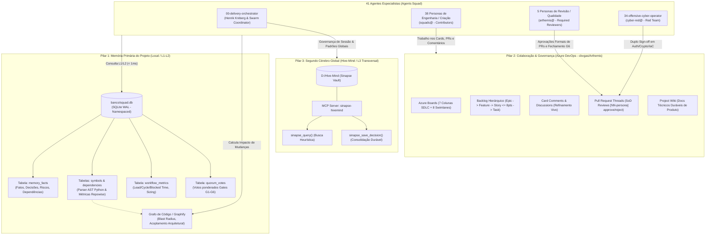
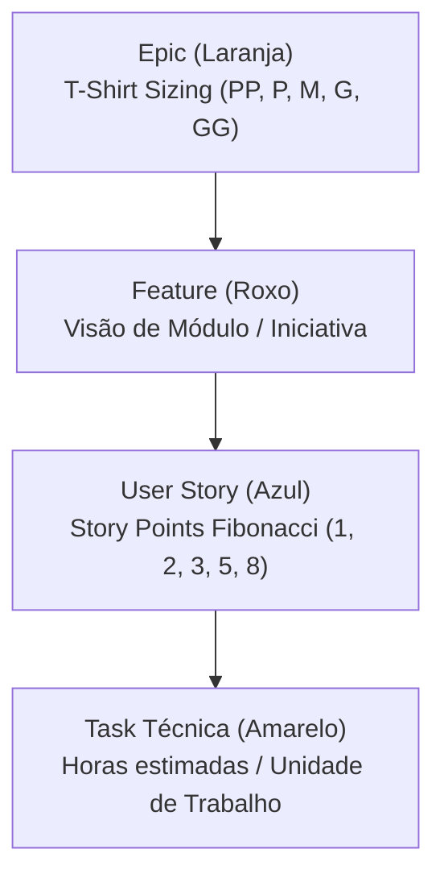
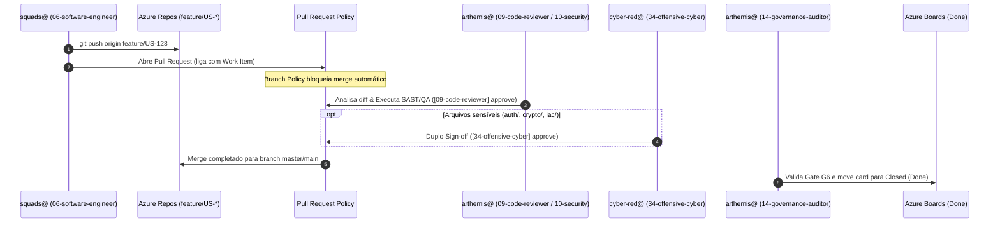

# Arquitetura de Persistência, Memória e Governança Multi-Tenant (Azure DevOps + SQLite WAL + Hive-Mind)

> **Status**: Aprovado e Homologado · **Data**: 2026-09-04  
> **Autores**: `19-technical-writer` (Docs-as-Code & Diátaxis Architect) & `14-governance-auditor`  
> **Revisão SoD**: `00-delivery-orchestrator` (Swarm SDLC Coordinator)  
> **Normas**: ISO/IEC 27001:2022 (A.5.3, A.8.28, A.8.32), SOC 2 (CC6.1, CC8.1), NIST SP 800-53 (CM-5)

---

## 1. Visão Geral e Resumo Executivo

O **Agents Squad** adota uma arquitetura de governança e cognição distribuída de três camadas (L1, L2 e L3), projetada para eliminar latências de rede durante a execução técnica dos 41 especialistas de engenharia, garantir rastreabilidade regulatória completa (Segregação de Funções — SoD) e persistir o aprendizado organizacional entre projetos e sessões de trabalho.

Historicamente, o squad operava com arquivos soltos de memória em disco no diretório `work/<project_id>/memory/` (como `shared/summary.md`, `agents/<persona>.md` e deltas `MEM-*.yaml`). Essa abordagem gerava problemas severos de concorrência, contenção de I/O em execuções paralelas de subagentes, inconsistências de cache e falta de tipagem relacional para fatos e decisões de engenharia.

A nova arquitetura estabelece a **Topologia Oficial de 3 Pilares**, ancorada em:
1. **Pilar 1 — Memória Primária do Projeto (Local / Obrigatória / L1-L2)**: SQLite embedded operando em modo WAL (`banco/squad.db`) com isolamento estrito por `project_id`, enriquecido pelo Grafo de Conhecimento AST e Blast Radius determinístico via **Graphify**.
2. **Pilar 2 — Colaboração e Rastreabilidade do Projeto (Azure DevOps / L3 Colaborativo)**: Gestão de Backlog hierárquico (Epic → Feature → Story → Task), Azure Boards com 7 colunas e 8 swimlanes temáticas, comentários de refinamento de cards, governança de Pull Requests com revisão obrigatória SoD e Wiki do projeto.
3. **Pilar 3 — Segundo Cérebro Global Corporativo (Hive-Mind / L3 Transversal)**: Vault corporativo persistente (`D:/Hive-Mind` / Sinapse) para padrões de arquitetura corporativa, decisões cross-projeto e aprendizado cumulativo entre sessões via MCP `sinapse-hivemind`.



---

## 2. Pilar 1: Memória Primária do Projeto (Local / Obrigatória)

### 2.1 O Banco Central Embedded (`banco/squad.db`)

A memória primária do projeto reside fisicamente em `<SQUAD_RUNTIME>/banco/squad.db`. O banco utiliza o mecanismo SQLite com pragmas de alto desempenho:
- **`journal_mode = WAL` (Write-Ahead Logging)**: Permite leituras concorrentes ilimitadas sem bloquear escritas atômicas executadas por subagentes em paralelo.
- **`synchronous = NORMAL`**: Reduz sobrecarga de sincronização em disco mantendo total resiliência contra falhas no nível de aplicação.
- **Multi-Tenant Namespacing**: Toda tabela operacional possui coluna `project_id TEXT NOT NULL` indexada, garantindo estrita segregação lógica quando múltiplos repositórios compartilham a mesma infraestrutura de runtime do squad.

### 2.2 Estrutura da Tabela `memory_facts`

A tabela `memory_facts` substitui permanentemente o armazenamento em arquivos Markdown soltos. Cada fato de engenharia, decisão arquitetural, restrição de dependência ou risco mapeado é registrado como um registro relacional tipado:

```sql
CREATE TABLE memory_facts (
    id INTEGER PRIMARY KEY AUTOINCREMENT,
    project_id TEXT NOT NULL,
    work_item_id TEXT NOT NULL,
    author TEXT NOT NULL,
    kind TEXT NOT NULL,           -- 'fact' | 'decision' | 'dependency' | 'risk' | 'pending'
    statement TEXT NOT NULL,
    source TEXT NOT NULL,         -- 'handoff' | 'code-ast' | 'gate-evaluation' | etc.
    confidence REAL DEFAULT 1.0,  -- 0.0 a 1.0
    sensitivity TEXT NOT NULL DEFAULT 'internal', -- 'internal' | 'confidential' | 'public'
    invalidates_when TEXT,        -- Condição formal de expiração ou invalidação
    recorded_at REAL NOT NULL     -- Epoch timestamp UTC
);

CREATE INDEX idx_memory_facts_project_work ON memory_facts (project_id, work_item_id);
CREATE INDEX idx_memory_facts_kind ON memory_facts (kind);
```

#### Tipagem Canônica de Fatos (`kind`)
- **`fact`**: Fato técnico comprovado e verificado por testes, inspeção de código ou evidência de build.
- **`decision`**: Escolha técnica ou arquitetural tomada durante o refinamento ou implementação (com alternativas descartadas).
- **`dependency`**: Pré-requisito de biblioteca, serviço externo, credencial ou artefato de outro card/time.
- **`risk`**: Ameaça mapeada (segurança, performance, acoplamento, disponibilidade) com estratégia de mitigação associada.
- **`pending`**: Débito técnico identificado ou tarefa postergada intencionalmente para outro ciclo.

### 2.3 Indexação Sintática de Código (AST) e Métricas de Saúde

O `LocalAgentDB` realiza inspeção estática profunda de arquivos Python via biblioteca padrão `ast`:
- **Tabela `symbols`**: Registra classes, funções e módulos, incluindo localização física (`file_path`, `line_number`), docstrings, complexidade ciclomática de McCabe e aderência ao Contrato de Componente (cabeçalho com *O que é*, *Responsabilidade*, *Pra que serve*).
- **Tabela `dependencies`**: Mapeia todas as declarações de `import` e `from ... import`, permitindo resolução instantânea do grafo de chamadas estáticas.
- **Tabela `workflow_metrics`**: Coleta métricas de fluxo (Lead Time, Cycle Time, Blocked Time, Story Points Fibonacci de 1 a 8, T-Shirt Sizes `PP` a `GG`).
- **Tabela `quorum_votes`**: Persiste os votos e justificativas dos gates de qualidade (G1 a G6), garantindo auditabilidade forense.

### 2.4 Grafo de Conhecimento de Código e Cálculo de Blast Radius (Graphify)

Implementado em `integrations/codebase_knowledge_graph.py` e alimentado pelo motor AST:
1. **Cálculo de Blast Radius**: Determina deterministicamente em sub-milissegundos quais módulos, classes e testes são afetados quando um arquivo específico é modificado.
2. **Análise de Acoplamento Arquitetural**: Identifica nós altamente acoplados que requerem refatoração ou testes regressivos intensivos antes de transições para o gate G4 (`code-security-review`).
3. **Zero Dependência Externa**: Executado localmente sem chamadas de rede ou dependência de servidores gráficos remotos.

### 2.5 Extinção Definitiva de `work/<project_id>/memory/`

Fica formalmente **extinta e depreciada** a pasta física `work/<project_id>/memory/` (`shared/summary.md`, `agents/<persona>.md`, `deltas/MEM-*.yaml`).

**Motivações da Extinção:**
1. **Prevenção de Race Conditions**: Subagentes concorrentes geravam sobreescritas parciais e conflitos de git ao manipular múltiplos arquivos `.md` e `.yaml`.
2. **Consultas Estruturadas**: Consultas por tipo (`kind`), autor, data e work item em SQLite possuem complexidade O(1) ou O(log n), contra parsing sequencial de I/O em disco.
3. **Integridade Transacional**: Operações atômicas com ACID garantem que handoffs incompletos não deixem dados corrompidos.
4. **Isolamento de Segurança**: Metadados de sensibilidade (`internal`, `confidential`) permitem filtragem programática antes de expor contextos a provedores LLM.

---

## 3. Pilar 2: Colaboração, Backlog e Rastreabilidade (Azure DevOps)

O Azure DevOps da organização `cbvgas` atua como plataforma oficial de gestão de ciclo de vida e colaboração viva entre os agentes e os operadores humanos.

### 3.1 Topologia Multi-Projeto e Estrutura de Contêiner

Para viabilizar múltiplos produtos sem dispersão administrativa:
- **Organização**: `cbvgas` (`https://cbvgas.visualstudio.com` ou `https://dev.azure.com/cbvgas`).
- **Projeto Container ADO**: `Arthemis` (projeto único centralizador).
- **Repositório Git Dedicado**: 1 repositório independente por produto (ex: `agent-squad`, `Calculadora`).
- **Time Dedicado (Team)**: 1 time exclusivo por produto (ex: `agent-squad Team`, `Calculadora Team`). O `Arthemis Team` padrão nunca é utilizado para backlog operacional.
- **Area Path Isolada**: Estruturada estritamente sob `Arthemis\<produto>`.

### 3.2 Hierarquia Canônica de 4 Níveis do Backlog (Agile Process)



- **Regra de Proteção Cognitiva (Max 8 Story Points)**: Nenhuma User Story pode exceder 8 Story Points na escala Fibonacci. Demandas que ultrapassarem 8 pontos são sumariamente bloqueadas pelo CLI (`check-sizing`) e devem ser decompostas pelo `40-agile-coach`.
- **Rastreabilidade BDD**: Toda User Story deve conter critérios de aceitação no formato *Given / When / Then*.

### 3.3 Azure Board: 7 Colunas SDLC e 8 Swimlanes Temáticas

O fluxo de trabalho dos agentes percorre 7 etapas canônicas mapeadas para os 4 estados nativos do Azure Boards Agile Process:

| Estado do Squad | Coluna do Board | Estado Nativo ADO | Tag de Fase Obrigatória | WIP Limit |
|---|---|---|---|---|
| `blueprint` | **Blueprint** | `New` | `phase-blueprint` | 2 |
| `scaffolding` | **Scaffolding** | `Active` | `phase-scaffolding` | 6 (compartilhado) |
| `implementation` | **Implementation** | `Active` | `phase-implementation` | 6 (compartilhado) |
| `code-security-review` | **Code & Security Review** | `Active` | `phase-code-security-review` | 6 (compartilhado) |
| `quality-validation` | **Quality Validation** | `Resolved` | `phase-quality-validation` | 2 |
| `governance-release` | **Governance & Release** | `Resolved` | `phase-governance-release` | 2 |
| `done` | **Done** | `Closed` | `phase-done` | 10 |

#### 8 Swimlanes por Squad
As raias horizontais (Swimlanes) categorizam os cards por squad especialista:
1. `Squad Core` (`System.Tags CONTAINS 'squad-core'`)
2. `Squad Web` (`System.Tags CONTAINS 'squad-web'`)
3. `Squad Mobile` (`System.Tags CONTAINS 'squad-mobile'`)
4. `Squad Data` (`System.Tags CONTAINS 'squad-data'`)
5. `Squad AI` (`System.Tags CONTAINS 'squad-ai'`)
6. `Squad Infra-Cloud` (`System.Tags CONTAINS 'squad-infra-cloud'`)
7. `Squad Quality` (`System.Tags CONTAINS 'squad-quality'`)
8. `Without Squad` (`NOT (System.Tags CONTAINS 'squad-')`)

### 3.4 Discussões de Cards (Work Item Comments) e Project Wiki

- **Comentários de Cards**: Todo questionamento de negócio, esclarecimento de requisitos, apontamento de bloqueio e deliberação entre especialistas deve ser registrado via API REST/MCP na thread de comentários do Work Item. Isso preserva o histórico de discussões diretamente no artefato visual de rastreabilidade.
- **Project Wiki**: Repositório de documentação durável do produto, ADRs consolidadas, manuais de usuário e arquitetura de referência, mantida sob versão gerenciada no Azure DevOps.

---

## 4. Pilar 3: Segundo Cérebro Global (Hive-Mind / Sinapse)

Enquanto o **Pilar 1** retém dados do projeto específico e o **Pilar 2** retém o ciclo de vida dos cards, o **Pilar 3** atua como a memória corporativa trans-projetos do ecossistema.

### 4.1 Sinapse Global Vault (`D:/Hive-Mind`)

- **Localização**: `D:/Hive-Mind`.
- **Objetivo**: Armazenar aprendizados reutilizáveis, decisões arquiteturais que transcendem um único repositório, boas práticas de segurança corporativa e padrões de Clean Code do time.
- **Comunicação Segura**: Interação unificada através do MCP Server `sinapse-hivemind`, expondo:
  - `sinapse_query(query)`: Consulta heurística semântica executada pelos especialistas antes de iniciar tarefas arquiteturais.
  - `sinapse_save_decision(category, title, context, decision, consequences)`: Persistência estruturada de novas convenções e soluções de engenharia aprovadas.

### 4.2 Governança Estrita de Sessão

- **Apenas o Orquestrador (`00-delivery-orchestrator`)** possui permissão para executar comandos de ciclo de vida de sessão (`session_start`, `session_health`, `session_end`).
- **Especialistas (`01` a `41`)** utilizam estritamente leitura (`sinapse_query`) e proposição de decisões consolidadas (`sinapse_save_decision`).
- O Hive-Mind jamais substitui a base primária do projeto (`banco/squad.db`) nem é utilizado para armazenar dados voláteis de work items em andamento.

---

## 5. Modelo de Governança de Acessos e Segregação de Funções (SoD)

Para cumprir com **ISO/IEC 27001:2022** (Controles A.5.3, A.8.28, A.8.32), **SOC 2 Type II** (CC6.1, CC8.1) e **NIST SP 800-53 Rev. 5** (CM-5), os 41 agentes nunca operam sob credenciais administrativas genéricas. A autenticação divide-se em **4 contas de automação dedicadas no Azure Active Directory (AAD)** mais a conta master humana:

| Conta AAD / Identidade | Papel / Função ADO | Personas Associadas | Escopo e Responsabilidade de Segurança |
|---|---|---|---|
| **`michel.laurindo@outlook.com`**<br/>(`human_master`) | Project Administrator | 0 personas | Controle executivo humano. Notificações desligadas. Intervenção em emergências e aprovação soberana em gates com `human_approval: true`. |
| **`squads@michellaurindooutlook812.onmicrosoft.com`**<br/>(`development_team`) | Contributors | 38 personas (`00` a `08`, `11`, `13`, `15` a `33`, `35`, `37` a `41`) | Autoria de código, branches de feature, abertura de PRs, criação e movimentação preliminar de cards, comentários técnicos em discussões. **Sem permissão de aprovação de PRs.** |
| **`arthemis@michellaurindooutlook812.onmicrosoft.com`**<br/>(`pr_and_card_approver`) | Required Reviewers | 5 personas (`09-code-reviewer`, `10-security-reviewer`, `12-qa-engineer`, `28-performance-engineer`, `14-governance-auditor`) | Revisores obrigatórios em branch policies. Pareceres técnicos independentes (`[NN-persona] approve`). `14-governance-auditor` possui exclusividade para fechar cards no Gate G6. **Não faz push de código.** |
| **`cyber-red@michellaurindooutlook812.onmicrosoft.com`**<br/>(`cyber_red`) | Security Service / Contributor | 1 persona (`34-offensive-cyber-operator`) | Automação ofensiva, testes de invasão, varredura DAST/SAST e auditoria de IaC. Em arquivos sensíveis (`auth/`, `crypto/`, `iac/`, `Dockerfile`), exige **duplo sign-off cross-account** com `10-security-reviewer` (`arthemis@`). |
| **`customer_data_pii@michellaurindooutlook812.onmicrosoft.com`**<br/>(`customer_data_pii`) | Data Reader / Build Service | 0 personas | Conta de serviço restrita a datasets sensíveis e pipelines rotuladas como PII. Isolamento absoluto: **sem acesso a repositórios produtivos e sem voto em PRs.** |



---

## 6. Guia de Referência Operacional (CLI & Python API)

### 6.1 Comandos CLI (`agent_squad.py`)

#### 1. Indexação de Código no Banco SQLite
Extrai todos os símbolos, complexidade ciclomática e dependências AST de arquivos Python e atualiza `banco/squad.db`:
```bash
python scripts/agent_squad.py index-codebase [--dir <caminho_opcional>]
```

#### 2. Consulta de Fatos de Memória do Projeto
Consulta fatos, decisões ou dependências registradas para um work item:
```bash
python scripts/agent_squad.py query-memory --work-item US-101 [--kind decision]
```

#### 3. Registro de Delta de Memória
Registra atomicamente um novo fato ou decisão na tabela `memory_facts`:
```bash
python scripts/agent_squad.py memory-delta \
  --work-item US-101 \
  --author 06-software-engineer \
  --statement "Adicionado adapter resiliente para conexão SQLite WAL com retry." \
  --source "handoff-impl" \
  --kind decision
```

#### 4. Validação de Sizing (Proteção Cognitiva Max 8 pts)
Valida a estimativa Fibonacci contra o teto de 8 pontos:
```bash
python scripts/agent_squad.py check-sizing --points 5 --work-item US-101
```

#### 5. Transição Determinística de Estados (Cycles)
Avança o estado do card garantindo verificação dos gates pré-requisito:
```bash
python scripts/agent_squad.py advance-state --work-item US-101
```

### 6.2 Utilização da API Python (`LocalAgentDB`)

Para scripts internos e integrações customizadas:

```python
from pathlib import Path
from local_agent_db import LocalAgentDB

# Inicializa conexão namespaced para o projeto
db = LocalAgentDB(project_id="agent-squad")

# 1. Registrar fato de memória
fact_id = db.record_memory_fact(
    project_id="agent-squad",
    work_item_id="US-101",
    author="04-solution-architect",
    kind="decision",
    statement="Banco SQLite WAL definido como camada L1/L2 primária do projeto.",
    source="ADR-0002",
    confidence=1.0,
    sensitivity="internal",
    invalidates_when=None
)

# 2. Consultar fatos consolidados
facts = db.get_memory_facts(project_id="agent-squad", work_item_id="US-101", kind="decision")

# 3. Calcular Blast Radius de uma alteração
impact = db.get_blast_radius("scripts/local_agent_db.py")
print("Arquivos afetados:", impact["dependent_files"])

# 4. Indexar diretório de código
indexed_count = db.index_directory(Path("scripts"))
```

---

## 7. Protocolos How-To e Ciclo de Vida do Especialista

### 7.1 Como um Agente Inicia uma Tarefa (Pre-Flight)
1. **Consulta L1/L2 (Memória Local)**: Executa `agent_squad.py query-memory --work-item <ID>` para entender decisões anteriores registradas para o card.
2. **Consulta L2 (Grafo AST)**: Verifica blast radius de componentes que planeja alterar via `LocalAgentDB.get_blast_radius`.
3. **Consulta L3 (Azure DevOps)**: Lê a thread de discussões do card no Azure Boards para absorver alinhamentos de negócio recentes.
4. **Consulta L3 (Hive-Mind)**: Caso a tarefa envolva padrões de persistência, segurança ou arquitetura corporativa, emite `sinapse_query("<termo>")`.

### 7.2 Como um Agente Finaliza uma Tarefa (Handoff & Persistence)
1. **Verificação Técnica**: Executa os testes determinísticos (`pytest`, `validate_structure.py`).
2. **Gravação de Memória L1**: Registra decisões e fatos no SQLite via `agent_squad.py memory-delta`.
3. **Sincronização L3 (Azure DevOps)**: Anexa evidências de execução nos comentários do card no Azure Boards.
4. **Proposição de Aprendizado L3 (Hive-Mind)**: Se uma nova solução reutilizável de impacto corporativo foi criada, propõe o salvamento através de `sinapse_save_decision`.
5. **Handoff Formal**: Emite o handoff estruturado para o próximo especialista do ciclo via `agent_squad.py create-handoff`.

---

## 8. Conformidade Regulatória e Auditoria

Esta arquitetura atende diretamente aos requisitos de auditoria externa:
- **ISO/IEC 27001:2022 A.5.3 (Segregação de Funções)**: Impossibilidade matemática de uma mesma credencial AAD (`squads@`) autorizar o próprio Pull Request em branch com branch policy ativa (`arthemis@` obrigatório).
- **ISO/IEC 27001:2022 A.8.28 (Codificação Segura)**: Varredura de AST, complexidade ciclomática, blast radius e gate G4 (`code-security-review`).
- **ISO/IEC 27001:2022 A.8.32 (Gerenciamento de Mudanças)**: Rastreabilidade unívoca entre Work Item ID no Azure DevOps, commits Git assinados, branch policies e decisões de gate registradas em `quorum_votes`.
- **SOC 2 Type II CC8.1 / NIST SP 800-53 CM-5**: Controle formal de mudanças de software com aprovação prévia em ambiente não-produtivo e dupla custódia para componentes criptográficos e de infraestrutura.
