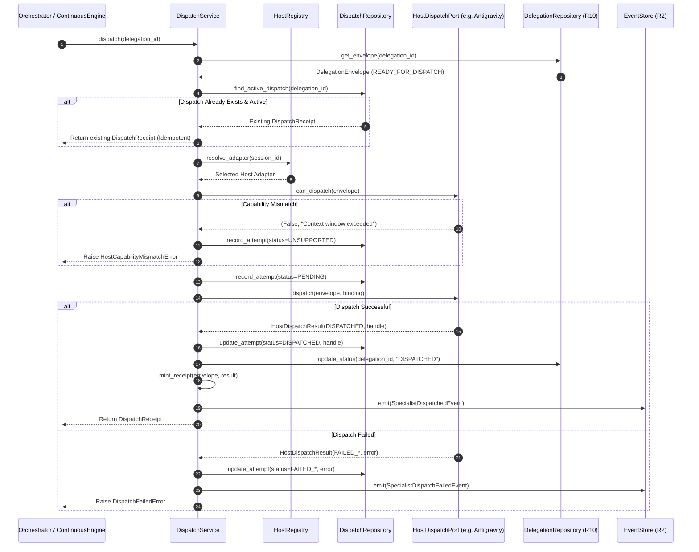

# R11 — HOST-NATIVE SPECIALIST DISPATCH ARCHITECTURE SPECIFICATION
## Ports & Adapters Runtime Seam for Host-Agnostic Specialist Invocation

**Lead Architect:** 04-solution-architect (Martin Fowler & Gregor Hohpe — Solution Architect & Enterprise Integration Lead)  
**Collaborators:** 27-platform-engineer, 06-software-engineer, 10-security-reviewer, 11-test-engineer  
**Governing Milestone:** R11 (HOST-NATIVE SPECIALIST DISPATCH)  
**Status:** APPROVED FOR IMPLEMENTATION (STAGE B DELIVERABLE)  
**Date:** 2026-09-18  
**Trust Boundary:** Agent Squad Control Plane (Neutral Domain) ⟷ Host Runtime Execution Substrates  

---

## 1. Executive Summary & Problem Statement

Milestone **R10 (MCP Session Authority, Preflight & Delegation Envelope)** solved the integrity seam between context assembly and delegation readiness. It instituted the canonical `CanonicalSessionManager`, deterministic `PreflightValidator`, and durable persistence of authoritative `DelegationEnvelope` records in SQLite (`banco/squad.db`) with state `READY_FOR_DISPATCH`. In strict accordance with the R10 non-goals, the delegation subsystem terminated at persistence, enforcing **ZERO Host Dispatch**.

However, as established in the Stage A audit report (`R11_CURRENT_HOST_DISPATCH_MAP.md`), the existing platform codebase possesses a fundamental execution void:
1. **Configuration vs. Execution Conflation:** All host modules in `integrations/` (`claude_adapter.py`, `codex_adapter.py`, `copilot_adapter.py`, `hermes_adapter.py`, `kilo_adapter.py`, `openclaw_adapter.py`, `zcode_adapter.py`, and `register_antigravity_mcp.py`) are exclusively static installer scripts that merge JSON/TOML/YAML configuration blocks for MCP STDIO clients. None of them implement runtime subagent spawning, process management, or dispatch tracking.
2. **Missing Antigravity Runtime Adapter:** Despite being the primary interactive host platform for Agent Squad, `integrations/antigravity_adapter.py` does not exist on disk, and no abstraction adapts `DelegationEnvelope` into Antigravity's host-native `invoke_subagent` tool payload.
3. **Execution Void in Continuous Orchestration:** The continuous execution engine (`scripts/continuous_trigger_engine.py::run_continuous`) advances the lifecycle state machine in an empty loop while leaving `agent_dispatches: []` completely uninstantiated.
4. **Missing Dispatch Ledger & Evidence Chain:** The platform produces zero durable proof of dispatch (`DispatchReceipt`), failing to bridge the cryptographic trust chain between prompt compilation (`instruction_hash`) and execution evidence.

Milestone **R11** resolves this platform-level execution seam by introducing a formal **Ports & Adapters (Hexagonal) Architecture**. It provides a host-agnostic control plane core capable of resolving the active host runtime, verifying host capabilities against delegation requirements, invoking the host-native dispatch mechanism, recording monotonic dispatch attempts, minting canonical `DispatchReceipt` artifacts in `banco/squad.db`, and emitting domain events into the R2 Outbox.

```
┌────────────────────────────────────────────────────────────────────────────────────────────────┐
│                             R11 DISPATCH ARCHITECTURE PIPELINE                                 │
└────────────────────────────────────────────────────────────────────────────────────────────────┘

  R10 Canonical Pipeline
    ┌─────────────────────────────┐
    │     DelegationEnvelope      │  State: READY_FOR_DISPATCH
    │  (banco/squad.db persisted) │  instruction_hash: SHA-256 (immutable)
    └──────────────┬──────────────┘
                   │
                   ▼
  R11 Dispatch Subsystem (scripts/runtime/dispatch/)
    ┌────────────────────────────────────────────────────────────────────────┐
    │                         DispatchService                                │
    │  1. Ingests DelegationEnvelope in READY_FOR_DISPATCH                   │
    │  2. Probes Active Host Runtime via HostRegistry                        │
    │  3. Validates HostCapabilities (subagents, terminal, context window)  │
    │  4. Enforces Idempotency & Concurrency (no duplicate in-flight dispatch)│
    │  5. Allocates Monotonic DispatchAttempt (table: dispatch_attempts)     │
    └───────────────────────┬────────────────────────────────────────────────┘
                            │ Delegates invocation via HostDispatchPort
                            ▼
    ┌────────────────────────────────────────────────────────────────────────┐
    │                      HostDispatchPort (Protocol)                       │
    │  - get_capabilities() -> HostCapabilities                              │
    │  - can_dispatch(envelope) -> bool                                      │
    │  - dispatch(envelope, binding) -> HostDispatchResult                   │
    │  - check_status(host_execution_id) -> HostStatusResult                 │
    │  - cancel(host_execution_id) -> bool                                   │
    └──────┬────────────────┬─────────────────┬───────────────┬──────────────┘
           │                │                 │               │
           ▼                ▼                 ▼               ▼
    ┌─────────────┐  ┌─────────────┐   ┌─────────────┐  ┌───────────┐
    │ Antigravity │  │    Codex    │   │ Gemini CLI  │  │  Claude   │   [FakeHostAdapter]
    │   Adapter   │  │   Adapter   │   │   Adapter   │  │  Adapter  │   (Deterministic Test Double)
    └──────┬──────┘  └──────┬──────┘   └──────┬──────┘  └─────┬─────┘
           │                │                 │               │
           ▼                ▼                 ▼               ▼
      Antigravity       Codex CLI         Gemini CLI      Claude CLI /
      Native Subagent   Subprocess        Headless Subp.  MCP Subagent
           │                │                 │               │
           └────────────────┴────────┬────────┴───────────────┘
                                     │
                                     ▼
    ┌────────────────────────────────────────────────────────────────────────┐
    │               Ledger Minting & Domain Event Emission                   │
    │  1. Mint Canonical DispatchReceipt (scripts/domain/receipts.py)        │
    │  2. Persist dispatch attempt to SQLite (banco/squad.db)                │
    │  3. Transition DelegationEnvelope status -> DISPATCHED                 │
    │  4. Emit SpecialistDispatchedEvent to R2 Outbox                        │
    └────────────────────────────────────────────────────────────────────────┘
```

---

## 2. R0 Failure Baseline Addressed

R11 directly resolves the systemic failures identified in `docs/audits/R0_CORE_WORKFLOW_FAILURE_BASELINE.md`:

| Defect ID | R0 Baseline Finding | Concrete Root Cause | R11 Architectural Resolution |
| :--- | :--- | :--- | :--- |
| **Area H (Host Boundary)** | Host adapters in `integrations/` are static configuration scripts; zero runtime subagent dispatch exists. | Confusing configuration installers with execution adapters; no runtime abstraction for host invocation. | Implements `HostDispatchPort` protocol and clean `HostRegistry` separating static configuration from runtime execution. |
| **R0-LIFE-011** | `ContinuousTriggerEngine` operates purely as a state advancer, emitting empty `agent_dispatches: []`. | Lack of an orchestrator seam to hand off `DelegationEnvelope` to an executable host dispatch mechanism. | `DispatchService` integrates with the engine, providing non-blocking specialist dispatch and returning concrete `DispatchReceipt` references. |
| **R0-DEL-004** | Compiled instruction was decoupled from dispatch payload and cryptographic hash. | Ad-hoc synthetic strings substituted for authoritative prompt payload. | R11 treats `DelegationEnvelope.compiled_instruction` as strictly immutable; validates `sha256(payload) == instruction_hash` before dispatch. |
| **R0-DEL-001** | Missing/fallback session tokens in dispatch resolvers (`test_root`, `test_item`). | Permissive fallbacks without session authority checks. | R11 requires valid `session_id` registered in `CanonicalSessionManager`; validates session active status before host invocation. |
| **R0-LIFE-006** | Absence of formal proof of specialist dispatch prior to gate transitions. | Gate evaluators checked static text files instead of cryptographic receipt chains. | R11 mints and persists canonical `DispatchReceipt` cryptographically bound to `instruction_hash` and `delegation_id`. |

---

## 3. Upstream Contracts Consumed

R11 does not invent domain models; it consumes and enforces upstream canonical contracts:

1. **R1 (Canonical Domain Contracts — `scripts/domain/`):**
   - `DelegationEnvelope` (`scripts/domain/delegation.py#L122`): Authoritative dispatch payload containing `delegation_id`, `sender_role`, `target_role`, `work_item_id`, `compiled_instruction`, and `instruction_hash`.
   - `HostCapabilities` (`scripts/domain/delegation.py#L180`): Capability matrix (`has_subagent_dispatch`, `has_filesystem_write`, `has_terminal_execution`, `has_mcp_client`, `has_background_tasks`, `max_token_context`).
   - `DispatchReceipt` (`scripts/domain/receipts.py#L55`): Canonical proof of dispatch inheriting from `BaseReceipt` (`receipt_id`, `work_item_id`, `agent_id`, `instruction_hash`, `evidence_hash`, `target_agent_id`, `delegation_id`, `dispatched_at`).
   - `assert_sod_compliance` (`scripts/domain/receipts.py#L176`): Invariant asserting author cannot review or validate own work.
2. **R2 (Event & Trigger Engine — `scripts/domain/events.py`):**
   - `DomainEvent`: Canonical event envelope with `event_id`, `event_type`, `work_item_id`, `project_id`, `source`, `correlation_id`, `causation_id`, `idempotency_key`, `timestamp`, and `payload`.
   - `EventStore` (`scripts/runtime/events/store.py`): Persistent transactional outbox in SQLite (`banco/squad.db`).
3. **R4 (Mandatory Lifecycle Engine — `scripts/runtime/lifecycle/`):**
   - Validates that the work item's current lifecycle stage matches the stage authorized in the delegation assignment.
4. **R8 (Stage-Aware Specialist Routing — `scripts/domain/delegation.py#L196`):**
   - `ExecutionAssignment`: Authoritative binding between work item stage and assigned agent persona.
5. **R9 (Work Context & Skills Activation — `scripts/domain/delegation.py#L91`):**
   - `ActivationPacket`: Verifies that `compiled_instruction` matches the prompt payload compiled under the 7/3 skill budget.
6. **R10 (MCP Session & Preflight — `scripts/runtime/delegation/`):**
   - `CanonicalSessionManager`: Verifies session existence, status (`active`), and TTL freshness.
   - `DelegationRepository`: Reads envelopes with status `READY_FOR_DISPATCH` and updates status to `DISPATCHED`.

---

## 4. Boundaries & Non-Negotiable Invariants

To guarantee platform stability, deterministic auditability, and clear separation of concerns, R11 enforces **six absolute invariants**:

```
┌────────────────────────────────────────────────────────────────────────────────────────┐
│                        R11 NON-NEGOTIABLE BOUNDARY INVARIANTS                          │
├────────────────────────────────┬───────────────────────────────────────────────────────┤
│ 1. ZERO Lifecycle Completion   │ Dispatching a specialist NEVER completes a lifecycle  │
│                                │ stage or work item. Stage advancement is strictly     │
│                                │ triggered by verified receipts in R4/R12.             │
├────────────────────────────────┼───────────────────────────────────────────────────────┤
│ 2. ZERO Execution-Success      │ R11 mints DispatchReceipt, NEVER ExecutionReceipt.    │
│    Assumption                  │ Proving dispatch occurred is decoupled from whether   │
│                                │ the specialist's code/deliverable passed tests.       │
├────────────────────────────────┼───────────────────────────────────────────────────────┤
│ 3. ZERO Review/Test/QA         │ R11 never evaluates gates G4, G5, or G6. Dispatch is   │
│    Approval                    │ an outbound actuation, not a verification signoff.    │
├────────────────────────────────┼───────────────────────────────────────────────────────┤
│ 4. ZERO Background Watchdog    │ DispatchService operates strictly on-demand. It does  │
│    Loop                        │ not spawn background daemon polling loops, cron jobs,  │
│                                │ or sleep threads (watchdog reconciliation is R13).    │
├────────────────────────────────┼───────────────────────────────────────────────────────┤
│ 5. ZERO Instruction Mutation   │ DelegationEnvelope.compiled_instruction is strictly   │
│                                │ immutable. Zero prompt prefixing, wrapping, framing,   │
│                                │ or re-compilation by any host adapter.                │
├────────────────────────────────┼───────────────────────────────────────────────────────┤
│ 6. STRICT Control Plane        │ The core control plane (scripts/runtime/dispatch/) is │
│    Neutrality                  │ 100% host-agnostic. All host-specific APIs, binaries, │
│                                │ and protocols reside exclusively inside adapters.     │
└────────────────────────────────┴───────────────────────────────────────────────────────┘
```

---

## 5. Ports & Adapters Architecture (Hexagonal Design)

The dispatch subsystem follows Clean Architecture / Ports and Adapters principles:

```
┌─────────────────────────────────────────────────────────────────────────────────────────┐
│                                APPLICATION CORE (DOMAIN)                                │
│                                                                                         │
│   scripts/domain/delegation.py          scripts/domain/receipts.py                      │
│   ┌──────────────────────────┐          ┌──────────────────────────┐                    │
│   │    DelegationEnvelope    │          │     DispatchReceipt      │                    │
│   └──────────────────────────┘          └──────────────────────────┘                    │
│                                                                                         │
├─────────────────────────────────────────────────────────────────────────────────────────┤
│                          APPLICATION SERVICES (USE CASES)                               │
│                                                                                         │
│   scripts/runtime/dispatch/service.py                                                   │
│   ┌─────────────────────────────────────────────────────────────────────────────────┐   │
│   │                                DispatchService                                  │   │
│   │  - dispatch_delegation(delegation_id) -> DispatchReceipt                        │   │
│   │  - check_dispatch_status(dispatch_id) -> DispatchStatus                         │   │
│   │  - cancel_dispatch(dispatch_id) -> bool                                         │   │
│   └───────────────┬─────────────────────────────────┬───────────────────────────────┘   │
│                   │ Uses                            │ Ingests / Emits                   │
│                   ▼                                 ▼                                   │
│   ┌───────────────────────────────┐     ┌───────────────────────────────────────────┐   │
│   │      DispatchRepository       │     │          EventStore / Outbox              │   │
│   │  (scripts/runtime/dispatch/   │     │        (scripts/runtime/events/)          │   │
│   │   repository.py)              │     └───────────────────────────────────────────┘   │
│   └───────────────────────────────┘                                                     │
│                   │ Invokes outbound port                                               │
│                   ▼                                                                     │
│   ┌─────────────────────────────────────────────────────────────────────────────────┐   │
│   │                                HostDispatchPort                                 │   │
│   │                             (Abstract Specification)                            │   │
│   └───────────────────────────────────────┬─────────────────────────────────────────┘   │
├───────────────────────────────────────────┼─────────────────────────────────────────────┤
│                                  ADAPTERS │ (INFRASTRUCTURE LAYER)                      │
│                                           │                                             │
│       ┌───────────────────┬───────────────┴───┬───────────────────┐                     │
│       ▼                   ▼                   ▼                   ▼                     │
│ ┌───────────────┐   ┌───────────┐       ┌───────────┐       ┌───────────┐               │
│ │  Antigravity  │   │   Codex   │       │Gemini CLI │       │  Claude   │               │
│ │    Adapter    │   │  Adapter  │       │  Adapter  │       │  Adapter  │               │
│ └───────┬───────┘   └─────┬─────┘       └─────┬─────┘       └─────┬─────┘               │
└─────────┼─────────────────┼───────────────────┼───────────────────┼─────────────────────┘
          ▼                 ▼                   ▼                   ▼
    Antigravity IDE     Codex CLI           Gemini CLI          Claude Code /
    Subagent Tool       Child Process       Headless Runner     MCP Subagent
```

### Architectural Principles:
1. **Dependency Inversion:** High-level policy (`DispatchService`) depends on the abstraction (`HostDispatchPort`), never on concrete host tools or subprocess commands.
2. **Pluggable Discovery:** Hosts register via `HostRegistry`. The active host is resolved dynamically based on runtime environment probes (e.g. environment variables, tool availability, session configuration), with zero hardcoded `if/elif` statements in the core.
3. **Deterministic Testability:** The test suite executes 100% hermetically against `FakeHostAdapter` without requiring live network connections, external IDEs, or LLM tokens.

---

## 6. Canonical Data Contracts

The dispatch subsystem introduces three canonical data contracts located in `scripts/runtime/dispatch/contracts.py` (stdlib-only, dataclasses, frozen):

### 6.1 `DispatchStatus` (Enum)
```python
class DispatchStatus(str, Enum):
    """Lifecycle state of an individual specialist dispatch attempt."""
    PENDING = "PENDING"                    # Dispatch initiated, awaiting adapter execution
    DISPATCHED = "DISPATCHED"              # Successfully launched on target host substrate
    ACKNOWLEDGED = "ACKNOWLEDGED"          # Host runtime confirmed specialist accepted task
    FAILED_RETRYABLE = "FAILED_RETRYABLE"  # Transient failure (e.g. rate limit, spawn timeout)
    FAILED_TERMINAL = "FAILED_TERMINAL"    # Non-retryable failure (e.g. invalid role, missing binary)
    UNSUPPORTED = "UNSUPPORTED"            # Host lacks required capabilities for envelope
    CANCELLED = "CANCELLED"                # Dispatch aborted prior to specialist execution
```

### 6.2 `HostExecutionBinding` (Dataclass)
```python
@dataclass(frozen=True)
class HostExecutionBinding(BaseDomainModel):
    """Captures the concrete execution context binding between Squad and the Host."""
    host_kind: str                        # "antigravity", "codex", "gemini_cli", "claude", "fake"
    host_version: str                     # Host environment version or build identifier
    session_id: str                       # Bound MCP session UUID
    execution_handle: str                 # Host-native handle (e.g. conversation_id, pid, task_id)
    dispatch_mode: str                    # "native_subagent", "headless_cli", "background_process"
    capabilities: HostCapabilities        # Snapshot of active host capabilities at dispatch time
    metadata: Dict[str, Any] = field(default_factory=dict)
```

### 6.3 `HostDispatchResult` (Dataclass)
```python
@dataclass(frozen=True)
class HostDispatchResult(BaseDomainModel):
    """Normalized response returned by a HostDispatchPort implementation upon dispatch."""
    status: DispatchStatus
    host_execution_id: str                # Unique identifier generated by host (or synthetic handle)
    evidence_payload: Dict[str, Any]      # Host-native launch receipt or process attributes
    error_code: Optional[str] = None      # Standardized failure code if status in FAILED_*
    error_message: Optional[str] = None   # Human-readable diagnostics
    dispatched_at: datetime = field(default_factory=datetime.utcnow)
```

### 6.4 `DispatchReceipt` Harmonization
R11 utilizes the canonical `DispatchReceipt` defined in `scripts/domain/receipts.py#L55`:
- `receipt_id`: `RCP-DISP-<hex12>`
- `receipt_type`: `"DISPATCH"`
- `work_item_id`: `DelegationEnvelope.work_item_id`
- `agent_id`: `DelegationEnvelope.sender_role`
- `target_agent_id`: `DelegationEnvelope.target_role`
- `delegation_id`: `DelegationEnvelope.delegation_id`
- `instruction_hash`: `DelegationEnvelope.instruction_hash` (verbatim)
- `evidence_hash`: `sha256(canonical_json(HostDispatchResult.evidence_payload)).hexdigest()`
- `dispatched_at`: UTC timestamp of successful host invocation

---

## 7. HostDispatchPort Specification

The port contract defines the exact interface required for any host adapter. It is defined in `scripts/runtime/dispatch/port.py` using Python's `typing.Protocol` with runtime checkability:

```python
@runtime_checkable
class HostDispatchPort(Protocol):
    """Outbound port for host-native specialist agent dispatch."""

    @property
    def host_kind(self) -> str:
        """Returns unique host kind identifier (e.g. 'antigravity', 'codex')."""
        ...

    def get_capabilities(self) -> HostCapabilities:
        """Reports static and runtime-probed capabilities of this host."""
        ...

    def can_dispatch(self, envelope: DelegationEnvelope) -> Tuple[bool, Optional[str]]:
        """Verifies whether this host can execute the given delegation envelope.
        
        Returns:
            (True, None) if supported.
            (False, reason_string) if unsupported.
        """
        ...

    def dispatch(
        self,
        envelope: DelegationEnvelope,
        binding: HostExecutionBinding,
    ) -> HostDispatchResult:
        """Executes host-native dispatch of the specialist agent.
        
        Must be idempotent where supported by host.
        Fails closed on any host communication or invocation failure.
        """
        ...

    def check_status(self, host_execution_id: str) -> HostStatusResult:
        """Queries the lifecycle state of an active or completed specialist dispatch."""
        ...

    def cancel(self, host_execution_id: str) -> bool:
        """Terminates or signals cancellation to the host specialist execution."""
        ...
```

---

## 8. HostRegistry & Dynamic Host Resolution

To prevent coupling and eliminate hardcoded branching in the orchestrator, host discovery is managed by `HostRegistry` (`scripts/runtime/dispatch/registry.py`).

### 8.1 Registry Lifecycle
1. **Registration:** Adapters register statically or dynamically by providing their `host_kind` and a factory constructor.
2. **Probe & Resolution Priority:**
   - **Explicit Override:** If `SQUAD_HOST_ADAPTER` environment variable is defined, that adapter is loaded directly.
   - **Session Host Binding:** If the MCP session declares a specific `host` (e.g. `session.host == "antigravity"`), that host is matched.
   - **Environment Probing:** In the absence of an explicit declaration, the registry probes the runtime environment:
     * Antigravity probe: Checks for Antigravity-specific tools or environment marker (`ANTIGRAVITY_AGENT_ID`, `GEMINI_CLI_MODE`).
     * Codex probe: Checks for `CODEX_CLI_PATH` or `codex` in system `PATH`.
     * Gemini CLI probe: Checks for `agy` or `gemini` executable in `PATH`.
     * Claude probe: Checks for `CLAUDE_CODE_ENTRYPOINT` or active Claude Desktop STDIO connection.
   - **Default Fallback:** In test environments or when no host is detected, resolves to `FakeHostAdapter` or raises `HostResolutionError` in strict production mode.

```
┌────────────────────────────────────────────────────────────────────────────────────────┐
│                               HOST RESOLUTION LOGIC                                    │
└────────────────────────────────────────────────────────────────────────────────────────┘

  Delegation Request
          │
          ▼
  1. Check Environment Variable (SQUAD_HOST_ADAPTER)? ──► [Matched Adapter]
          │ (None)
          ▼
  2. Check Session Binding (session['host'])? ──────────► [Matched Adapter]
          │ (Unset / "auto")
          ▼
  3. Environment Probing:
     ├─ Antigravity marker detected? ────────────────────► [AntigravityDispatchAdapter]
     ├─ Codex CLI binary found? ─────────────────────────► [CodexDispatchAdapter]
     ├─ Gemini CLI binary found? ────────────────────────► [GeminiCliDispatchAdapter]
     └─ Claude CLI binary found? ────────────────────────► [ClaudeDispatchAdapter]
          │ (None Detected)
          ▼
  4. Is Environment Test Mode (SQUAD_ENV == 'test')?
     ├─ True ────────────────────────────────────────────► [FakeHostAdapter]
     └─ False ───────────────────────────────────────────► Raise HostResolutionError(FAIL-CLOSED)
```

---

## 9. Host Adapters Detailed Design

### 9.1 `FakeHostAdapter` (Deterministic Test Double)
- **Path:** `scripts/runtime/dispatch/adapters/fake.py`
- **Capabilities:**
  - `has_subagent_dispatch: True`
  - `has_filesystem_write: True`
  - `has_terminal_execution: True`
  - `has_mcp_client: True`
  - `has_background_tasks: True`
  - `max_token_context: 1_000_000`
- **Behavior:**
  - In-memory deterministic queue recording all calls to `dispatch()`.
  - Configurable fault injection: `simulate_failure(status=FAILED_RETRYABLE, error_code="RATE_LIMIT")`.
  - Returns synthetic `host_execution_id = f"fake-exec-{uuid.uuid4().hex[:8]}"`.
  - Used across 100% of unit and diagnostic tests.

### 9.2 `AntigravityDispatchAdapter` (Google Antigravity IDE)
- **Path:** `scripts/runtime/dispatch/adapters/antigravity.py`
- **Capabilities:**
  - `has_subagent_dispatch: True`
  - `has_filesystem_write: True`
  - `has_terminal_execution: True`
  - `has_mcp_client: True`
  - `has_background_tasks: True`
  - `max_token_context: 2_000_000`
- **Invocation Mechanism:**
  - Antigravity exposes the host-native tool `invoke_subagent`.
  - The adapter translates `DelegationEnvelope` into the standard `Subagents` array payload:
    ```json
    {
      "Subagents": [
        {
          "TypeName": "self",
          "Role": "06-software-engineer",
          "Prompt": "<compiled_instruction verbatim>",
          "Workspace": "inherit",
          "Model": "inherit"
        }
      ]
    }
    ```
  - Where running within an agent session executing via tool call, the adapter outputs or bridges the invocation to the host tool handler.
  - Evidence capture: Dispatched subagents communicate results back via `send_message(Recipient="<orchestrator_conversation_id>")`. The adapter extracts the conversation ID and records it in `HostExecutionBinding.execution_handle`.

### 9.3 `CodexDispatchAdapter` (OpenAI Codex CLI / Process)
- **Path:** `scripts/runtime/dispatch/adapters/codex.py`
- **Capabilities:**
  - `has_subagent_dispatch: False`
  - `has_filesystem_write: True`
  - `has_terminal_execution: True`
  - `has_mcp_client: True`
  - `has_background_tasks: True`
  - `max_token_context: 128_000`
- **Invocation Mechanism:**
  - Spawns background worker process using standard library `subprocess.Popen`.
  - Passes `compiled_instruction` via atomic temporary instruction file or STDIO pipe to prevent CLI argument length overflow on Windows.
  - Command: `codex exec --instruction-file <path> --work-dir <work_dir> --non-interactive`.
  - Records process PID as `host_execution_id`.

### 9.4 `GeminiCliDispatchAdapter` (Google Gemini CLI / `agy` Headless)
- **Path:** `scripts/runtime/dispatch/adapters/gemini_cli.py`
- **Capabilities:**
  - `has_subagent_dispatch: True`
  - `has_filesystem_write: True`
  - `has_terminal_execution: True`
  - `has_mcp_client: True`
  - `has_background_tasks: True`
  - `max_token_context: 1_000_000`
- **Invocation Mechanism:**
  - Spawns headless CLI runner: `agy run --agent <role> --instruction-file <path> --json-output`.
  - Returns subprocess tracking handle.

### 9.5 `ClaudeDispatchAdapter` (Anthropic Claude Code CLI / MCP Bridge)
- **Path:** `scripts/runtime/dispatch/adapters/claude.py`
- **Capabilities:**
  - `has_subagent_dispatch: False`
  - `has_filesystem_write: True`
  - `has_terminal_execution: True`
  - `has_mcp_client: True`
  - `has_background_tasks: False`
  - `max_token_context: 200_000`
- **Invocation Mechanism:**
  - Spawns Claude Code CLI: `claude -p "<prompt_file>" --output-format json`.
  - Returns process execution identifier.

---

## 10. DispatchService Workflow & State Transition

The central orchestrator of Milestone R11 is `DispatchService` (`scripts/runtime/dispatch/service.py`). It coordinates the entire dispatch lifecycle from envelope verification to ledger persistence:



### Step-by-Step State Transitions:
1. **Fetch & Verify Envelope:** Loads `DelegationEnvelope` from SQLite table `delegation_envelopes`. Verifies status is `READY_FOR_DISPATCH`. If status is already `DISPATCHED`, checks for idempotent existing receipt.
2. **Session Freshness Validation:** Calls `CanonicalSessionManager.get_session(session_id)` to assert the session is `active` and not expired.
3. **Idempotency Gate:** Checks if an active dispatch attempt already exists for `delegation_id`. If existing attempt is `DISPATCHED` or `ACKNOWLEDGED`, returns the previously minted `DispatchReceipt`.
4. **Adapter Resolution:** Obtains the concrete `HostDispatchPort` from `HostRegistry`.
5. **Capability Negotiation:** Calls `adapter.can_dispatch(envelope)`. If false, records attempt with status `UNSUPPORTED` and raises `HostCapabilityMismatchError`.
6. **Pending Allocation:** Writes an initial attempt row to `dispatch_attempts` with status `PENDING` and a newly generated monotonic `attempt_number`.
7. **Host Invocation:** Calls `adapter.dispatch(envelope, binding)`.
8. **Outcome Handling:**
   - **Success (`DISPATCHED`):**
     * Updates `dispatch_attempts` with `host_execution_id` and status `DISPATCHED`.
     * Updates `delegation_envelopes` setting `status = 'DISPATCHED'`.
     * Mints canonical `DispatchReceipt` and saves to SQLite.
     * Emits `SpecialistDispatchedEvent` into R2 Outbox.
     * Returns `DispatchReceipt`.
   - **Failure (`FAILED_RETRYABLE` / `FAILED_TERMINAL`):**
     * Updates `dispatch_attempts` with failure status, error code, and error message.
     * Emits `SpecialistDispatchFailedEvent` into R2 Outbox.
     * Raises typed exception (`DispatchFailedError`).

---

## 11. Persistence Model (SQLite Schema `dispatch_attempts`)

All dispatch lifecycle operations are recorded with durable ACID transactions in `banco/squad.db`. The schema is managed by `DispatchRepository` (`scripts/runtime/dispatch/repository.py`):

```sql
-- DDL for Host Dispatch Ledger in SQLite (banco/squad.db)

CREATE TABLE IF NOT EXISTS dispatch_attempts (
    dispatch_id TEXT PRIMARY KEY,               -- Unique dispatch identifier (DSP-<hex12>)
    delegation_id TEXT NOT NULL,                -- Foreign key to delegation_envelopes(delegation_id)
    session_id TEXT NOT NULL,                   -- Associated MCP session ID
    work_item_id TEXT NOT NULL,                 -- Target work item identifier
    sender_role TEXT NOT NULL,                  -- Orchestrator persona (e.g. 00-delivery-orchestrator)
    target_role TEXT NOT NULL,                  -- Specialist persona (e.g. 06-software-engineer)
    host_kind TEXT NOT NULL,                    -- Host provider ("antigravity", "codex", etc.)
    host_execution_id TEXT,                     -- Host-native handle (conversation_id, pid, etc.)
    attempt_number INTEGER NOT NULL DEFAULT 1,  -- Monotonic attempt counter per delegation
    status TEXT NOT NULL,                       -- PENDING, DISPATCHED, ACKNOWLEDGED, FAILED_*, UNSUPPORTED
    instruction_hash TEXT NOT NULL,             -- SHA-256 bound to DelegationEnvelope
    evidence_hash TEXT NOT NULL,                -- SHA-256 bound to host launch evidence
    error_code TEXT,                            -- Standardized error taxonomy code
    error_message TEXT,                         -- Diagnostic failure message
    receipt_payload TEXT,                       -- Serialized JSON of canonical DispatchReceipt
    metadata TEXT NOT NULL DEFAULT '{}',        -- JSON metadata of host binding
    dispatched_at TEXT NOT NULL,                -- ISO-8601 UTC timestamp of dispatch call
    acknowledged_at TEXT,                       -- ISO-8601 UTC timestamp of specialist ACK (optional)
    completed_at TEXT,                          -- ISO-8601 UTC timestamp of final dispatch status
    created_at TEXT NOT NULL,                   -- Record creation timestamp
    updated_at TEXT NOT NULL                    -- Record update timestamp
);

-- Performance and Idempotency Indexes
CREATE INDEX IF NOT EXISTS idx_disp_delegation ON dispatch_attempts(delegation_id);
CREATE INDEX IF NOT EXISTS idx_disp_work_item ON dispatch_attempts(work_item_id);
CREATE INDEX IF NOT EXISTS idx_disp_session ON dispatch_attempts(session_id);
CREATE INDEX IF NOT EXISTS idx_disp_status ON dispatch_attempts(status);
CREATE INDEX IF NOT EXISTS idx_disp_instruction ON dispatch_attempts(instruction_hash);
```

### Table Relationships:
```
  mcp_sessions (R10)
      │ 1
      ▼ N
  delegation_envelopes (R10)
      │ 1
      ▼ N
  dispatch_attempts (R11)
      │ 1
      ▼ 1
  events / event_deliveries (R2 Outbox)
```

---

## 12. Idempotency & Concurrency Strategy

In distributed and agentic workflows, dispatch commands can be triggered repeatedly due to network timeouts, user retries, or reactive event loops. R11 enforces strict deterministic idempotency:

1. **Unique Delegation Identity:** Each `DelegationEnvelope` has a globally unique `delegation_id`.
2. **Monotonic Dispatch Attempts:**
   - Querying `dispatch_attempts` by `delegation_id` identifies any in-flight or successfully completed dispatch.
   - If a dispatch record with status in `(DISPATCHED, ACKNOWLEDGED)` exists, `DispatchService` **NEVER invokes the host adapter a second time**. It extracts the cached `receipt_payload`, deserializes the canonical `DispatchReceipt`, and returns it immediately.
3. **Transient Failure Retry Allowance:**
   - If previous attempts resulted in `FAILED_RETRYABLE`, a new attempt may be initiated.
   - The repository increments `attempt_number = MAX(attempt_number) + 1`.
   - The maximum retry budget per delegation is governed by platform policy (`_MAX_DISPATCH_RETRIES = 3`). Exceeding this budget transitions the attempt to `FAILED_TERMINAL`.
4. **Concurrency Locking:**
   - SQLite WAL mode (`PRAGMA journal_mode=WAL; PRAGMA synchronous=NORMAL;`) with transaction timeout ensures thread-safe and process-safe writes.
   - `INSERT INTO dispatch_attempts` under a transaction prevents concurrent threads from initiating twin dispatches for the same `delegation_id`.

---

## 13. Error Handling & Failure Taxonomy

R11 implements an exhaustive, typed exception hierarchy in `scripts/runtime/dispatch/errors.py`:

```
SquadError (scripts.domain.common)
  └── DispatchError
        ├── HostResolutionError              (Unable to resolve valid host adapter)
        ├── HostCapabilityMismatchError      (Target host lacks required capabilities)
        ├── SessionInvalidForDispatchError   (MCP session expired or blocked)
        ├── DelegationEnvelopeNotReadyError  (Envelope status != READY_FOR_DISPATCH)
        ├── DispatchExecutionFailedError     (Host adapter threw execution exception)
        │     ├── DispatchRetryableError     (Transient failure: timeout, rate limit)
        │     └── DispatchTerminalError      (Permanent failure: missing binary, syntax)
        ├── DispatchIdempotencyConflictError (Concurrent conflicting dispatch in-flight)
        └── DispatchReceiptIntegrityError    (Failed hash verification on minted receipt)
```

### Standardized Error Codes:
- `ERR_HOST_UNRESOLVED`: No matching host adapter found in registry.
- `ERR_CAPABILITY_MISMATCH`: Host cannot satisfy required tools or context size.
- `ERR_HOST_SPAWN_TIMEOUT`: Subagent invocation or process spawn timed out.
- `ERR_HOST_INVOCATION_FAILED`: Underlying host tool or CLI returned non-zero exit code.
- `ERR_INSTRUCTION_HASH_MISMATCH`: Envelope instruction altered prior to dispatch.
- `ERR_MAX_RETRIES_EXCEEDED`: Retry budget exhausted for this delegation.

---

## 14. R2 Event Integration

Upon state mutations, `DispatchService` creates and emits canonical `DomainEvent` instances to the R2 Outbox (`EventStore` in `banco/squad.db`):

### 14.1 `SpecialistDispatchedEvent`
- **`event_type`:** `"agent_squad.specialist.dispatched"`
- **`source`:** `"runtime.dispatch_service"`
- **`correlation_id`:** `delegation_envelope.work_item_id`
- **`causation_id`:** `delegation_envelope.delegation_id`
- **`payload`:**
  ```json
  {
    "dispatch_id": "DSP-1a2b3c4d5e6f",
    "delegation_id": "DEL-9f8e7d6c5b4a",
    "work_item_id": "STORY-101",
    "sender_role": "00-delivery-orchestrator",
    "target_role": "06-software-engineer",
    "host_kind": "antigravity",
    "host_execution_id": "conv-subagent-778899",
    "receipt_id": "RCP-DISP-001122334455",
    "instruction_hash": "e3b0c44298fc1c149afbf4c8996fb92427ae41e4649b934ca495991b7852b855",
    "dispatched_at": "2026-09-18T20:30:00Z"
  }
  ```

### 14.2 `SpecialistDispatchFailedEvent`
- **`event_type`:** `"agent_squad.specialist.dispatch_failed"`
- **`source`:** `"runtime.dispatch_service"`
- **`correlation_id`:** `delegation_envelope.work_item_id`
- **`causation_id`:** `delegation_envelope.delegation_id`
- **`payload`:**
  ```json
  {
    "dispatch_id": "DSP-1a2b3c4d5e6f",
    "delegation_id": "DEL-9f8e7d6c5b4a",
    "work_item_id": "STORY-101",
    "target_role": "06-software-engineer",
    "host_kind": "codex",
    "error_code": "ERR_HOST_SPAWN_TIMEOUT",
    "error_message": "Process failed to acknowledge within 30000ms",
    "retryable": true,
    "attempt_number": 1
  }
  ```

---

## 15. Security & Isolation Boundaries

Aligned with STRIDE threat modeling principles:

1. **Prompt Injection & Tampering Defense:**
   - `DelegationEnvelope.compiled_instruction` is verified against `instruction_hash` using `hashlib.sha256` immediately prior to dispatch.
   - Any byte disparity triggers an immediate abort (`DispatchReceiptIntegrityError`).
2. **Filesystem Containment:**
   - When adapters pass instructions to external CLI runners (e.g. Codex, Claude), files are written exclusively inside the project-bound directory:
     `%SQUAD_RUNTIME%\work\<project_id>\.dispatch\instructions\`
   - Writing outside the canonical project root violates `PathContainmentViolation` and is blocked.
3. **Execution Credential Sanitization:**
   - No plaintext tokens, passwords, or personal access tokens are stored in `dispatch_attempts` or embedded into dispatch metadata.
   - MCP configurations use standard environment variable indirection.
4. **Segregation of Duties (SoD) Enforcement:**
   - The dispatch engine strictly verifies that specialist personas cannot be dispatched to review their own prior execution receipts, calling `assert_sod_compliance` when processing review stages.

---

## 16. Testing Strategy & Test Doubles

The testing architecture for Milestone R11 ensures 100% deterministic coverage without external dependencies:

```
┌────────────────────────────────────────────────────────────────────────────────────────┐
│                               R11 TEST SUITE TOPOLOGY                                  │
├───────────────────────────────┬────────────────────────────────────────────────────────┤
│ Unit Tests                    │ - Test HostRegistry resolution logic and precedence    │
│ (scripts/tests/dispatch/)     │ - Test capability negotiation across mock matrices     │
│                               │ - Test DispatchReceipt minting and hash validation     │
│                               │ - Test error taxonomy and exception mapping            │
├───────────────────────────────┼────────────────────────────────────────────────────────┤
│ Integration Tests             │ - Test DispatchService with FakeHostAdapter            │
│ (scripts/tests/dispatch/)     │ - Test SQLite persistence in dispatch_attempts         │
│                               │ - Test envelope status transitions (READY -> DISP)     │
│                               │ - Test R2 Outbox event emission                        │
├───────────────────────────────┼────────────────────────────────────────────────────────┤
│ Concurrency & Idempotency     │ - Test twin concurrent dispatch calls on same envelope │
│ (scripts/tests/dispatch/)     │ - Test replay with identical delegation_id             │
│                               │ - Test retry backoff on simulated FAILED_RETRYABLE     │
├───────────────────────────────┼────────────────────────────────────────────────────────┤
│ Boundary Invariant Tests      │ - Assert ZERO lifecycle stage advancement on dispatch  │
│ (scripts/tests/dispatch/)     │ - Assert ZERO ExecutionReceipt generated (only DISP)   │
│                               │ - Assert ZERO instruction prompt mutation in adapters  │
└───────────────────────────────┴────────────────────────────────────────────────────────┘
```

### Test Doubles:
- `FakeHostAdapter`: Primary test double simulating subagent dispatch, failures, timeouts, and status reporting.
- `MockEventStore`: In-memory event capture verifying `SpecialistDispatchedEvent` payload schema.

---

## 17. Migration & Legacy Path (`scripts/sdd_dispatch.py`)

As discovered in Stage A, `FileSDDDispatcher` in `scripts/sdd_dispatch.py` implemented a legacy, file-based dispatch queue (`requests/`, `claims/`, `receipts/`) using raw JSON dictionaries unlinked from `DelegationEnvelope`.

### Legacy Harmonization Plan:
1. **Deprecation Notice:** `scripts/sdd_dispatch.py` is marked deprecated.
2. **Adapter Facade:** `FileSDDDispatcher` is refactored into a compatibility adapter implementing `HostDispatchPort`. When legacy CLI commands (`squad sdd run`) execute with `--dispatch`, the request is routed through `DispatchService` using canonical `DelegationEnvelope` semantics.
3. **Receipt Unification:** Legacy receipt generation (`EXEC-SDD-...`) is superseded by canonical `DispatchReceipt` and subsequent R12 `ExecutionReceipt`. Existing filesystem artifacts remain readable for backward-compatible audit replay.

---

## 18. Module Structure for Implementation (Stage C Blueprint)

The implementation to be executed by `06-software-engineer` in Stage C will introduce the following concrete files:

```
scripts/runtime/dispatch/
├── __init__.py               # Exports DispatchService, HostRegistry, HostDispatchPort
├── contracts.py              # DispatchStatus, HostExecutionBinding, HostDispatchResult
├── errors.py                 # Typed exception hierarchy
├── port.py                   # HostDispatchPort Protocol definition
├── registry.py               # HostRegistry discovery and resolution
├── repository.py             # DispatchRepository SQLite persistence (dispatch_attempts)
├── service.py                # DispatchService canonical orchestration
└── adapters/
    ├── __init__.py           # Package initialization
    ├── fake.py               # FakeHostAdapter (deterministic test double)
    ├── antigravity.py        # AntigravityDispatchAdapter (invoke_subagent binding)
    ├── codex.py              # CodexDispatchAdapter (CLI / process binding)
    ├── gemini_cli.py         # GeminiCliDispatchAdapter (headless CLI binding)
    └── claude.py             # ClaudeDispatchAdapter (CLI / MCP binding)
```

---

## 19. Architecture Signoff & Stage B Verdict

As Lead Solution Architect (`04-solution-architect`), I formally verify that this specification satisfies all functional, architectural, and governance requirements of Milestone R11:
- Clean Ports & Adapters separation decoupling Squad control plane from host runtimes.
- Strict enforcement of the 6 non-negotiable invariants (Zero lifecycle completion, zero execution assumption, zero review approval, zero background watchdog, zero instruction mutation, strict neutrality).
- Cryptographic evidence chain bridging R10 `DelegationEnvelope` to canonical `DispatchReceipt` and R2 `DomainEvent` outbox.
- Authoritative persistence in SQLite `banco/squad.db`.

**STAGE B STATUS: APPROVED FOR IMPLEMENTATION**  
**NEXT ACTION:** Handoff to Delivery Orchestrator (`00`) to authorize Stage C implementation by `06-software-engineer`.
