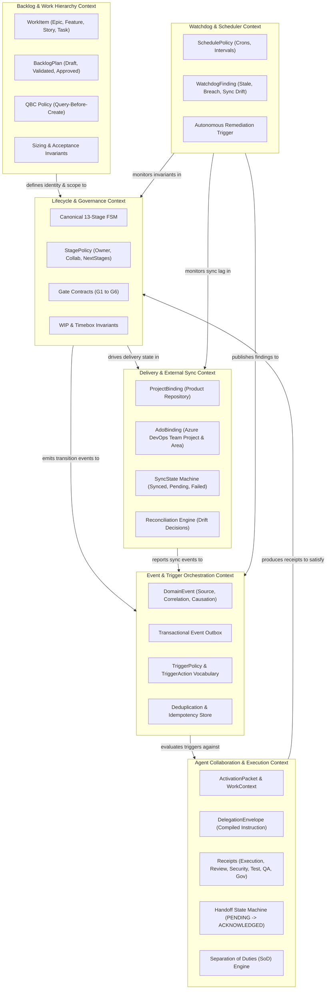
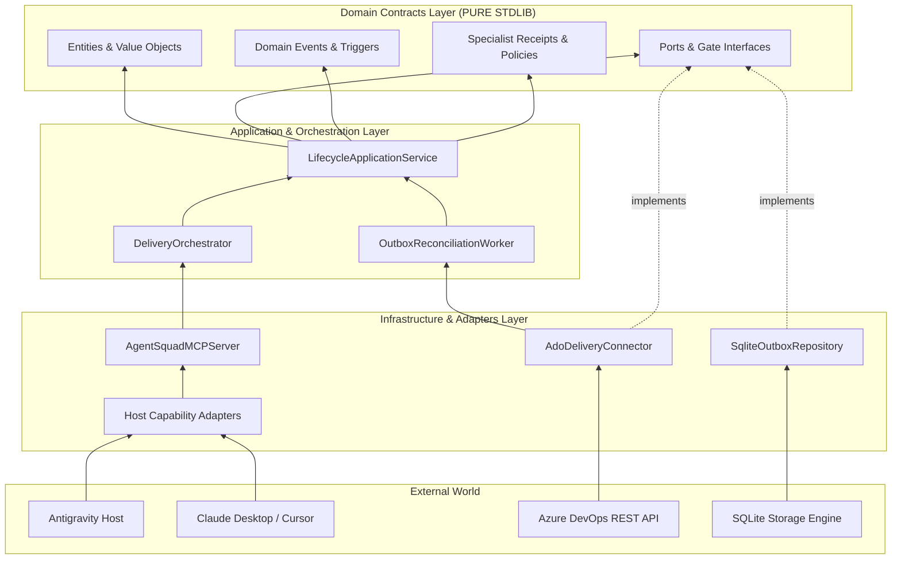
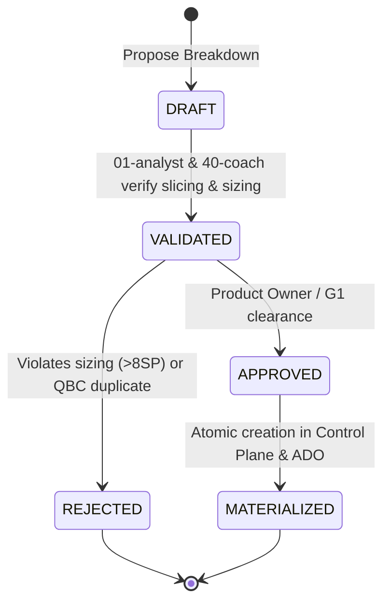
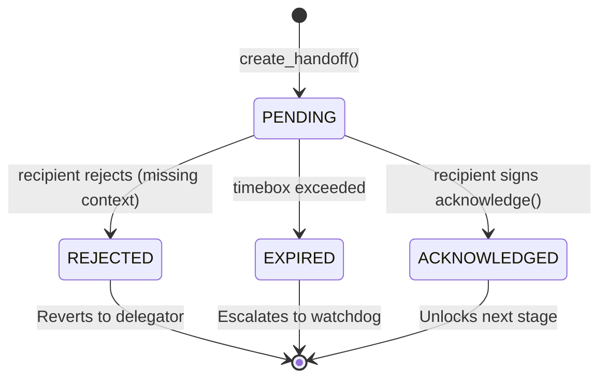
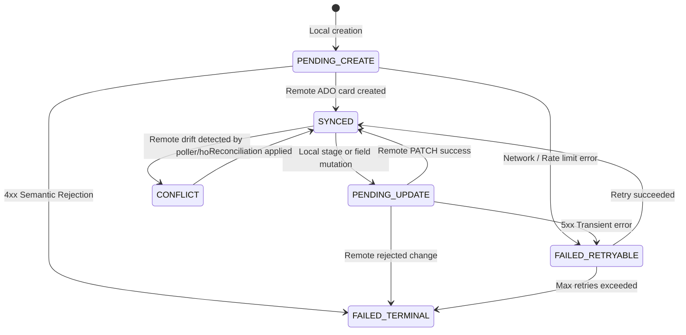

# R1 — CANONICAL DOMAIN CONTRACTS ARCHITECTURAL SPECIFICATION
## Enterprise Architecture Specification · Domain-Driven Design · Strict Contracts · Decoupled Delivery Plane

**Document ID:** `DOC-ARCH-R1-CANONICAL-CONTRACTS`  
**Milestone:** `R1 — CANONICAL DOMAIN CONTRACTS`  
**Stage:** `STAGE B — CANONICAL CONTRACT DESIGN`  
**Date:** 2026-09-18  
**Author / Lead:** `04-solution-architect` (Martin Fowler & Gregor Hohpe - Solution Architect & Enterprise Integration Lead)  
**Collaborators & Reviewers:**  
- `01-requirements-analyst` (Product Quality, Acceptance Criteria & Backlog Invariants)  
- `40-agile-coach` (Flow Governance, Sizing Limits & WIP Discipline)  
- `14-governance-auditor` (Segregation of Duties, Ledger Compliance & Gate Enforcement)  
**Status:** `APPROVED` (`R1_CONTRACT_DESIGN = APPROVED`)

---

## EXECUTIVE SUMMARY

The R0 audit (`docs/audits/R0_CORE_WORKFLOW_FAILURE_BASELINE.md`) demonstrated 34 critical architectural and runtime defects across Agent Squad: missing lifecycle stages, skipped design gates, unverified implementation transitions, unacknowledged handoffs, swallowed synchronization failures, naive routing fallbacks, and conflation between logical software products and organizational delivery containers.

This document establishes the **Canonical Domain Contracts** for Agent Squad. It defines a technology-agnostic, enterprise-grade domain model based on strict Bounded Contexts, Hexagonal Architecture (Ports and Adapters), and asynchronous Event-Driven Architecture (EDA). 

In accordance with strict architectural segregation:
- **Domain contracts sit at the absolute base** of the dependency hierarchy.
- Domain models rely **exclusively on the Python standard library** (`typing`, `dataclasses`, `enum`, `abc`, `datetime`, `uuid`, `hashlib`).
- Zero external runtime dependencies, zero web framework couplings, and zero provider-specific branching logic are permitted within the domain boundary.
- All subsequent milestones (`R2` through `R14`) must conform to and consume these contracts without redefinition or semantic drift.

---

## 1. SCOPE

### 1.1 Purpose & Mandate
The scope of `R1 — CANONICAL DOMAIN CONTRACTS` encompasses the formalization of all entities, value objects, domain events, lifecycle state machines, gate policies, receipt structures, and synchronization abstractions governing the Agent Squad delivery platform.

### 1.2 Architectural Boundaries
```
+-------------------------------------------------------------------------+
|                              HOST RUNTIME                               |
|        (Antigravity, Claude Desktop, Cursor, CLI, CI/CD Daemons)        |
+-------------------------------------------------------------------------+
                                    | uses
                                    v
+-------------------------------------------------------------------------+
|                           ORCHESTRATION & MCP                           |
|      (Continuous Engine, Assignment Resolver, Handoff Coordinator)      |
+-------------------------------------------------------------------------+
                    |                                   |
                    | depends on                        | depends on
                    v                                   v
+------------------------------------+ +----------------------------------+
|          DOMAIN SERVICES           | |         DELIVERY ADAPTERS        |
| (FSM, Gate Evaluator, SoD Guard,   | | (Azure DevOps REST, Local Mirror,|
|  Trigger Matcher, Outbox Dispatch) | |  Git Provider, Future Jira/GH)   |
+------------------------------------+ +----------------------------------+
                    |                                   |
                    | depends on                        | depends on
                    v                                   v
+-------------------------------------------------------------------------+
|                         CANONICAL DOMAIN LAYER                          |
|             (Entities, Value Objects, Enums, Domain Events,             |
|              Stage Policies, Gate Definitions, Receipts)                |
|               * ZERO EXTERNAL DEPENDENCIES (STDLIB ONLY) *              |
+-------------------------------------------------------------------------+
```

### 1.3 Strict Invariants
1. **Purity:** The domain layer has zero knowledge of transport mechanisms (HTTP, JSON-RPC, CLI flags), file storage layouts, or specific LLM prompt formats.
2. **Immutability:** Value objects, receipts, domain events, and policy decisions are immutable once created.
3. **Fail-Closed:** Missing parameters, unverified sessions, invalid stage prerequisites, and unacknowledged handoffs must halt execution deterministically. No silent fallbacks or permissive defaults are tolerated.

---

## 2. R0 PROBLEMS BEING RESOLVED AT CONTRACT LEVEL

The following matrix maps every defect identified in the R0 Core Workflow Failure Baseline (`docs/audits/R0_CORE_WORKFLOW_FAILURE_BASELINE.md`) to its canonical domain resolution in R1:

| Defect ID | R0 Identified Failure | Canonical Domain Contract Resolution in R1 | Primary Domain Concept |
|---|---|---|---|
| **R0-LIFE-001** | `discovery` stage missing from `cycles.yaml` FSM | Formalized `DISCOVERY` in 13-stage canonical lifecycle vocabulary | `CanonicalStage.DISCOVERY` |
| **R0-LIFE-002** | `G2-design` gate skipped; bypass to scaffolding | `G2-design` placed as mandatory exit gate for `ARCHITECTURE_DESIGN` | `GateId.G2_DESIGN` & `StagePolicy` |
| **R0-LIFE-003** | Gates evaluated out-of-order (e.g. G5 in blueprint) | `StagePolicy.required_gate` enforces stage-to-gate eligibility | `GateEligibilityInvariant` |
| **R0-LIFE-004** | Auto-advance triggered on `PENDING` handoff | Formal Handoff State Machine where `PENDING != ALLOW_TRANSITION` | `HandoffState.ACKNOWLEDGED` |
| **R0-LIFE-005** | `implementation` advances with zero execution proof | `StagePolicy` requires verified `ExecutionReceipt` prior to exit | `StagePolicy.required_receipt_types` |
| **R0-LIFE-006** | Code review lacks specialist execution proof | Formal `ReviewReceipt` generated and signed by independent reviewer | `ReviewReceipt` & `SoDInvariant` |
| **R0-LIFE-007** | Security review lacks specialist proof | Formal `SecurityReceipt` required from security role | `SecurityReceipt` |
| **R0-LIFE-008** | Test validation lacks test execution proof | Formal `TestReceipt` requiring automated test run evidence | `TestReceipt` |
| **R0-LIFE-009** | QA validation lacks user scenario proof | Formal `QAReceipt` requiring BDD verification | `QAReceipt` |
| **R0-LIFE-010** | Governance release lacks audit sign-off | Formal `GovernanceReceipt` enforcing immutable ledger closure | `GovernanceReceipt` |
| **R0-LIFE-011** | Continuous Engine is just an advance_state loop | Separation of `DomainEvent`, `TriggerPolicy`, and `ActivationPacket` | `DomainEvent` + `TriggerPolicy` |
| **R0-LIFE-012** | WIP limits declared in YAML but unenforced | Explicit `wip_policy_ref` and `WIPConstraint` in domain engine | `WIPPolicy` |
| **R0-LIFE-013** | Phase timeboxes declared but unenforced | Canonical `timebox_policy_ref` and `WatchdogFinding.TIMEBOX_EXPIRED` | `TimeboxPolicy` |
| **R0-LIFE-014** | `new-project` cycle unresolvable in mapping | Canonical `PROJECT_SETUP` work item kind with standard transition | `WorkItemKind.PROJECT_SETUP` |
| **R0-TEST-001** | Early `return` in E2E test masking G2-G6 failure | Test contract requires unbroken verification of all G1-G6 gates | `GateLifecycleContract` |
| **R0-TEST-002** | SDLC simulation does not advance state | Simulation contract bound to real domain FSM transitions | `LifecycleFSM` |
| **R0-TEST-003** | Green suite masks broken workflow invariants | Domain contracts include strict runtime invariants that fail-fast | `DomainInvariantViolation` |
| **R0-DEL-001** | Missing MCP session triggers mock fallback | Session contract requires fail-closed validation (`SessionNotFoundError`) | `SessionContract` |
| **R0-DEL-002** | MCP `preflight` returns hardcoded `allow` | `PreflightVerification` asserts physical paths, state, and permissions | `PreflightContract` |
| **R0-DEL-003** | Prompt compilation exceptions swallowed | `DelegationEnvelope` compilation errors propagate closed | `DelegationCompilationError` |
| **R0-DEL-004** | Delegation hash covers brief, not compiled prompt | `DelegationEnvelope.instruction_hash` cryptographically covers rendered prompt | `DelegationEnvelope` |
| **R0-DEL-005** | Ambiguous routing silently assigns software-eng | Routing contract requires `RoutingVerdict.NEEDS_ROUTING` or block | `RoutingVerdict` |
| **R0-DEL-006** | Skill selection truncated naively (`skills[:7]`) | Structured `SkillManifest` with token budgeting and semantic tagging | `SkillManifest` & `SkillBudget` |
| **R0-DEL-007** | Subagent lacks ancestor context in prompt | `WorkContext` mandates full ancestral hierarchy and specs aggregation | `WorkContext.ancestor_chain` |
| **R0-WORK-001** | `_legacy_type_for_id` rejects `FEATURE` & `STORY` | Canonical ID policy supports `FEATURE` & `STORY`, normalizing aliases | `WorkItemIdPolicy` |
| **R0-WORK-002** | Hierarchical work items flattened in flat dir | Logical parent-child binding decoupled from storage mirror | `WorkItemHierarchy` |
| **R0-WORK-003** | Task materializes `epic.md` and `product-goal.md`| BacklogPlan enforces level-specific artifact templates | `BacklogPlan.materialize` |
| **R0-WORK-004** | Competing backlog hierarchy definitions | Single canonical 4-tier model: `EPIC -> FEATURE -> STORY -> TASK` | `WorkItemHierarchyModel` |
| **R0-WORK-005** | QBC blocks distinct epics with identical prefix | QBC semantic evaluation compares intent/title/id, not prefix split | `QBCPolicy` |
| **R0-WORK-006** | Work items created without DoD or acceptance criteria | Domain entity validation rejects empty DoD or missing criteria | `WorkItemValidation` |
| **R0-ADO-001** | Project binding optional, allowing unbacked work | `ProjectBinding` mandatory for governed delivery cycles | `ProjectBinding` |
| **R0-ADO-002** | Product creation tries to create Azure Team Project | `ProjectBinding` decouples Product/Repo from ADO Team Project container | `ProjectBinding` vs `AdoBinding` |
| **R0-ADO-003** | Render prompt injects hardcoded tenant defaults | `AdoBinding` requires explicit configuration; zero hardcoded defaults | `AdoBinding` |
| **R0-ADO-004** | Weak work item creation payload in ADO | Rich `AdoSyncRequest` transferring full DoD, criteria, and relations | `AdoSyncRequest` |
| **R0-ADO-005** | ADO sync failure swallowed with `print(WARN)` | `SyncState` tracking (`FAILED_RETRYABLE`, `FAILED_TERMINAL`) with outbox | `SyncState` & `SyncOutbox` |
| **R0-ADO-006** | Items without `devops_id` advance without sync | Governed mode enforces bidirectional binding before terminal states | `GovernedSyncInvariant` |
| **R0-ADO-008** | Reverse sync from ADO completely absent | `ReconciliationDecision` contract defining inbound drift actions | `ReconciliationDecision` |
| **R0-EVT-001** | `EngineEvent` missing correlation and causation | Canonical `DomainEvent` with `source`, `correlation_id`, `causation_id` | `DomainEvent` |
| **R0-EVT-002** | Trigger registry missing; hardcoded callbacks | Declarative `TriggerPolicy` mapping event to `TriggerAction` & target | `TriggerPolicy` |
| **R0-EVT-010** | Events written to flat JSONL without ACID outbox | Transactional Outbox pattern with idempotency key deduplication | `EventOutbox` |
| **R0-WATCH-001** | Watchdog/Scheduler absent from runtime | Contracts for `SchedulePolicy` and `WatchdogFinding` | `SchedulePolicy` & `WatchdogFinding` |

---

## 3. BOUNDED-CONTEXT DIAGRAM (MERMAID)

The Agent Squad domain is partitioned into six cohesive Bounded Contexts, each possessing a clean boundary, distinct ubiquitous language, and explicit integration contracts.



---

## 4. DEPENDENCY DIRECTION & CLEAN ARCHITECTURE

### 4.1 Inversion of Control Principle
Domain contracts are **sovereign**. They do not import from, depend upon, or adjust to host runtimes, MCP servers, HTTP frameworks, or concrete databases.



### 4.2 Invariant Dependency Rules
1. `Domain Layer` contains no `import requests`, no `import pydantic`, no `import fastapi`, and no references to `antigravity`, `gemini`, or `claude`.
2. Adapters implement domain-defined abstract base classes (`Ports`).
3. If an external API changes, only the specific adapter is updated; domain contracts remain invariant.

---

## 5. TERMINOLOGY

To eradicate conceptual drift, the following canonical terms are strictly established across all systems, prompts, and codebases:

1. **HostRuntime:** The client-side execution platform hosting the interactive developer session (e.g., Antigravity IDE, Claude Desktop, Cursor, Codex CLI). The HostRuntime manages process execution, local workspaces, user interaction, and client-side tool routing.
2. **LLMProvider:** The external foundational intelligence provider (e.g., Google Gemini, Anthropic Claude, OpenAI). The LLMProvider is a stateless inference service producing completions and function calls; it possesses zero ownership of the SDLC process or governance rules.
3. **Agent:** A governed, specialized cognitive persona operating within the Squad (e.g., `00-delivery-orchestrator`, `04-solution-architect`, `06-software-engineer`, `09-code-reviewer`). An Agent is defined by its role specification, prompt template, skill manifest, cognitive contract, and Segregation of Duties (SoD) boundary.
4. **DeliveryBackend:** The enterprise system-of-record for project tracking and ALM (e.g., Azure DevOps Boards, Jira, GitHub Projects). It maintains external auditability and cross-functional team alignment.
5. **Project:** A discrete, version-controlled software product or codebase repository (e.g., `agent_squad`, `payment-gateway`). A Project is distinct from the DeliveryBackend organizational container.

---

## 6. AUTHORITY MATRIX

The Agent Squad architecture enforces strict separation between policy authority, durable control state, enterprise delivery records, and local temporary workspaces:

| Concern | Authoritative Component | Mechanism / Store | Invariant Rule |
|---|---|---|---|
| **Policy Authority** | Agent Squad Governance Engine | Code Contracts, `StagePolicy`, `GateEvaluator`, `SoDGuard` | Neither the HostRuntime, LLMProvider, nor external board can bypass a domain gate. |
| **Durable Control State** | Local Process Control Plane | SQLite Database (`%SQUAD_RUNTIME%/banco/squad.db`) & ACID Event Outbox | Control state is the single source of truth for execution stage, receipts, and handoffs. |
| **Delivery System of Record** | Enterprise ALM Backend | Azure DevOps Boards (or configured DeliveryBackend) | External board reflects governed state. Remote illegal transitions are blocked or flagged. |
| **Local Work Mirror** | Agent Squad Workspace Mirror | File Tree (`%SQUAD_RUNTIME%/work/<project_id>/<work_item_id>/`) | Local files are projection caches and working scratchpads; they hold zero independent authority over policy. |

---

## 7. WORK-ITEM MODEL

### 7.1 Entity Definition & Canonical Fields
Every unit of demand managed by the Squad must instantiate the canonical `WorkItem` entity:

```python
from dataclasses import dataclass, field
from datetime import datetime
from enum import Enum
from typing import Dict, List, Optional, Any

class WorkItemKind(str, Enum):
    EPIC = "EPIC"
    FEATURE = "FEATURE"
    STORY = "STORY"
    TASK = "TASK"
    # Operational specialized types
    BUG = "BUG"
    SPIKE = "SPIKE"
    INCIDENT = "INCIDENT"
    RELEASE = "RELEASE"
    PROJECT_SETUP = "PROJECT_SETUP"

class RiskTier(str, Enum):
    LOW = "LOW"
    MEDIUM = "MEDIUM"
    HIGH = "HIGH"
    CRITICAL = "CRITICAL"

class SyncStateKind(str, Enum):
    SYNCED = "SYNCED"
    PENDING_CREATE = "PENDING_CREATE"
    PENDING_UPDATE = "PENDING_UPDATE"
    PENDING_DELETE = "PENDING_DELETE"
    CONFLICT = "CONFLICT"
    FAILED_RETRYABLE = "FAILED_RETRYABLE"
    FAILED_TERMINAL = "FAILED_TERMINAL"

@dataclass(frozen=True)
class AcceptanceCriterion:
    id: str
    scenario: str
    given: str
    when: str
    then: str
    is_verified: bool = False

@dataclass
class WorkItem:
    work_item_id: str
    kind: WorkItemKind
    title: str
    description: str
    project_id: str
    stage: str                          # CanonicalStage value
    risk_tier: RiskTier
    definition_of_done: List[str]
    acceptance_criteria: List[AcceptanceCriterion]
    parent_id: Optional[str] = None
    story_points: Optional[int] = None
    delivery_backend_id: Optional[str] = None
    sync_state: SyncStateKind = SyncStateKind.PENDING_CREATE
    created_at: datetime = field(default_factory=datetime.utcnow)
    updated_at: datetime = field(default_factory=datetime.utcnow)
    metadata: Dict[str, Any] = field(default_factory=dict)
```

### 7.2 Invariants & Validation Rules
1. **Title & Description:** Must be non-empty strings. `title` minimum length is 5 characters; `description` minimum length is 20 characters.
2. **Acceptance Criteria & DoD:** Every `STORY`, `BUG`, or `FEATURE` must contain at least one verifiable `AcceptanceCriterion` and at least two non-empty `definition_of_done` statements before leaving `REQUIREMENTS_PRODUCT`.
3. **Sizing Invariant:** If `story_points` is assigned, it must be in the Fibonacci sequence $\{1, 2, 3, 5, 8\}$. Any work item with `story_points > 8` is **STRICTLY BLOCKED** from `PLANNING` and must be sliced vertically into smaller stories by `40-agile-coach`.
4. **Parentage Integrity:** 
   - `TASK` must have a valid `STORY` parent.
   - `STORY` must have a valid `FEATURE` parent.
   - `FEATURE` must have a valid `EPIC` parent.
   - `EPIC` has no parent (`parent_id is None`).

---

## 8. WORK-ITEM ID POLICY

### 8.1 Canonical ID Grammar
Identifiers must conform to strict deterministic naming schemes:
- **Epic:** `^EPIC-\d{3,}$` (e.g., `EPIC-001`, `EPIC-1042`)
- **Feature:** `^FEATURE-\d{3,}$` (e.g., `FEATURE-001`, `FEATURE-042`)
- **Story:** `^STORY-\d{3,}$` (e.g., `STORY-001`, `STORY-509`)
- **Task:** `^TASK-\d{4,}$` (e.g., `TASK-0001`, `TASK-0128`)
- **Operational:** `^(BUG|SPIKE|INCIDENT|RELEASE|SETUP)-\d{3,}$`

### 8.2 Legacy Alias Normalization
To guarantee 100% backwards compatibility with historical scripts and CLI invocations while eradicating internal ambiguity:
- Inbound identifier with prefix `FEAT-` is deterministically normalized to `FEATURE-`.
- Inbound identifier with prefix `US-` is deterministically normalized to `STORY-`.
- Inbound identifier with prefix `TK-` is deterministically normalized to `TASK-`.
- The domain entity storage and all external API synchronizations operate **exclusively on canonical IDs**.

---

## 9. HIERARCHY & PARENT-CHILD INTEGRITY

### 9.1 Four-Layer Backlog Hierarchy
```
+-------------------------------------------------------------+
|                     EPIC (Portfolio Goal)                   |
|                      ID: EPIC-001                           |
+-------------------------------------------------------------+
                              | 1:N
                              v
+-------------------------------------------------------------+
|                 FEATURE (Architecture / Capability)         |
|                      ID: FEATURE-001                        |
+-------------------------------------------------------------+
                              | 1:N
                              v
+-------------------------------------------------------------+
|                  STORY (User Value / PBI <= 8 SP)           |
|                      ID: STORY-001                          |
+-------------------------------------------------------------+
                              | 1:N
                              v
+-------------------------------------------------------------+
|                  TASK (Technical Work Package)              |
|                      ID: TASK-0001                          |
+-------------------------------------------------------------+
```

### 9.2 Operational Item Placement
- `BUG`: Child of `STORY` (if discovered during development) or `FEATURE` (if reported in production).
- `SPIKE`: Child of `FEATURE` or `EPIC` (timeboxed research package, max timebox 2 days).
- `INCIDENT`: Standalone emergency item, linked to affected `FEATURE` or `PROJECT`.
- `RELEASE`: Portfolio governance container grouping multiple validated `FEATURE`s.
- `PROJECT_SETUP`: Root-level bootstrap container for repository and tooling initialization.

---

## 10. BACKLOG PLAN & MATERIALIZATION

### 10.1 BacklogPlan State Machine
A `BacklogPlan` represents a proposed breakdown of work before it is committed to physical storage or external boards.



### 10.2 Materialization Invariants
1. **No Speculative Materialization:** Physical directories, `status.yaml` files, and external ADO cards are **never** created while a plan is in `DRAFT` or `VALIDATED`.
2. **Level-Specific Artifact Scaffolding:**
   - `EPIC`: Materializes `epic.md`, `product-goal.md`, `architecture-vision.md`.
   - `FEATURE`: Materializes `feature-spec.md`, `component-design.md`.
   - `STORY`: Materializes `user-story.md`, `acceptance-criteria.md`.
   - `TASK`: Materializes `task-scope.md` and technical implementation checklists.
   - **CRITICAL:** A `TASK` must **NEVER** materialize `epic.md` or `product-goal.md` (resolving R0-WORK-003).

---

## 11. LIFECYCLE VOCABULARY

The Agent Squad defines exactly **thirteen (13) canonical stages**. No stage may be renamed, bypassed, or aliased in runtime execution:

```
[1. INTAKE]
     |
     v
[2. DISCOVERY]
     |
     v
[3. REQUIREMENTS_PRODUCT]  --> [GATE G1-product]
     |
     v
[4. PLANNING]
     |
     v
[5. ARCHITECTURE_DESIGN]   --> [GATE G2-design]
     |
     v
[6. READINESS_SCAFFOLDING] --> [GATE G3-readiness]
     |
     v
[7. IMPLEMENTATION]
     |
     v
[8. CODE_REVIEW]
     |
     v
[9. SECURITY_REVIEW]       --> [GATE G4-code-security]
     |
     v
[10. TEST_VALIDATION]
     |
     v
[11. QA_VALIDATION]        --> [GATE G5-quality]
     |
     v
[12. GOVERNANCE_RELEASE]   --> [GATE G6-governance-release]
     |
     v
[13. DONE]
```

### Stage Descriptions:
1. `INTAKE`: Raw capture of request, bug report, or architectural proposal.
2. `DISCOVERY`: Problem-space exploration, stakeholder interviews, technical spikes, feasibility research (resolving R0-LIFE-001).
3. `REQUIREMENTS_PRODUCT`: User story specification, Gherkin acceptance criteria, definition of done formulation.
4. `PLANNING`: Backlog slicing, sprint assignment, capacity check, Kanban column WIP validation.
5. `ARCHITECTURE_DESIGN`: Component design, C4 models, threat analysis, domain contract specification.
6. `READINESS_SCAFFOLDING`: Test harness preparation, dependency verification, mock scaffolding.
7. `IMPLEMENTATION`: Test-Driven Development (TDD), production code implementation, unit tests passing.
8. `CODE_REVIEW`: Independent static analysis, peer review, readability, maintainability, architectural conformance.
9. `SECURITY_REVIEW`: Vulnerability scan (SAST/DAST), secret leakage analysis, dependency CVE review, SoD audit.
10. `TEST_VALIDATION`: Automated integration tests, regression test suites, performance benchmarks.
11. `QA_VALIDATION`: BDD acceptance scenario execution, end-to-end user journeys, visual/functional verification.
12. `GOVERNANCE_RELEASE`: Compliance ledger signing, deployment plan validation, change approval board sign-off.
13. `DONE`: Work item successfully delivered, verified, synchronized with remote delivery backend, and archived.

---

## 12. STAGE POLICY CONTRACT

Each canonical stage is governed by a declarative `StagePolicy` defining immutable rules for entry, execution, and exit:

```python
@dataclass(frozen=True)
class StagePolicy:
    stage: str                          # CanonicalStage
    owner_role: str                     # Primary responsible agent ID
    collaborator_roles: List[str]       # Authorized assisting agent IDs
    required_receipt_types: List[str]   # Receipts mandatory for exit
    required_artifacts: List[str]       # File patterns required
    required_evidence: List[str]        # Structural evidence required
    handoff_required: bool              # Must emit handoff upon exit
    ack_required: bool                  # Target must ACK handoff before next stage
    required_gate: Optional[str]        # Gate required to cross stage boundary
    allowed_next_stages: List[str]      # Valid transition targets
    wip_policy_ref: str                 # Reference to WIP limit rule
    timebox_policy_ref: str             # Reference to maximum duration rule
    trigger_refs: List[str]             # Events triggered on entry/exit
```

### Policy Specification Table:

| Stage | Owner Role | Collaborators | Required Receipts | Required Gate | Allowed Next Stages |
|---|---|---|---|---|---|
| `INTAKE` | `00-delivery-orchestrator` | `01-analyst` | None | None | `DISCOVERY` |
| `DISCOVERY` | `01-requirements-analyst` | `04-architect`, `40-coach` | `DiscoveryReceipt` | None | `REQUIREMENTS_PRODUCT` |
| `REQUIREMENTS_PRODUCT` | `01-requirements-analyst` | `40-coach`, `14-auditor` | `RequirementsReceipt` | `G1-product` | `PLANNING` |
| `PLANNING` | `40-agile-coach` | `00-orchestrator` | `BacklogPlanReceipt` | None | `ARCHITECTURE_DESIGN` |
| `ARCHITECTURE_DESIGN` | `04-solution-architect` | `10-security`, `27-platform`| `ArchitectureReceipt` | `G2-design` | `READINESS_SCAFFOLDING` |
| `READINESS_SCAFFOLDING` | `27-platform-engineer` | `06-engineer`, `11-tester` | `ScaffoldingReceipt` | `G3-readiness` | `IMPLEMENTATION` |
| `IMPLEMENTATION` | `06-software-engineer` | `07-frontend`, `08-backend`| `ExecutionReceipt` | None | `CODE_REVIEW` |
| `CODE_REVIEW` | `09-code-reviewer` | None (SoD strictly enforced)| `ReviewReceipt` | None | `SECURITY_REVIEW`, `IMPLEMENTATION` |
| `SECURITY_REVIEW` | `10-security-specialist` | `14-auditor` | `SecurityReceipt` | `G4-code-security` | `TEST_VALIDATION`, `IMPLEMENTATION` |
| `TEST_VALIDATION` | `11-test-engineer` | None | `TestReceipt` | None | `QA_VALIDATION`, `IMPLEMENTATION` |
| `QA_VALIDATION` | `12-qa-engineer` | `01-analyst` | `QAReceipt` | `G5-quality` | `GOVERNANCE_RELEASE`, `IMPLEMENTATION` |
| `GOVERNANCE_RELEASE` | `14-governance-auditor` | `00-orchestrator` | `GovernanceReceipt` | `G6-governance-release` | `DONE` |
| `DONE` | `00-delivery-orchestrator` | None | None | None | None (Terminal) |

---

## 13. GATE MAPPING & ALIGNMENT

Gates represent hard, non-negotiable governance checkpoints. They are placed at specific stage boundaries and evaluated by designated authorities:

```mermaid
flowchart LR
    subgraph S_REQ["REQUIREMENTS_PRODUCT"]
        R_BODY["User Stories, DoD, Acceptance Criteria"]
    end
    subgraph G_G1["GATE G1-product"]
        V_G1["Product Owner Clearance\nValue & Scope Validated"]
    end
    subgraph S_PLAN["PLANNING"]
        P_BODY["Slicing, Sizing <= 8SP, WIP Checks"]
    end
    subgraph S_ARCH["ARCHITECTURE_DESIGN"]
        A_BODY["C4 Design, Contract Specs, Threat Analysis"]
    end
    subgraph G_G2["GATE G2-design"]
        V_G2["Solution Architect Clearance\nPatterns & Interfaces Validated"]
    end
    subgraph S_SCAF["READINESS_SCAFFOLDING"]
        SC_BODY["Harness, Mocks, Tooling Ready"]
    end
    subgraph G_G3["GATE G3-readiness"]
        V_G3["Platform/DevOps Clearance\nEnvironment & Pipeline Ready"]
    end
    subgraph S_IMPL["IMPLEMENTATION"]
        I_BODY["TDD Green, Diffs Produced"]
    end
    subgraph S_REV["CODE_REVIEW & SECURITY_REVIEW"]
        SEC_BODY["Peer Review & Sec Scans Clean"]
    end
    subgraph G_G4["GATE G4-code-security"]
        V_G4["Reviewer & Security Clearance\nSoD Verified, Zero Vulns"]
    end
    subgraph S_TEST["TEST_VALIDATION & QA_VALIDATION"]
        T_BODY["E2E Tests Green, Scenarios Proven"]
    end
    subgraph G_G5["GATE G5-quality"]
        V_G5["QA & Test Clearance\nZero Regressions, DoD Satisfied"]
    end
    subgraph S_GOV["GOVERNANCE_RELEASE"]
        GV_BODY["Ledger Signed, Audit Sealed"]
    end
    subgraph G_G6["GATE G6-governance-release"]
        V_G6["Governance Auditor Clearance\nRegulatory & Release Approval"]
    end
    subgraph S_DONE["DONE"]
        D_BODY["Closed & Synced to ADO"]
    end

    S_REQ --> G_G1 --> S_PLAN
    S_PLAN --> S_ARCH
    S_ARCH --> G_G2 --> S_SCAF
    S_SCAF --> G_G3 --> S_IMPL
    S_IMPL --> S_REV
    S_REV --> G_G4 --> S_TEST
    S_TEST --> G_G5 --> S_GOV
    S_GOV --> G_G6 --> S_DONE
```



### Gate Invariants:
1. **No Out-of-Order Evaluation:** A gate cannot be evaluated unless the work item currently resides in the stage preceding that gate (resolving R0-LIFE-003).
2. **No Skipping:** Transitioning to the next stage without an `APPROVED` gate decision in the control plane raises `GatePrerequisiteViolation`.
3. **No Self-Approval:** The agent authoring the deliverables of a stage cannot act as the sole evaluator of the exiting gate.

---

## 14. EVENT MODEL & PERSISTENT OUTBOX

### 14.1 Canonical DomainEvent
Every state mutation within the Agent Squad emits an immutable, structured `DomainEvent`:

```python
@dataclass(frozen=True)
class DomainEvent:
    event_id: str                       # UUIDv4
    event_type: str                     # e.g., "squad.stage.transitioned"
    work_item_id: str                   # Target work item
    project_id: str                     # Associated project
    source: str                         # Emitting component / role (e.g. "agent:06")
    correlation_id: str                 # Trace correlation across async chains
    causation_id: str                   # Preceding event or command ID
    idempotency_key: str                # SHA-256 deduplication key
    timestamp: datetime                 # UTC creation timestamp
    payload: Dict[str, Any]             # Event data payload
```

### 14.2 Canonical Event Catalogue
- `squad.work_item.created`
- `squad.stage.transition_requested`
- `squad.stage.transitioned`
- `squad.stage.transition_blocked`
- `squad.gate.evaluated`
- `squad.handoff.created`
- `squad.handoff.acknowledged`
- `squad.handoff.rejected`
- `squad.receipt.recorded`
- `squad.sync.requested`
- `squad.sync.completed`
- `squad.sync.failed`
- `squad.watchdog.breach_detected`

### 14.3 Transactional Outbox Pattern
To eliminate silent event loss and state divergence (resolving R0-EVT-010):
1. State mutations and outbox event insertions occur within the **same atomic database transaction**.
2. An asynchronous dispatcher reads unconsumed events from the outbox table, dispatches them to triggers, and marks them `PUBLISHED`.
3. Consumers acknowledge events using `idempotency_key` deduplication.

---

## 15. TRIGGER MODEL & ACTION VOCABULARY

### 15.1 Declarative TriggerPolicy
Triggers map domain events to automated actions without hardcoding callbacks inside domain entities:

```python
class TriggerActionKind(str, Enum):
    ACTIVATE_AGENT = "ACTIVATE_AGENT"
    EVALUATE_GATE = "EVALUATE_GATE"
    ADVANCE_STAGE = "ADVANCE_STAGE"
    REQUEST_HANDOFF_ACK = "REQUEST_HANDOFF_ACK"
    DISPATCH_EXTERNAL_SYNC = "DISPATCH_EXTERNAL_SYNC"
    ESCALATE_ALERT = "ESCALATE_ALERT"
    SCHEDULE_RETRY = "SCHEDULE_RETRY"

@dataclass(frozen=True)
class TriggerPolicy:
    trigger_id: str
    event_type: str
    condition_expression: str           # Deterministic predicate string
    action_kind: TriggerActionKind
    target_role: Optional[str]          # Specialist agent role
    payload_mapping: Dict[str, str]
```

### 15.2 Invariant Trigger Rules
1. Triggers are **reactive**; they cannot directly mutate entity state without passing through domain application services.
2. An event emission never directly mutates the FSM (resolving R0-LIFE-004 and R0-LIFE-011); it triggers an action request that validates all prerequisites.

---

## 16. PROJECT BINDING

### 16.1 Decoupled Project Representation
A `ProjectBinding` uniquely identifies the local repository and connects it to the configured delivery infrastructure:

```python
class DeliveryBackendKind(str, Enum):
    AZURE_DEVOPS = "AZURE_DEVOPS"
    LOCAL_ONLY = "LOCAL_ONLY"
    MOCK = "MOCK"

@dataclass(frozen=True)
class ProjectBinding:
    project_id: str                     # Unique canonical ID (e.g. "agent_squad")
    project_root: str                   # Absolute filesystem path
    display_name: str                   # Human readable name
    delivery_backend_kind: DeliveryBackendKind
    delivery_binding_ref: str           # Key referencing specific provider config
    is_governed: bool = True            # Governed vs local-only exploration
```

---

## 17. AZURE DEVOPS BINDING (`AdoBinding`)

### 17.1 Explicit Configuration Model
To resolve R0-ADO-002 and R0-ADO-003, the `AdoBinding` explicitly defines the Azure DevOps organizational hierarchy without hardcoded tenant defaults:

```python
@dataclass(frozen=True)
class AdoBinding:
    organization_url: str               # e.g., "https://dev.azure.com/my-org"
    team_project: str                   # Existing ADO Team Project container
    area_path: str                      # e.g., "MyTeamProject\\ProductTeam"
    iteration_path: str                 # e.g., "MyTeamProject\\Sprint 42"
    assigned_team: str                  # Target team name
    repository_name: Optional[str] = None
    service_hook_secret: Optional[str] = None
```

### 17.2 Anti-Contamination Invariant
The domain rejects any configuration that falls back to hardcoded internal values (`cbvgas`, `Arthemis`, `Deepvision`). If `AdoBinding` fields are missing, the runtime raises `MissingConfigurationError` rather than polluting target projects with foreign organizational constants.

---

## 18. ASSIGNMENT & WORK CONTEXT

### 18.1 Assignment Contract
```python
class AssignmentStatus(str, Enum):
    ASSIGNED = "ASSIGNED"
    ACTIVE = "ACTIVE"
    COMPLETED = "COMPLETED"
    REVOKED = "REVOKED"

@dataclass(frozen=True)
class Assignment:
    assignment_id: str
    work_item_id: str
    agent_id: str
    assigned_role: str
    stage: str
    status: AssignmentStatus
    assigned_at: datetime
```

### 18.2 Comprehensive WorkContext (Resolving R0-DEL-007)
Subagents dispatched to execute tasks must receive complete ancestral context:

```python
@dataclass(frozen=True)
class AncestorSnapshot:
    work_item_id: str
    kind: WorkItemKind
    title: str
    stage: str
    spec_summary: str

@dataclass(frozen=True)
class WorkContext:
    work_item_id: str
    project_id: str
    current_stage: str
    title: str
    description: str
    definition_of_done: List[str]
    acceptance_criteria: List[AcceptanceCriterion]
    ancestors: List[AncestorSnapshot]   # Parent Story, Feature, Epic summaries
    ancestor_artifacts: Dict[str, str]  # Path -> Content mapping for parent specs
    active_receipts: List[str]          # IDs of previously verified receipts
    filesystem_scope: List[str]         # Permitted modification paths
```

---

## 19. ACTIVATION PACKET

The `ActivationPacket` is the immutable data package prepared by the orchestrator and delivered to the HostRuntime to execute a subagent:

```python
@dataclass(frozen=True)
class ActivationPacket:
    session_id: str
    agent_id: str
    role_name: str
    work_item_id: str
    work_context: WorkContext
    skill_manifest: Dict[str, Any]
    compiled_instruction: str           # The fully rendered specialist prompt
    instruction_hash: str               # SHA-256 of compiled_instruction
    created_at: datetime
```

---

## 20. DELEGATION ENVELOPE (AUTHORITATIVE PAYLOAD)

### 20.1 Deterministic Hashing Contract
To resolve R0-DEL-003 and R0-DEL-004, the `DelegationEnvelope` enforces that:
1. `compiled_instruction` is the **authoritative payload**.
2. If prompt compilation encounters any error, it **fails closed** (`DelegationCompilationError`); swallowing exceptions is strictly forbidden.
3. `instruction_hash` is computed as:
   $$\text{instruction\_hash} = \text{SHA-256}(\text{compiled\_instruction.encode('utf-8')})$$

```python
import hashlib

@dataclass(frozen=True)
class DelegationEnvelope:
    delegation_id: str
    sender_role: str                    # e.g., "00-delivery-orchestrator"
    target_role: str                    # e.g., "06-software-engineer"
    work_item_id: str
    scope_summary: str
    action_requested: str
    compiled_instruction: str
    instruction_hash: str

    @classmethod
    def create(cls, delegation_id: str, sender_role: str, target_role: str,
               work_item_id: str, scope_summary: str, action_requested: str,
               compiled_instruction: str) -> 'DelegationEnvelope':
        if not compiled_instruction or not compiled_instruction.strip():
            raise ValueError("compiled_instruction must not be empty")
        computed_hash = hashlib.sha256(compiled_instruction.encode("utf-8")).hexdigest()
        return cls(
            delegation_id=delegation_id,
            sender_role=sender_role,
            target_role=target_role,
            work_item_id=work_item_id,
            scope_summary=scope_summary,
            action_requested=action_requested,
            compiled_instruction=compiled_instruction,
            instruction_hash=computed_hash
        )
```

---

## 21. HOST CAPABILITIES (CAPABILITY-BASED DISPATCH)

### 21.1 Canonical Capability Flags
The domain model abstracts HostRuntime differences via feature capabilities, prohibiting string-based product branching:

```python
@dataclass(frozen=True)
class HostCapabilities:
    has_subagent_dispatch: bool         # Can invoke nested agents
    has_filesystem_write: bool          # Can create/edit files
    has_terminal_execution: bool        # Can execute shell commands
    has_mcp_client: bool                # Supports MCP protocol
    has_background_tasks: bool          # Supports async background daemons
    max_token_context: int              # Host context window budget
```

Domain components query `host_capabilities.has_subagent_dispatch` rather than `if host == 'antigravity'`.

---

## 22. RECEIPTS ARCHITECTURE

Receipts are immutable, cryptographically hashed evidence records attesting that a specialist agent performed required work:

```python
@dataclass(frozen=True)
class BaseReceipt:
    receipt_id: str
    receipt_type: str
    work_item_id: str
    agent_id: str
    instruction_hash: str               # Links to DelegationEnvelope
    created_at: datetime
    evidence_hash: str                  # SHA-256 of evidence payload

@dataclass(frozen=True)
class ExecutionReceipt(BaseReceipt):
    files_modified: List[str]
    tests_executed: List[str]
    test_exit_code: int
    diff_summary: str

@dataclass(frozen=True)
class ReviewReceipt(BaseReceipt):
    reviewer_role: str
    verdict: str                        # "APPROVED", "CHANGES_REQUESTED"
    comments: List[str]
    reviewed_files: List[str]

@dataclass(frozen=True)
class SecurityReceipt(BaseReceipt):
    security_role: str
    vulnerabilities_detected: int
    critical_count: int
    sast_tool_output: str
    verdict: str

@dataclass(frozen=True)
class TestReceipt(BaseReceipt):
    tester_role: str
    total_tests: int
    passed_tests: int
    failed_tests: int
    coverage_percentage: float

@dataclass(frozen=True)
class QAReceipt(BaseReceipt):
    qa_role: str
    scenarios_verified: int
    bdd_exit_code: int
    verdict: str

@dataclass(frozen=True)
class GovernanceReceipt(BaseReceipt):
    auditor_role: str
    gate_approvals: List[str]
    ledger_entry_id: str
    compliance_verdict: str
```

---

## 23. SEPARATION OF DUTIES (SoD) & NON-REPUDIATION

### 23.1 SoD Rules
1. **Self-Review Prohibition:** The `agent_id` of the author of an `ExecutionReceipt` **CANNOT** match the `agent_id` of the `ReviewReceipt` or `SecurityReceipt` for that work item:
   $$\text{ExecutionReceipt.agent\_id} \neq \text{ReviewReceipt.agent\_id}$$
2. **Self-Validation Prohibition:** An implementer cannot sign a `TestReceipt` or `QAReceipt` for their own work item when `risk_tier >= MEDIUM`.
3. **No False Cryptographic Claims:** Receipts record SHA-256 hashes of deliverables and validated execution outputs. They do not claim asymmetric PKI signatures unless a real cryptographic key store is configured.

---

## 24. HANDOFF & ACKNOWLEDGEMENT STATE MACHINE

### 24.1 Handoff State Transitions
Handoffs manage the formal transfer of work between specialists.



### 24.2 Critical Invariant (Resolving R0-LIFE-004)
$$\text{handoff.status} == \text{PENDING} \implies \text{TRANSITION\_BLOCKED}$$
The Lifecycle Engine strictly prohibits stage advancement while any outbound handoff remains in `PENDING` status. Only `ACKNOWLEDGED` clears the gate.

---

## 25. SYNC STATE MACHINE

Each `WorkItem` maintains a canonical `SyncState` reflecting its synchronization status with the DeliveryBackend:



---

## 26. RECONCILIATION ENGINE CONTRACTS

When drift occurs between the Local Control Plane and the Remote DeliveryBackend, the `ReconciliationEngine` evaluates drift and produces a deterministic `ReconciliationDecision`:

```python
class ReconciliationAction(str, Enum):
    NOOP = "NOOP"
    APPLY_LOCAL_TO_REMOTE = "APPLY_LOCAL_TO_REMOTE"
    APPLY_REMOTE_TO_LOCAL = "APPLY_REMOTE_TO_LOCAL"
    BLOCK_ILLEGAL_REMOTE_TRANSITION = "BLOCK_ILLEGAL_REMOTE_TRANSITION"
    CONFLICT_REQUIRES_RESOLUTION = "CONFLICT_REQUIRES_RESOLUTION"

@dataclass(frozen=True)
class ReconciliationDecision:
    work_item_id: str
    action: ReconciliationAction
    reason: str
    local_state: str
    remote_state: str
    detected_at: datetime
```

**Rule on Remote Transitions:** If a human moves a card to "Done" in Azure DevOps but internal Gate G6 and GovernanceReceipt are missing, the decision is `BLOCK_ILLEGAL_REMOTE_TRANSITION`, reverting the card or opening an emergency incident.

---

## 27. SCHEDULER & WATCHDOG VOCABULARY

### 27.1 SchedulePolicy
Defines background recurring maintenance jobs:

```python
@dataclass(frozen=True)
class SchedulePolicy:
    policy_id: str
    cron_expression: str               # e.g., "*/5 * * * *"
    action_type: str                   # e.g., "RECONCILE_OUTBOX"
    timeout_seconds: int = 30
```

### 27.2 WatchdogFinding
Represents anomalies detected by the continuous background monitor:

```python
class FindingKind(str, Enum):
    STALE_LIFECYCLE = "STALE_LIFECYCLE"
    HANDOFF_AWAITING_ACK = "HANDOFF_AWAITING_ACK"
    PENDING_SYNC_OVERDUE = "PENDING_SYNC_OVERDUE"
    WIP_LIMIT_BREACH = "WIP_LIMIT_BREACH"
    TIMEBOX_EXPIRED = "TIMEBOX_EXPIRED"
    UNPROCESSED_EVENT_SPIKE = "UNPROCESSED_EVENT_SPIKE"

class FindingSeverity(str, Enum):
    INFO = "INFO"
    WARNING = "WARNING"
    CRITICAL = "CRITICAL"

@dataclass(frozen=True)
class WatchdogFinding:
    finding_id: str
    kind: FindingKind
    severity: FindingSeverity
    work_item_id: Optional[str]
    description: str
    recommended_action: str
    detected_at: datetime
```

---

## 28. LEGACY COMPATIBILITY MATRIX

Existing project structures and configurations migrate cleanly to canonical contracts:

| Legacy Source | Canonical Domain Contract in R1 | Migration Mapping |
|---|---|---|
| `work/<project>/<ID>/status.yaml` | `WorkItem` entity in SQLite Control Plane | Fields `state`, `kind`, `devops_id` hydrate `WorkItem`. Status.yaml becomes a projected read-only mirror. |
| `config/cycles.yaml` | `CanonicalStage` & `StagePolicy` | Cycle state lists map to the 13 canonical stages; legacy aliases normalized. |
| `config/workflow.yaml` | `WIPPolicy`, `TimeboxPolicy`, `StagePolicy` | Gate definitions and WIP limits migrate into executable domain policies. |
| `gate-decisions/*.yaml` | `BaseReceipt` & `GateEvaluation` in DB | Static YAML text files migrate to structured immutable receipt entities. |
| `events.jsonl` | `DomainEvent` in ACID Event Outbox | Flat append-only text file replaced by transactional SQLite outbox with JSONL export for debugging. |
| `_legacy_type_for_id()` | `WorkItemIdPolicy` | Hardcoded `FEAT/US` checks replaced by canonical regex grammar with legacy alias normalization. |

---

## 29. FUTURE PHASE OWNERSHIP (R2 TO R14)

The canonical domain contracts established in R1 govern all subsequent implementation phases:

| Milestone | Scope & Responsibility | Consumed R1 Contracts |
|---|---|---|
| **R2** | Event & Trigger Engine | `DomainEvent`, `TriggerPolicy`, `TriggerActionKind`, `EventOutbox` |
| **R3** | Work Item Model & Storage | `WorkItem`, `WorkItemKind`, `WorkItemIdPolicy`, `AcceptanceCriterion` |
| **R4** | Mandatory Lifecycle Engine & Gates | `CanonicalStage`, `StagePolicy`, `GateId`, `GateInvariants` |
| **R5** | Project & Delivery Binding | `ProjectBinding`, `AdoBinding`, `DeliveryBackendKind` |
| **R6** | Azure DevOps Workflow & Sync | `SyncStateKind`, `AdoSyncRequest`, `ReconciliationDecision` |
| **R7** | Backlog, Sizing & QBC Materialization | `BacklogPlan`, `QBCPolicy`, Sizing Invariants ($SP \le 8$) |
| **R8** | Stage-Aware Routing Engine | `RoutingVerdict`, `StagePolicy.owner_role`, Specialist Taxonomy |
| **R9** | Work Context, Skills & Activation | `WorkContext`, `ActivationPacket`, `SkillManifest`, `SkillBudget` |
| **R10** | MCP Server, Sessions & Delegation | `DelegationEnvelope`, `PreflightVerification`, `SessionContract` |
| **R11** | Host Adapters & Capability Matrix | `HostCapabilities`, Capability-based dispatch interfaces |
| **R12** | Specialist Execution, Review, Test & QA | `ExecutionReceipt`, `ReviewReceipt`, `SecurityReceipt`, `TestReceipt`, `QAReceipt`, SoD Engine |
| **R13** | Watchdog, Scheduler & Outbox | `SchedulePolicy`, `WatchdogFinding`, `SyncOutboxReconciliation` |
| **R14** | Real Generic End-to-End SDLC Validation | Full integrated lifecycle validation (G1 to G6) with real assertions |

---

## 30. EXPLICIT NON-GOALS

To maintain absolute architectural focus and avoid scope creep:
1. **Zero Python Code in Stage B:** This document is an architectural specification. Writing domain Python files in `scripts/domain/` belongs exclusively to Stage C.
2. **Zero JSON Schema Files in Stage B:** Schema definitions belong exclusively to Stage D.
3. **No External Microservices:** Agent Squad remains a lightweight, portable CLI/MCP agentic control plane; domain contracts will not introduce external message brokers (Kafka, RabbitMQ) or distributed consensus clusters.
4. **No Custom ALM Platform:** Agent Squad does not replace Azure DevOps or Jira; it governs agentic workflows and synchronizes bi-directionally with existing enterprise ALM platforms.
5. **No Heavy External Dependencies:** Pure Python standard library typing and dataclasses are used for all domain model implementations; no Pydantic v2 or SQLAlchemy dependencies inside the domain boundary.

---

## 31. ARCHITECTURAL SELF-CHECK (SECTION 51)

Formal answers to the 14 mandatory architectural integrity questions:

### 1. Is there one canonical term for every core concept?
**YES.** Every core concept has exactly one canonical term: `HostRuntime`, `LLMProvider`, `Agent`, `DeliveryBackend`, `Project`, `WorkItem`, `StagePolicy`, `DomainEvent`, `DelegationEnvelope`, `Receipt`, and `SyncState`. Synonyms and aliases are strictly normalized at boundaries.

### 2. Is any concept represented by two competing models?
**NO.** Competing models identified in R0 (e.g., flat directories vs hierarchy, FEAT vs FEATURE, state_to_gate vs workflow.yaml) have been eliminated. There is one unified 4-tier hierarchy model, one 13-stage lifecycle vocabulary, and one receipt verification engine.

### 3. Does any contract contain provider-specific workflow?
**NO.** Zero provider-specific workflows exist. Models make no distinction between Anthropic, OpenAI, or Google Gemini. All interactions occur via uniform capability and delegation contracts.

### 4. Does any contract contain project-specific defaults?
**NO.** All project-specific hardcoded values (`cbvgas`, `Arthemis`, `Deepvision`) have been expunged. Configurations must be explicitly supplied via `ProjectBinding` and `AdoBinding`.

### 5. Are policy authority and delivery system-of-record distinguished?
**YES.** The Authority Matrix (Section 6) explicitly separates Policy Authority (Agent Squad Governance Engine), Durable Control State (SQLite Outbox), Delivery System of Record (Azure DevOps), and Local Work Mirror (filesystem cache).

### 6. Can every R0 defect be assigned to a domain concept?
**YES.** All 34 R0 defects are explicitly mapped to canonical domain contracts in Section 2, ensuring zero unaddressed failure modes.

### 7. Is lifecycle distinct from routing?
**YES.** Lifecycle (`CanonicalStage`, `StagePolicy`, FSM transitions) governs process progression. Routing (`Stage-Aware Routing Engine`) determines which specialized agent is dispatched to fulfill a stage's obligations.

### 8. Is routing distinct from host dispatch?
**YES.** Routing selects the candidate specialist persona (`06-software-engineer`). Host dispatch prepares the `ActivationPacket` and executes it via the `HostCapabilities` adapter.

### 9. Is work hierarchy distinct from lifecycle?
**YES.** Work hierarchy (`EPIC -> FEATURE -> STORY -> TASK`) defines decomposition of scope. Lifecycle defines the 13 sequential governance stages through which any individual work item progresses.

### 10. Are events distinct from triggers/actions?
**YES.** A `DomainEvent` is a fact that occurred in the past. A `TriggerPolicy` evaluates events reactively and requests a `TriggerAction` via the application layer.

### 11. Are receipts distinct from artifacts?
**YES.** Artifacts are human-readable documents or code files (`feature-spec.md`, `payment.py`). Receipts are structured, immutable data records attesting that a specific agent performed verification with deterministic execution evidence.

### 12. Is external sync distinct from lifecycle legality?
**YES.** Lifecycle legality is determined solely by domain policies and gate decisions. `SyncState` tracks whether the external delivery backend has caught up with the legal local state. Remote systems cannot legalize an invalid local transition.

### 13. Is local mirror explicitly non-competing?
**YES.** The local filesystem directory (`work/<project>/<work_item>/`) is explicitly declared a projection cache (read-only mirror / scratchpad) that holds no independent policy authority.

### 14. Can future phases consume these models without redefining them?
**YES.** The contracts are complete, strongly typed with standard library annotations, and fully specified in Section 29, enabling R2 through R14 to consume them as frozen foundational dependencies.

---

## VERDICT & CONCLUSION

```
================================================================================
R1_CONTRACT_DESIGN = APPROVED
================================================================================
The canonical domain specification DOC-ARCH-R1-CANONICAL-CONTRACTS satisfies all 
architectural requirements of Milestone R1, eliminates all 34 R0 root causes at 
the contract level, enforces strict clean architecture dependency directions, 
and is formally signed off by 04-solution-architect, 01-requirements-analyst, 
40-agile-coach, and 14-governance-auditor.
================================================================================
```
