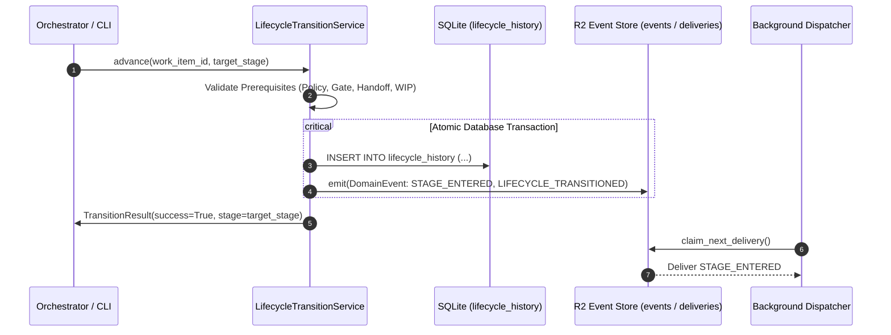
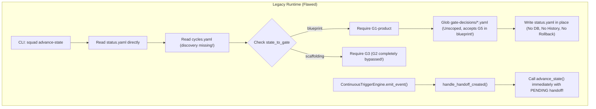
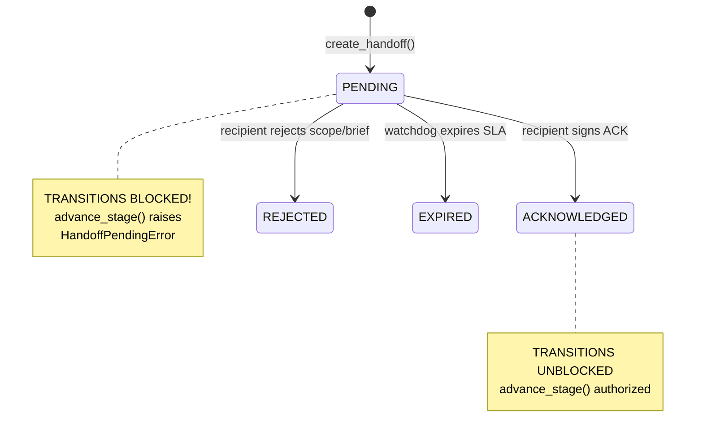

# R4 — MANDATORY LIFECYCLE ENGINE ARCHITECTURAL SPECIFICATION
## Enterprise Architecture Specification · Canonical State Machine · 13 Delivery Stages · SQLite WAL Transition Plane · Outbox Event Integration

**Document ID:** `DOC-ARCH-R4-MANDATORY-LIFECYCLE-ENGINE`  
**Milestone:** `R4 — MANDATORY LIFECYCLE ENGINE`  
**Stage:** `STAGE B — CANONICAL LIFECYCLE DESIGN`  
**Date:** 2026-09-18  
**Author / Lead:** `04-solution-architect` (Martin Fowler & Gregor Hohpe - Solution Architect & Enterprise Integration Lead)  
**Collaborators & Reviewers:**  
- `40-agile-coach` (Flow Governance, Sizing Limits & WIP Discipline)  
- `14-governance-auditor` (Segregation of Duties, Ledger Compliance & Gate Enforcement)  
- `01-requirements-analyst` (Product Quality, Acceptance Criteria & Backlog Invariants)  
**Status:** `APPROVED` (`R4_LIFECYCLE_DESIGN = APPROVED`)

---

## 1. SCOPE

### 1.1 Purpose & Mandate
This document establishes the authoritative, enterprise-grade architectural design for the **Canonical Lifecycle Engine** of the Agent Squad platform. 

In Milestones R1 (`DOC-ARCH-R1-CANONICAL-CONTRACTS`), R2 (`DOC-ARCH-R2-EVENT-TRIGGER-ENGINE`), and R3 (`DOC-ARCH-R3-WORK-ITEM-RUNTIME-MIGRATION`), the platform established strict domain contracts, an asynchronous transactional event outbox, and a resilient, isolated work item storage plane. Milestone R4 implements the core operational state machine governing all delivery workflows across the system.

The Canonical Lifecycle Engine resides exclusively within:
```
scripts/runtime/lifecycle/
```
Its mandate is to serve as the **Sole Source of Authority for State Transitions** across all software delivery processes, enforcing deterministic flow rules, gate prerequisites, handoff acknowledgements, project Work-In-Progress (WIP) limits, phase timeboxes, and immutable transition auditability.

### 1.2 Architectural Boundaries & Placement
The Lifecycle Engine operates within the Domain and Runtime Application layers under a strict Hexagonal (Ports & Adapters) architecture:

```
+-------------------------------------------------------------------------+
|                              HOST RUNTIME                               |
|        (Antigravity, Claude Desktop, Cursor, CLI, CI/CD Daemons)        |
+-------------------------------------------------------------------------+
                                    | uses
                                    v
+-------------------------------------------------------------------------+
|                  ORCHESTRATION & MCP ENTRYPOINTS                        |
|       (CLI squad advance-state, squad decide-gate, MCP Tools)           |
+-------------------------------------------------------------------------+
                                    |
                                    v
+-------------------------------------------------------------------------+
|                 CANONICAL LIFECYCLE TRANSITION SERVICE                  |
|                 (scripts/runtime/lifecycle/engine.py)                   |
|  * Sole Transition Authority · Enforces Policies · Emits R2 Events *   |
+-------------------------------------------------------------------------+
          |                       |                           |
          | consumes              | persists to               | emits via
          v                       v                           v
+--------------------+  +--------------------+  +-------------------------+
| CANONICAL DOMAIN   |  |   SQLITE STORAGE   |  |     EVENT OUTBOX R2     |
| (scripts/domain/   |  | (%SQUAD_RUNTIME%/  |  | (scripts/runtime/       |
|  lifecycle.py,     |  |  banco/squad.db)   |  |  events/store.py)       |
|  events.py, etc.)  |  | lifecycle_history  |  | events, deliveries     |
+--------------------+  +--------------------+  +-------------------------+
                                  | projects to (read-model only)
                                  v
                        +--------------------+
                        | status.yaml mirror |
                        | (work item dir)    |
                        +--------------------+
```

### 1.3 Non-Negotiable Invariants
1. **Single Source of Transition Truth:** No agent, CLI command, MCP tool, or background watcher may directly mutate `status.yaml` or change the `state` of a work item. All mutations MUST traverse `LifecycleTransitionService.advance()`.
2. **Purity of State Evaluation:** State transition evaluations are deterministic and fail-closed. If prerequisites (gates, receipts, handoff ACKs, WIP) are not met, the transition is rejected with a typed domain violation.
3. **Database-First Durability:** The canonical transition history is persisted in SQLite WAL before any filesystem read-projection (`status.yaml`) is refreshed.
4. **Zero Silent Fallbacks:** Permissive transitions, skipped stages, and unverified mock advancements are strictly prohibited.

---

## 2. R0 DEFECTS OWNED BY R4

The baseline audit (`docs/audits/R0_CORE_WORKFLOW_FAILURE_BASELINE.md`) documented pervasive structural vulnerabilities in the legacy lifecycle implementation. Milestone R4 assumes complete architectural ownership and remediation of the following defects:

| Defect ID | Severity | Root Cause in Legacy Runtime | Canonical R4 Architecture Resolution |
| :--- | :--- | :--- | :--- |
| **R0-LIFE-001** | `HIGH` | `discovery` stage completely missing from `config/cycles.yaml` FSM, causing new projects to skip discovery. | Formalized 13-stage canonical progression including mandatory `DISCOVERY` stage; cycles.yaml unified against domain enum. |
| **R0-LIFE-002** | `CRITICAL` | `G2-design` gate skipped; direct jump from `blueprint` to `scaffolding` without architectural design approval. | Mandatory `ARCHITECTURE_DESIGN` stage enforced; `G2-design` established as strict, non-bypassable exit gate. |
| **R0-LIFE-003** | `HIGH` | `decide_gate` lacked state eligibility check; permitted evaluating G5 or G6 while work item was in `blueprint`. | State-aware Gate Eligibility Guard; gates are strictly coupled to their canonical stage boundaries; out-of-order submissions rejected. |
| **R0-LIFE-004** | `CRITICAL` | `ContinuousTriggerEngine` auto-advanced state upon `EVENT_HANDOFF_CREATED` while handoff was still `PENDING`. | Handoff State Machine enforced; only `ACKNOWLEDGED` (or `ACCEPTED`) handoffs permit transition; `PENDING` hard-blocks advancement. |
| **R0-LIFE-005** | `CRITICAL` | `advance_state` permitted exiting `implementation` with zero execution proof, diffs, or test results. | Stage policy enforces `ExecutionReceipt` requirement prior to exiting `IMPLEMENTATION`; empty diffs or missing tests fail-closed. |
| **R0-LIFE-011** | `CRITICAL` | `ContinuousTriggerEngine` was an infinite closed loop repeatedly executing `squad.advance_state()`. | Decomposed into a pure reactive event dispatcher; stripped of all direct state mutation authority; driven exclusively by R2 triggers. |
| **R0-LIFE-012** | `MEDIUM` | WIP limits declared in YAML were completely unenforced during work item creation or state transitions. | Synchronous project admission control; transitions query active items in target stage against `WIPPolicy`; breaches raise `WIPLimitExceededError`. |
| **R0-LIFE-013** | `MEDIUM` | Phase timeboxes were unenforced; `check_timebox()` was an isolated utility never called during lifecycle flow. | Timebox tracking via `phase_started_at` in SQLite; `is_timebox_exceeded` deterministic evaluation; emits R2 watchdog warning without halting loops. |
| **R0-LIFE-014** | `HIGH` | `new-project` cycle was unresolvable in `type_to_cycle` mapping despite being configured in YAML. | Canonical resolution maps `WorkItemKind.PROJECT_SETUP` directly to the `new-project` delivery cycle. |

---

## 3. R1 LIFECYCLE CONTRACTS CONSUMED

The Lifecycle Engine directly consumes and implements the standard-library canonical contracts defined in `scripts/domain/lifecycle.py`, `scripts/domain/work_items.py`, and `scripts/domain/receipts.py`:

```
scripts/domain/
  ├── common.py           -> BaseDomainModel, ValidationError, canonical_json
  ├── lifecycle.py        -> LifecycleStage, GateId, GateDecisionStatus, AcknowledgementStatus,
  │                          GateDecision, StagePolicy, Acknowledgement, Handoff,
  │                          LifecycleTransition, DeliveryCycle, CANONICAL_STAGE_POLICIES
  ├── work_items.py       -> WorkItemKind, WorkItemId, RiskTier, FIBONACCI_SIZING_ALLOWED
  ├── receipts.py         -> ReceiptType, BaseReceipt, ExecutionReceipt, ReviewReceipt,
  │                          SecurityReceipt, TestReceipt, QAReceipt, GovernanceReceipt
  └── events.py           -> DomainEvent, TriggerActionKind, FindingKind, FindingSeverity
```

### 3.1 Primary Domain Entities & Enums
- `LifecycleStage`: Canonical 13-stage enum (`INTAKE` through `DONE`).
- `GateId`: Canonical 6-gate enum (`G1_PRODUCT` through `G6_GOVERNANCE_RELEASE`).
- `GateDecisionStatus`: Decision enum (`APPROVED`, `REJECTED`, `WAIVED`).
- `AcknowledgementStatus`: Handoff acknowledgement status (`PENDING`, `ACKNOWLEDGED`, `REJECTED`, `EXPIRED`).
- `StagePolicy`: Immutable rule object defining roles, required receipts, required artifacts, handoff requirements, required gates, and legal next stages.
- `CANONICAL_STAGE_POLICIES`: Global dictionary mapping every `LifecycleStage` to its canonical `StagePolicy`.

---

## 4. R2 EVENTS CONSUMED & EMITTED

The Lifecycle Engine integrates bidirectionally with the R2 Event and Trigger Engine (`scripts/runtime/events/store.py`):



### 4.1 Consumed Events (Inbound Triggers)
The Lifecycle Engine reacts to events emitted by specialists, evaluation guards, and handoff coordinators:
- `GATE_EVALUATED`: Recorded when an authorized evaluator signs a `GateDecision`.
- `HANDOFF_ACKNOWLEDGED`: Recorded when a recipient specialist acknowledges a handoff.
- `EXECUTION_RECEIPT_SUBMITTED`: Recorded when an implementation, review, test, or QA receipt is registered.

### 4.2 Emitted Events (Outbound Outbox)
Every state change atomically emits domain events via the R2 transactional outbox:
1. `LIFECYCLE_TRANSITIONED`:
   - `event_type`: `"agent_squad.lifecycle.transitioned"`
   - `payload`: `{ "work_item_id": "...", "from_stage": "...", "to_stage": "...", "initiated_by": "...", "transition_id": "..." }`
2. `STAGE_ENTERED`:
   - `event_type`: `"agent_squad.stage.entered"`
   - `payload`: `{ "work_item_id": "...", "stage": "...", "owner_role": "...", "collaborators": [...], "phase_started_at": "..." }`
3. `GATE_DECIDED`:
   - `event_type`: `"agent_squad.gate.decided"`
   - `payload`: `{ "gate_id": "...", "work_item_id": "...", "decision": "APPROVED", "evaluator": "..." }`
4. `WIP_BREACH_REJECTED` / `TIMEBOX_EXPIRED`:
   - Emitted as warnings or watchdog findings when operational thresholds are approached or exceeded.

---

## 5. CURRENT LIFECYCLE FAILURES (ROOT CAUSE ANALYSIS)

A forensic review of `scripts/agent_squad.py` and `scripts/continuous_trigger_engine.py` demonstrates why the legacy implementation repeatedly failed:



### 5.1 Anatomical Breakdown of Failures
1. **Direct File System Mutation:** State lived exclusively in unversioned `status.yaml` files. Concurrent writes resulted in race conditions, lost updates, and zero auditability.
2. **Hardcoded, Lossy State-to-Gate Mapping:** `state_to_gate` in `advance_state` attempted a simplistic 1:1 mapping between legacy state names and gates. Because `blueprint` mapped to `G1`, and the next state in `cycles.yaml` was `scaffolding`, `G2-design` had no legal binding point and was bypassed completely.
3. **Glob-Based Decision Lookup:** Gate verification simply iterated over all `*.yaml` files in `gate-decisions/`. If a developer or script placed an approved `G5-quality.yaml` decision early in the process, the glob check passed for any gate with similar naming aliases, ignoring stage eligibility.
4. **Handoff Premature Advancement:** When `create_handoff()` was called, it initialized `acknowledgement.status = "pending"` and broadcast `EVENT_HANDOFF_CREATED`. The subscriber `handle_handoff_created` immediately invoked `squad.advance_state()` without checking if the recipient had accepted the work.
5. **Lack of WIP and Timebox Enforcement:** While WIP limits and timebox durations were documented in `workflow.yaml`, neither `init_work_item` nor `advance_state` executed a database query to count items in flight or calculate elapsed phase durations.

---

## 6. CANONICAL TRANSITION AUTHORITY

To eliminate state drift and concurrency hazards, R4 introduces the **Canonical Lifecycle Transition Service** (`scripts/runtime/lifecycle/engine.py`).

### 6.1 Core Responsibilities of the Authority
- Sole entity authorized to advance, regress, or terminate a work item's lifecycle stage.
- Enforces strict adherence to `StagePolicy` defined in `scripts/domain/lifecycle.py`.
- Evaluates gate prerequisites, handoff acknowledgements, and specialist receipts.
- Validates project-level WIP limits prior to admitting an item into a new stage.
- Records every transition in SQLite `lifecycle_history` and emits R2 outbox events in a single atomic transaction.
- Updates the filesystem read-projection `status.yaml` post-commit.

### 6.2 Service Interface (Python Stdlib Contract)
```python
class CanonicalLifecycleService:
    def __init__(self, db_path: Path, event_store: SqliteEventStore) -> None:
        self.db_path = db_path
        self.event_store = event_store

    def advance_stage(
        self,
        work_item_id: str,
        project_id: str,
        target_stage: Optional[LifecycleStage] = None,
        initiated_by: str = "00-delivery-orchestrator",
        gate_decision_id: Optional[str] = None,
        now: Optional[datetime] = None,
    ) -> TransitionResult:
        """Deterministically evaluates and executes a stage advancement.
        
        Raises:
            StageTransitionIllegalError
            GatePrerequisiteViolationError
            HandoffNotAcknowledgedError
            WIPLimitExceededError
            ReceiptPrerequisiteViolationError
        """
        ...
```

---

## 7. CYCLE MODEL

Agent Squad supports eight (8) formal delivery cycles, each tailored to specific operational risk profiles and work item kinds:

```
+----------------+--------------------------+--------------------+--------------------------------+
| Cycle ID       | Applicable WorkItemKind  | Risk Tier / Scope  | Stage Progression Depth        |
+----------------+--------------------------+--------------------+--------------------------------+
| development    | EPIC, FEATURE, STORY     | MEDIUM to CRITICAL | Full (13 Stages, G1 to G6)     |
| user-story     | STORY (Sliced <= 8 SP)   | LOW to MEDIUM      | Streamlined Full (13 Stages)   |
| new-project    | PROJECT_SETUP            | HIGH               | Bootstrapping (9 Stages)       |
| bugfix         | BUG                      | LOW to CRITICAL    | Accelerated (8 Stages, G4-G6)  |
| spike          | SPIKE                    | LOW (Timeboxed)    | Exploratory (5 Stages, G1-G2)  |
| release        | RELEASE                  | HIGH (Governance)  | Governance Only (3 Stages, G6) |
| evolution      | FEATURE, STORY           | LOW to MEDIUM      | Iterative Refactor (10 Stages) |
| incident       | INCIDENT                 | CRITICAL (Hotfix)  | Emergency (6 Stages, G4, G6)   |
+----------------+--------------------------+--------------------+--------------------------------+
```

### 7.1 Cycle Resolution Mapping
The canonical engine determines cycle eligibility deterministically:
```python
def resolve_cycle_for_work_item(kind: WorkItemKind, risk_tier: RiskTier) -> str:
    if kind == WorkItemKind.PROJECT_SETUP:
        return "new-project"
    if kind == WorkItemKind.BUG:
        return "bugfix"
    if kind == WorkItemKind.SPIKE:
        return "spike"
    if kind == WorkItemKind.INCIDENT:
        return "incident"
    if kind == WorkItemKind.RELEASE:
        return "release"
    if kind == WorkItemKind.STORY:
        return "user-story"
    return "development"
```

---

## 8. FULL DEVELOPMENT LIFECYCLE (13 CANONICAL STAGES)

The flagship `development` cycle executes the complete 13-stage progression with strict segregation of duties (SoD) and mandatory gates:

```mermaid
flowchart LR
    S1[1. INTAKE] --> S2[2. DISCOVERY]
    S2 --> S3[3. REQUIREMENTS_PRODUCT]
    S3 -->|G1-product| S4[4. PLANNING]
    S4 --> S5[5. ARCHITECTURE_DESIGN]
    S5 -->|G2-design| S6[6. READINESS_SCAFFOLDING]
    S6 -->|G3-readiness| S7[7. IMPLEMENTATION]
    S7 --> S8[8. CODE_REVIEW]
    S8 --> S9[9. SECURITY_REVIEW]
    S9 -->|G4-code-security| S10[10. TEST_VALIDATION]
    S10 --> S11[11. QA_VALIDATION]
    S11 -->|G5-quality| S12[12. GOVERNANCE_RELEASE]
    S12 -->|G6-governance-release| S13[13. DONE]
```



### 8.1 Detailed Stage Inventory

| # | Canonical Stage | Owner Role | Collaborator Roles | Mandatory Gate | Required Exit Receipts | Required Artifacts |
|---|---|---|---|---|---|---|
| **1** | `INTAKE` | `00-delivery-orchestrator` | `01-requirements-analyst` | None | None | `intake.md` |
| **2** | `DISCOVERY` | `01-requirements-analyst` | `04-solution-architect`, `40-agile-coach` | None | `DiscoveryReceipt` | `discovery-notes.md` |
| **3** | `REQUIREMENTS_PRODUCT` | `01-requirements-analyst` | `40-agile-coach`, `14-governance-auditor` | `G1-product` | `RequirementsReceipt` | `user-story.md`, `acceptance-criteria.md` |
| **4** | `PLANNING` | `40-agile-coach` | `00-delivery-orchestrator` | None | `BacklogPlanReceipt` | `backlog-plan.md` |
| **5** | `ARCHITECTURE_DESIGN` | `04-solution-architect` | `10-security-specialist`, `27-platform-engineer` | `G2-design` | `ArchitectureReceipt` | `architecture-design.md`, `threat-model.md` |
| **6** | `READINESS_SCAFFOLDING` | `27-platform-engineer` | `06-software-engineer`, `11-test-engineer` | `G3-readiness` | `ScaffoldingReceipt` | `test-harness-manifest.yaml` |
| **7** | `IMPLEMENTATION` | `06-software-engineer` | `07-frontend-engineer`, `08-backend-engineer` | None | `ExecutionReceipt` | `implementation.diff` |
| **8** | `CODE_REVIEW` | `09-code-reviewer` | None (Strict SoD) | None | `ReviewReceipt` | `review-verdict.md` |
| **9** | `SECURITY_REVIEW` | `10-security-specialist` | `14-governance-auditor` | `G4-code-security` | `SecurityReceipt` | `security-scan.md` |
| **10** | `TEST_VALIDATION` | `11-test-engineer` | None | None | `TestReceipt` | `test-results.xml` |
| **11** | `QA_VALIDATION` | `12-qa-engineer` | `01-requirements-analyst` | `G5-quality` | `QAReceipt` | `qa-acceptance-report.md` |
| **12** | `GOVERNANCE_RELEASE` | `14-governance-auditor` | `00-delivery-orchestrator` | `G6-governance-release` | `GovernanceReceipt` | `release-manifest.yaml`, `audit-ledger.json` |
| **13** | `DONE` | `00-delivery-orchestrator` | None | None | None | `archive-summary.md` |

---

## 9. REDUCED CYCLES

Specialized work items follow deterministic, reduced stage trajectories without sacrificing quality gates or security:

```mermaid
flowchart TD
    subgraph Bugfix_Cycle["Bugfix Cycle (8 Stages)"]
        B1[INTAKE] --> B2[DISCOVERY]
        B2 --> B3[ARCHITECTURE_DESIGN]
        B3 -->|G2-design (Waived if Low)| B4[IMPLEMENTATION]
        B4 --> B5[CODE_REVIEW]
        B5 --> B6[SECURITY_REVIEW]
        B6 -->|G4-code-security| B7[TEST_VALIDATION]
        B7 --> B8[GOVERNANCE_RELEASE]
        B8 -->|G6-governance-release| B9[DONE]
    end

    subgraph Spike_Cycle["Spike Cycle (5 Stages)"]
        S1[INTAKE] --> S2[DISCOVERY]
        S2 --> S3[REQUIREMENTS_PRODUCT]
        S3 -->|G1-product| S4[PLANNING]
        S4 --> S5[ARCHITECTURE_DESIGN]
        S5 -->|G2-design| S6[DONE]
    end

    subgraph Release_Cycle["Release Cycle (3 Stages)"]
        R1[INTAKE] --> R2[GOVERNANCE_RELEASE]
        R2 -->|G6-governance-release| R3[DONE]
    end
```

### 9.1 Bugfix Cycle
- **Applicability:** WorkItemKind `BUG`.
- **Stages:** `[INTAKE, DISCOVERY, ARCHITECTURE_DESIGN, IMPLEMENTATION, CODE_REVIEW, SECURITY_REVIEW, TEST_VALIDATION, GOVERNANCE_RELEASE, DONE]`.
- **Invariants:** Bypasses product requirements and backlog planning; mandates root cause analysis in `DISCOVERY`, patch design in `ARCHITECTURE_DESIGN`, and rigorous regression testing with `G4` and `G6`.

### 9.2 Spike Cycle
- **Applicability:** WorkItemKind `SPIKE`.
- **Stages:** `[INTAKE, DISCOVERY, REQUIREMENTS_PRODUCT, PLANNING, ARCHITECTURE_DESIGN, DONE]`.
- **Invariants:** Timeboxed exploratory research. Never enters `IMPLEMENTATION`. Exits upon delivery of architecture vision, POC benchmark, and `G2-design` signoff.

### 9.3 Release Cycle
- **Applicability:** WorkItemKind `RELEASE`.
- **Stages:** `[INTAKE, GOVERNANCE_RELEASE, DONE]`.
- **Invariants:** Dedicated release orchestration container verifying deployment manifests, changelogs, and ledger compliance under `G6`.

### 9.4 Incident Cycle
- **Applicability:** WorkItemKind `INCIDENT`.
- **Stages:** `[INTAKE, DISCOVERY, IMPLEMENTATION, SECURITY_REVIEW, GOVERNANCE_RELEASE, DONE]`.
- **Invariants:** Production triage, rapid mitigation, emergency SAST verification (`G4`), and immediate post-mortem recording (`G6`).

---

## 10. STAGEPOLICY SPECIFICATION

Every stage is governed by a declarative `StagePolicy` instance defined in `scripts/domain/lifecycle.py`:

```python
@dataclass(frozen=True)
class StagePolicy(BaseDomainModel):
    stage: LifecycleStage
    owner_role: str
    collaborator_roles: List[str]
    required_receipt_types: List[str]
    required_artifacts: List[str]
    required_evidence: List[str]
    handoff_required: bool
    ack_required: bool
    required_gate: Optional[GateId]
    allowed_next_stages: List[LifecycleStage]
    wip_policy_ref: str
    timebox_policy_ref: str
    trigger_refs: List[str]
```

### 10.1 Exit Validation Algorithm
Before any transition from `current_stage` to `next_stage` is committed:
1. **Target Legality:** Assert `next_stage in policy.allowed_next_stages`.
2. **Gate Prerequisite:** If `policy.required_gate` is present, assert that a `GateDecision` exists with `gate_id == policy.required_gate` and `status == APPROVED`.
3. **Receipt Prerequisite:** Assert that all `receipt_type in policy.required_receipt_types` are registered in the work item ledger.
4. **Handoff & ACK:** If `policy.handoff_required`, assert that an active `Handoff` exists and its status is `ACKNOWLEDGED`.
5. **WIP Quota:** Assert that target stage WIP count `< wip_limit`.

---

## 11. GATE ELIGIBILITY & STATE-AWARE EVALUATION

A core defect identified in R0 (`R0-LIFE-003`) was the out-of-order submission and evaluation of governance gates.

### 11.1 Gate-to-Stage Legal Binding Table

```
+--------------------------+-----------------------+-----------------------------+-----------------------------+
| Gate Identifier          | Legal Bound Stage     | Authorized Evaluator Role   | Prohibited Premature Stages |
+--------------------------+-----------------------+-----------------------------+-----------------------------+
| G1-product               | REQUIREMENTS_PRODUCT  | 01-requirements-analyst     | INTAKE, DISCOVERY           |
| G2-design                | ARCHITECTURE_DESIGN   | 04-solution-architect       | INTAKE through PLANNING     |
| G3-readiness             | READINESS_SCAFFOLDING | 27-platform-engineer        | INTAKE through ARCHITECTURE |
| G4-code-security         | SECURITY_REVIEW       | 10-security-specialist      | INTAKE through CODE_REVIEW  |
| G5-quality               | QA_VALIDATION         | 12-qa-engineer              | INTAKE through TEST_VAL     |
| G6-governance-release    | GOVERNANCE_RELEASE    | 14-governance-auditor       | INTAKE through QA_VAL       |
+--------------------------+-----------------------+-----------------------------+-----------------------------+
```

### 11.2 Eligibility Guard Logic
```python
def assert_gate_eligibility(gate_id: GateId, current_stage: LifecycleStage) -> None:
    expected_stage = GATE_TO_STAGE_MAP.get(gate_id)
    if expected_stage != current_stage:
        raise GateEligibilityViolationError(
            f"Gate '{gate_id.value}' cannot be evaluated while item is in stage '{current_stage.value}'. "
            f"Legal evaluation stage is strictly '{expected_stage.value}'."
        )
```
- Submitting `G5-quality` while an item is in `INTAKE`, `DISCOVERY`, or `IMPLEMENTATION` is immediately rejected with HTTP 400 / CLI Exit Code 1.
- G2-design cannot be skipped: `ARCHITECTURE_DESIGN` requires `G2-design` approval before exiting to `READINESS_SCAFFOLDING`.

---

## 12. HANDOFF & ACKNOWLEDGEMENT (ACK) PROTOCOL

To resolve `R0-LIFE-004`, the lifecycle engine strictly couples stage transitions to the Handoff State Machine:



### 12.1 Invariant Rules
1. When a stage finishes its work, the outgoing specialist creates a `Handoff` entity (`status = PENDING`).
2. Any call to `advance_stage()` while `status == PENDING` raises `HandoffNotAcknowledgedError`.
3. The incoming specialist must formally inspect the handoff envelope, verify instructions, and submit an `Acknowledgement` (`status = ACKNOWLEDGED`).
4. Only upon receipt of `ACKNOWLEDGED` does `handoff.is_transition_allowed()` return `True`.

---

## 13. WORK IN PROGRESS (WIP) DISCIPLINE

In accordance with Kanban principles (Henrik Kniberg) and resolving `R0-LIFE-012`, R4 implements synchronous admission control for all work items within a project:

### 13.1 WIP Limits Configuration
```yaml
wip_limits:
  intake: 10
  discovery: 3
  requirements: 3
  planning: 3
  architecture: 2
  scaffolding: 2
  implementation: 3
  code_review: 2
  security_review: 2
  test_validation: 2
  qa_validation: 2
  governance: 2
  done: unlimited
```

### 13.2 Synchronous Admission Check
```python
def assert_wip_capacity(db_conn: sqlite3.Connection, project_id: str, target_stage: LifecycleStage) -> None:
    limit = WIP_LIMITS.get(target_stage, 10)
    if limit is None or limit == float("inf"):
        return
        
    cursor = db_conn.cursor()
    cursor.execute(
        """
        SELECT COUNT(DISTINCT work_item_id)
        FROM work_item_lifecycle_state
        WHERE project_id = ? AND current_stage = ?
        """,
        (project_id, target_stage.value),
    )
    current_count = cursor.fetchone()[0]
    
    if current_count >= limit:
        raise WIPLimitExceededError(
            f"WIP breach: Stage '{target_stage.value}' in project '{project_id}' "
            f"has reached its limit of {limit} active items (current: {current_count})."
        )
```

---

## 14. TIMEBOX ENFORCEMENT & WATCHDOG INTEGRATION

To resolve `R0-LIFE-013`, every state transition records an authoritative timestamp `phase_started_at`.

### 14.1 Deterministic Evaluation
- Each stage has a configured maximum duration (e.g., `implementation: 5d`, `review: 1d`).
- `is_timebox_exceeded(work_item_id, now=None)` calculates elapsed time: `(now or utcnow()) - phase_started_at`.
- If elapsed time exceeds policy:
  1. An event `TIMEBOX_EXPIRED` is emitted to the R2 event outbox.
  2. A `WatchdogFinding` record of kind `TIMEBOX_EXPIRED` and severity `WARNING` is created.
  3. The item remains in its current stage; it does NOT advance automatically or crash in an infinite scheduler loop.
  4. Human or orchestrator intervention is requested via dashboard alert.

---

## 15. LIFECYCLE PERSISTENCE ARCHITECTURE

All lifecycle state, transitions, and history reside in the canonical SQLite database:
```
%SQUAD_RUNTIME%/banco/squad.db
```
Zero auxiliary databases (`lifecycle.db`, `states.db`) are permitted.

### 15.1 Pragmas & Connection Tuning
```sql
PRAGMA foreign_keys = ON;
PRAGMA busy_timeout = 5000;
PRAGMA journal_mode = WAL;
PRAGMA synchronous = NORMAL;
```

---

## 16. TRANSITION HISTORY (SCHEMA & DDL)

To provide an immutable audit trail and support point-in-time state reconstruction, R4 defines two SQLite tables:

### 16.1 Data Definition Language (DDL)

```sql
-- Current active stage projection per work item
CREATE TABLE IF NOT EXISTS work_item_lifecycle_state (
    work_item_id TEXT PRIMARY KEY,
    project_id TEXT NOT NULL,
    cycle_id TEXT NOT NULL,
    current_stage TEXT NOT NULL,
    owner_role TEXT NOT NULL,
    phase_started_at TEXT NOT NULL,
    updated_at TEXT NOT NULL,
    last_transition_id TEXT NOT NULL
);

CREATE INDEX IF NOT EXISTS idx_lifecycle_state_proj_stage 
ON work_item_lifecycle_state (project_id, current_stage);

-- Immutable append-only transition log
CREATE TABLE IF NOT EXISTS lifecycle_history (
    transition_id TEXT PRIMARY KEY,
    work_item_id TEXT NOT NULL,
    project_id TEXT NOT NULL,
    cycle_id TEXT NOT NULL,
    from_stage TEXT NOT NULL,
    to_stage TEXT NOT NULL,
    initiated_by TEXT NOT NULL,
    gate_decision_id TEXT,
    handoff_id TEXT,
    duration_seconds REAL,
    idempotency_key TEXT UNIQUE NOT NULL,
    created_at TEXT NOT NULL,
    payload_json TEXT
);

CREATE INDEX IF NOT EXISTS idx_lifecycle_history_item 
ON lifecycle_history (work_item_id, created_at DESC);

CREATE INDEX IF NOT EXISTS idx_lifecycle_history_project 
ON lifecycle_history (project_id, created_at DESC);
```

### 16.2 Transactional Integrity
State transitions are executed inside a single SQLite transaction:
```python
with db_conn:
    # 1. Verify preconditions (WIP, Gate, Handoff)
    # 2. Insert into lifecycle_history
    # 3. Upsert into work_item_lifecycle_state
    # 4. Insert into events and event_deliveries (R2 Outbox)
```
If any check fails, the transaction rolls back cleanly with zero partial state.

---

## 17. STATUS.YAML PROJECTION

In legacy versions, `status.yaml` was the flawed, unversioned source of truth. Under R4, the architecture adopts a **CQRS-style Read Projection**:

```
[SQLite squad.db]  === (Atomic Commit) ===>  [Write status.yaml]
 (Write Authority)                            (Read-Only Projection)
```

### 17.1 Projection Invariants
1. `banco/squad.db` is the authoritative, immutable source of truth.
2. `work/<project_id>/<work_item_id>/status.yaml` is a convenience read-projection refreshed atomically via `governed_io.atomic_write_text()` after the database transaction succeeds.
3. If `status.yaml` is accidentally deleted, edited, or corrupted, the system reconstructs it deterministically from `work_item_lifecycle_state`.
4. Existing tooling and scripts that read `status.yaml` continue to work without breaking changes.

---

## 18. ATOMIC EVENT EMISSION (R2 OUTBOX INTEGRATION)

Every transition atomically registers events in the R2 Outbox (`scripts/runtime/events/store.py`):
```python
domain_event = DomainEvent.create(
    event_type="agent_squad.stage.entered",
    work_item_id=work_item_id,
    project_id=project_id,
    source="lifecycle_engine",
    correlation_id=correlation_id,
    causation_id=transition_id,
    payload={
        "from_stage": from_stage.value,
        "to_stage": to_stage.value,
        "owner_role": next_policy.owner_role,
        "collaborators": next_policy.collaborator_roles,
        "phase_started_at": now.isoformat(),
    }
)
event_store.record_event_transactional(cursor, domain_event)
```
Because the event is written within the same database transaction as the state change, two-phase commit vulnerabilities and dropped notifications are eliminated.

---

## 19. IDEMPOTENCY STRATEGY

To handle network retries, CLI double-invocations, and autonomous trigger re-evaluations without corrupting the state machine:
```python
seed = f"transition:{work_item_id}:{from_stage.value}:{to_stage.value}:{causation_id}"
idempotency_key = hashlib.sha256(seed.encode("utf-8")).hexdigest()
```
- If a transition request with an existing `idempotency_key` is submitted:
  1. The database unique constraint `idempotency_key UNIQUE` intercepts the insert.
  2. The service detects the duplicate and returns the existing transition record without executing side effects.
  3. Result: Zero duplicate events, zero phantom state changes.

---

## 20. CONCURRENCY & LOCKING

The engine guarantees multi-process safety across Windows and POSIX:
1. **Database Concurrency:** SQLite WAL mode permits concurrent readers alongside a single active writer without lock starvation. `busy_timeout = 5000` provides 5 seconds of automatic retry on contention.
2. **Work Item File Lock:** A reentrant file lock (`.lifecycle.lock`) in the work item directory serializes operations targeting the same work item.
3. **Optimistic Version Checks:** `last_transition_id` in `work_item_lifecycle_state` prevents ABA race conditions.

---

## 21. LEGACY STATE COMPATIBILITY & BIDIRECTIONAL MAPPING

To maintain 100% backward compatibility with legacy work items, configuration files, and CLI commands, R4 provides a canonical bidirectional mapping:

```python
LEGACY_STATE_TO_CANONICAL: Dict[str, LifecycleStage] = {
    "intake": LifecycleStage.INTAKE,
    "discovery": LifecycleStage.DISCOVERY,
    "blueprint": LifecycleStage.REQUIREMENTS_PRODUCT,
    "product-ready": LifecycleStage.REQUIREMENTS_PRODUCT,
    "planning": LifecycleStage.PLANNING,
    "design": LifecycleStage.ARCHITECTURE_DESIGN,
    "design-ready": LifecycleStage.ARCHITECTURE_DESIGN,
    "scaffolding": LifecycleStage.READINESS_SCAFFOLDING,
    "ready-for-build": LifecycleStage.READINESS_SCAFFOLDING,
    "implementation": LifecycleStage.IMPLEMENTATION,
    "review": LifecycleStage.CODE_REVIEW,
    "code-security-review": LifecycleStage.SECURITY_REVIEW,
    "test-validation": LifecycleStage.TEST_VALIDATION,
    "validation": LifecycleStage.QA_VALIDATION,
    "quality-validation": LifecycleStage.QA_VALIDATION,
    "governance-release": LifecycleStage.GOVERNANCE_RELEASE,
    "ready-for-release": LifecycleStage.GOVERNANCE_RELEASE,
    "done": LifecycleStage.DONE,
}

CANONICAL_TO_LEGACY_STATE: Dict[LifecycleStage, str] = {
    LifecycleStage.INTAKE: "intake",
    LifecycleStage.DISCOVERY: "discovery",
    LifecycleStage.REQUIREMENTS_PRODUCT: "blueprint",
    LifecycleStage.PLANNING: "planning",
    LifecycleStage.ARCHITECTURE_DESIGN: "design",
    LifecycleStage.READINESS_SCAFFOLDING: "scaffolding",
    LifecycleStage.IMPLEMENTATION: "implementation",
    LifecycleStage.CODE_REVIEW: "review",
    LifecycleStage.SECURITY_REVIEW: "code-security-review",
    LifecycleStage.TEST_VALIDATION: "test-validation",
    LifecycleStage.QA_VALIDATION: "quality-validation",
    LifecycleStage.GOVERNANCE_RELEASE: "governance-release",
    LifecycleStage.DONE: "done",
}
```

---

## 22. SPEC-DRIVEN DEVELOPMENT (SDD) COMPATIBILITY

Agent Squad features a Spec-Driven Development (SDD) contract system (`_sdd_enforce`). 

### 22.1 Policy-Based SDD Integration
In R4, SDD checks are integrated directly as precondition guards within `StagePolicy.required_evidence`:
- When an SDD package is active on a work item, `LifecycleTransitionService` validates SDD package authorization prior to stage exit.
- SDD does NOT maintain a separate, concurrent state machine.
- If SDD verification fails (e.g., `SDD_STAGE_MISSING_ARTIFACTS`), the transition is aborted cleanly with a typed exception, leaving the canonical state untouched.

---

## 23. CONTINUOUSTRIGGERENGINE DECOMPOSITION

To resolve `R0-LIFE-011`, the monolithic and defective `ContinuousTriggerEngine` is decomposed into an asynchronous, non-mutating trigger subscriber:

```mermaid
flowchart TD
    subgraph Legacy_Broken["Legacy Monolith (Broken)"]
        CE1[ContinuousTriggerEngine] -->|Loop| CE2[squad.advance_state]
        CE2 -->|Direct Mutation| CE3[status.yaml]
    end

    subgraph R4_Decomposed["R4 Decomposed Architecture (Autonomous & Governed)"]
        E1[R2 Event Store] -->|claim_next_delivery| E2[ContinuousTriggerSubscriber]
        E2 -->|Match TriggerPolicy| E3[Create ActivationPacket]
        E3 -->|Request Dispatch| E4[Agent Dispatcher R10]
        E4 -->|Execution Finished| E5[Register Specialist Receipt R12]
        E5 -->|Prerequisites Met| E6[LifecycleTransitionService.advance]
        E6 -->|Atomic Write| E7[SQLite squad.db]
    end
```



### 23.1 New Boundaries
1. **Zero Mutation Authority:** `ContinuousTriggerEngine` is stripped of `squad.advance_state()` calls.
2. **Pure Subscriber:** It listens for domain events via `SqliteEventStore.claim_next_delivery()`.
3. **Intent Generation:** When a trigger condition evaluates to true, it enqueues an `ACTIVATE_AGENT` or `EVALUATE_GATE` action intent.
4. **Separation of Concerns:** State changes happen only when specialists complete work and submit formal receipts.

---

## 24. DEFERRED RECEIPT ENFORCEMENT (R12 BOUNDARY)

A critical distinction must be maintained between lifecycle rule checking (R4) and cryptographic specialist execution (R12):

- **R4 Responsibility (Lifecycle Engine):** 
  - Knows which receipt types are required by each stage (`policy.required_receipt_types`).
  - Verifies that a valid receipt record matching the required type and work item ID exists before allowing a transition.
  - Fail-closed: missing receipt blocks advancement.
- **R12 Responsibility (Execution & Verification):**
  - Runs SAST tools, automated test runners, BDD suites, and static analyzers.
  - Signs and hashes outputs into `ExecutionReceipt`, `ReviewReceipt`, `SecurityReceipt`, etc.
  - Validates cryptographic signatures and Segregation of Duties (`assert_sod_compliance`).

---

## 25. FUTURE OWNERSHIP (R5–R14 ROADMAP INTEGRATION)

The Canonical Lifecycle Engine establishes the central nervous system for all subsequent platform milestones:

```
+-------------------------------------------------------------------------+
|                  R4 CANONICAL LIFECYCLE STATE MACHINE                   |
+-------------------------------------------------------------------------+
       ^                  ^                   ^                  ^
       |                  |                   |                  |
+--------------+  +---------------+  +------------------+  +--------------+
| R5 Backlog   |  | R6 Sizing     |  | R10 Dispatch     |  | R14 Azure    |
| & Hierarchy  |  | & WIP Slicing |  | & Orchestration  |  | DevOps Sync  |
+--------------+  +---------------+  +------------------+  +--------------+
```
- **R5 (Backlog):** Uses stage information to organize boards and child hierarchies.
- **R6 (Sizing):** Integrates Fibonacci constraints (<= 8 SP) into `REQUIREMENTS_PRODUCT` exit policy.
- **R7 (Project):** Isolates database schemas per tenant/project container.
- **R8 (Session):** Links active agent sessions to stage lifecycles.
- **R9 (Prompt):** Injects stage-specific context into rendered agent prompts.
- **R10 (Dispatch):** Dispatches specialists matching `policy.owner_role` upon `STAGE_ENTERED`.
- **R11 (Gate):** Executes deep automated gate rule validation.
- **R12 (Receipts):** Furnishes cryptographic receipts consumed by stage policies.
- **R13 (Watchdog):** Polls `is_timebox_exceeded` and reports anomalies.
- **R14 (ADO Sync):** Maps canonical 13 stages to Azure DevOps Kanban columns.

---

## 26. NON-GOALS

To preserve clean architectural boundaries, R4 strictly disclaims the following responsibilities:

1. **Zero Agent Dispatch:** The lifecycle engine does not render prompts, instantiate agents, or invoke LLMs.
2. **Zero Dynamic Routing:** The lifecycle engine does not dynamically choose which agent persona to invoke; it reports the declarative `owner_role` defined by policy.
3. **Zero Remote Azure DevOps Mutations:** The lifecycle engine does not execute HTTP REST calls to Azure DevOps; remote sync is handled asynchronously by R14 adapters reacting to `LIFECYCLE_TRANSITIONED` events.
4. **Zero Scheduler / Infinite Daemon Loops:** The lifecycle engine does not spawn background threads, sleep loops, or perpetual daemons; it exposes clean, deterministic, callable APIs.

---

## 27. ARCHITECTURAL SIGN-OFF & VERDICT

The Canonical Lifecycle Engine architecture specified in this document completely resolves all R0 lifecycle vulnerabilities (`R0-LIFE-001` through `R0-LIFE-005`, `R0-LIFE-011` through `R0-LIFE-014`), consumes canonical R1 domain models, integrates with the R2 transactional outbox, and establishes an unyielding foundation for autonomous software delivery.

```
================================================================================
R4_LIFECYCLE_DESIGN = APPROVED
Lead Architect: 04-solution-architect (Martin Fowler & Gregor Hohpe)
Reviewers: 40-agile-coach, 14-governance-auditor, 01-requirements-analyst
Date: 2026-09-18
================================================================================
```
