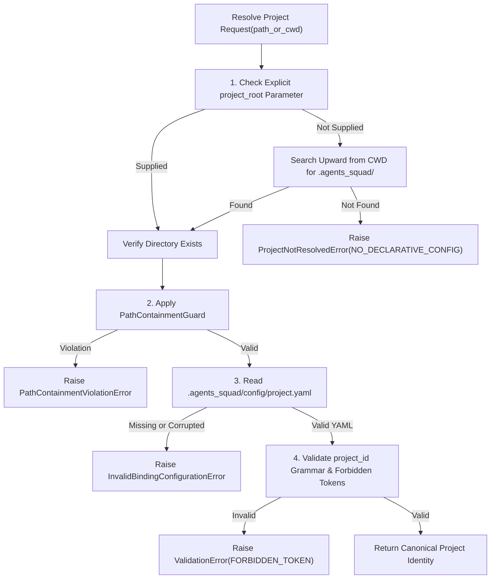
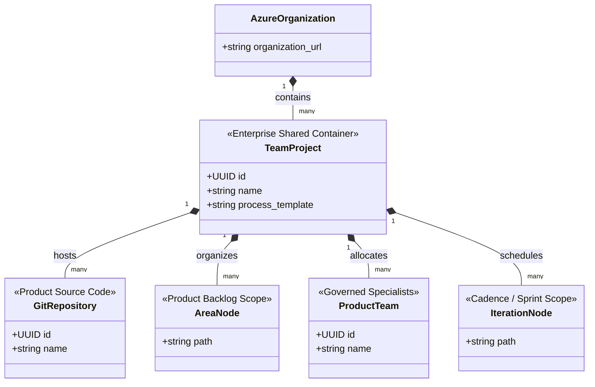
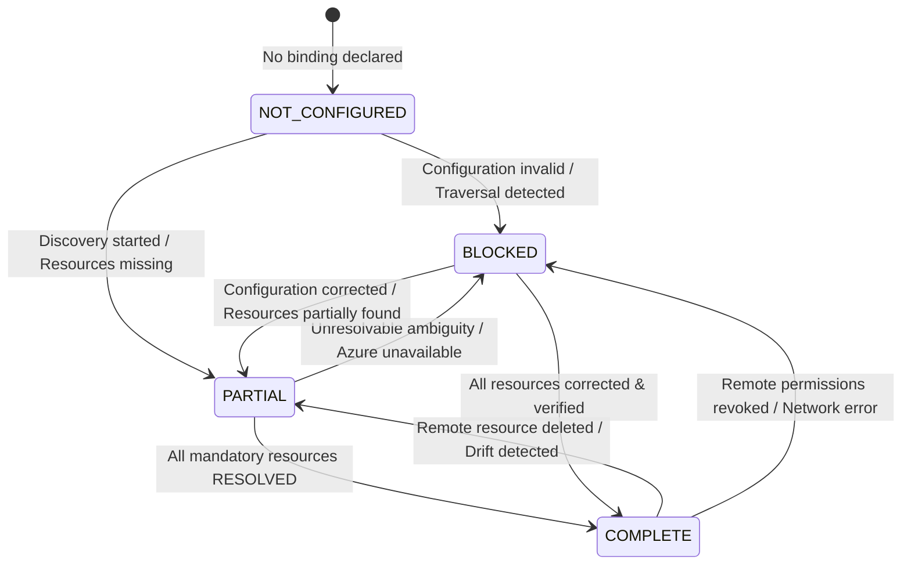
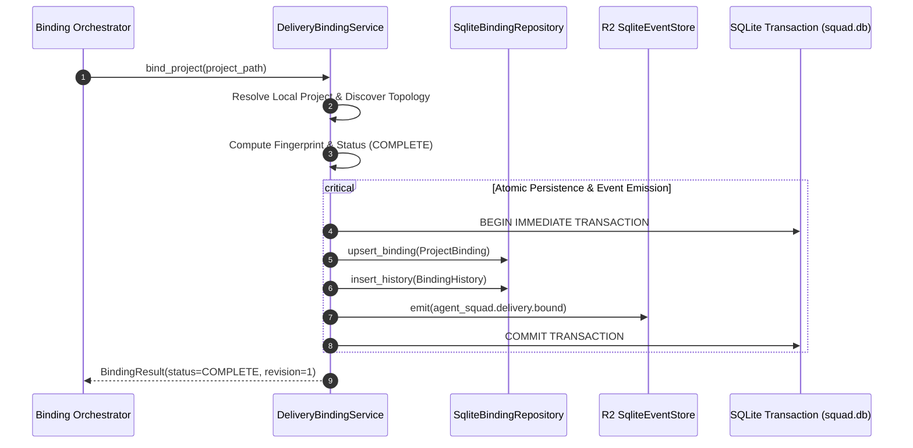

# R5 — PROJECT + DELIVERY BACKEND BINDING ARCHITECTURAL SPECIFICATION
## Enterprise Architecture Specification · Ports & Adapters Binding Plane · Read-Only Azure Discovery · Deterministic Project Resolution · SQLite WAL Binding Repository

**Document ID:** `DOC-ARCH-R5-PROJECT-DELIVERY-BINDING`  
**Milestone:** `R5 — PROJECT + DELIVERY BACKEND BINDING`  
**Stage:** `STAGE B — BINDING ARCHITECTURE`  
**Date:** 2026-09-18  
**Author / Lead:** `04-solution-architect` (Martin Fowler & Gregor Hohpe — Solution Architect & Enterprise Integration Lead)  
**Collaborators & Reviewers:**  
- `13-devops-release-engineer` (Release Engineering, Azure DevOps Backend Integration & Artifact Gates)  
- `14-governance-auditor` (Segregation of Duties, Secret Containment, Audit Trail & Ledger Invariants)  
**Status:** `APPROVED` (`R5_BINDING_DESIGN = APPROVED`)

---

## 1. SCOPE

### 1.1 Purpose & Authority
This specification establishes the authoritative, enterprise-grade architecture for **Milestone R5: Project + Delivery Backend Binding** within the Agent Squad platform.

Building on the foundations established in previous milestones:
- **R1 (`DOC-ARCH-R1-CANONICAL-CONTRACTS`):** Defined canonical immutable domain models (`ProjectBinding`, `AdoBinding`, `LocalWorkMirror`, `DeliveryBackendKind`).
- **R2 (`DOC-ARCH-R2-EVENT-TRIGGER-ENGINE`):** Provided the transactional SQLite Outbox and asynchronous domain event store.
- **R3 (`DOC-ARCH-R3-WORK-ITEM-RUNTIME-MIGRATION`):** Modernized work item naming, nested hierarchy, and path normalization.
- **R4 (`DOC-ARCH-R4-MANDATORY-LIFECYCLE-ENGINE`):** Built the 13-stage deterministic state machine governing transitions, gate eligibility, and WIP limits.

**Milestone R5 establishes the structural bridge connecting a local governed software project with its enterprise delivery backend (Azure DevOps or Local/Offline).**

The Binding Plane resides exclusively within:
```
scripts/runtime/delivery/
```
Its mandate is to serve as the **Sole Source of Authority for Project Identity and Backend Association**, guaranteeing:
1. Deterministic local project root and identity resolution without environmental ambiguity.
2. Safe, read-only discovery of remote enterprise delivery topology (Team Project, Repository, Team, Area Path, Iteration Path, Process Template).
3. Immutable, audited persistence of binding states in `%SQUAD_RUNTIME%/banco/squad.db`.
4. Decoupling between software products and shared enterprise containers.
5. Absolute enforcement of credential isolation and path containment.

```
+-------------------------------------------------------------------------+
|                              HOST RUNTIME                               |
|       (Antigravity, Claude Desktop, Cursor, CLI squad, CI Daemons)       |
+-------------------------------------------------------------------------+
                                    | consumes
                                    v
+-------------------------------------------------------------------------+
|                     DELIVERY BINDING ORCHESTRATOR                       |
|             (scripts/runtime/delivery/binding_service.py)               |
|   * Resolves Project · Discovers Topology · Persists Canonical State *  |
+-------------------------------------------------------------------------+
          |                       |                           |
          | uses                  | queries (Read-Only)       | emits via
          v                       v                           v
+--------------------+  +--------------------+  +-------------------------+
| LOCAL RESOLUTION   |  | AZURE DISCOVERY    |  |     EVENT OUTBOX R2     |
| (project.yaml,     |  | PORT / ADAPTER     |  | (agent_squad.delivery.* |
|  PathContainment)  |  | (REST API 7.1)     |  |  via SqliteEventStore)  |
+--------------------+  +--------------------+  +-------------------------+
                                  |
                                  v persists to
                        +--------------------+
                        |   SQLITE STORAGE   |
                        | (%SQUAD_RUNTIME%/  |
                        |  banco/squad.db)   |
                        |  project_bindings  |
                        |  binding_history   |
                        +--------------------+
```

---

## 2. NON-GOALS

To maintain absolute architectural clarity and segregation of duties, Milestone R5 explicitly declares the following **Non-Goals**:

1. **ZERO Remote Mutations in Azure DevOps:** Milestone R5 is strictly read-only with respect to external delivery backends. No HTTP `POST`, `PUT`, `PATCH`, or `DELETE` requests modifying remote Azure infrastructure shall be issued.
2. **ZERO Resource Creation:** R5 will NOT create Git repositories, Team Projects, Teams, Area Paths, Iteration Paths, or Service Hooks. (Resource provisioning is deferred to Milestone R6).
3. **ZERO Backlog Materialization:** R5 will NOT instantiate work item cards (Epics, Features, User Stories, Tasks, Bugs) in Azure DevOps or on disk. (Backlog materialization and QBC belong strictly to Milestone R7).
4. **ZERO Work Item State Synchronization:** R5 does NOT synchronize internal work item lifecycle states with external Kanban boards. (State synchronization belongs to Milestone R6).
5. **ZERO Autonomous Agent Dispatch:** R5 does NOT trigger or activate specialist personas (`software-engineer`, `code-reviewer`, etc.). (Agent dispatch belongs to Milestones R8, R10, and R11).
6. **ZERO Credential Handling or PAT Storage:** R5 does NOT manage or persist user tokens, passwords, or personal access tokens.

---

## 3. R0 DEFECTS OWNED BY R5

The baseline audit (`docs/audits/R0_CORE_WORKFLOW_FAILURE_BASELINE.md`) identified severe architectural defects in project resolution and backend binding. Milestone R5 assumes complete architectural ownership and remediation for:

| Defect ID | Severity | Root Cause in Legacy Runtime | Canonical R5 Architecture Resolution |
| :--- | :--- | :--- | :--- |
| **R0-ADO-001** | `HIGH` | `init_work_item` defaulted `devops=False` and permitted unanchored, unverified local execution without backend association. | Formal `ProjectBinding` requirement. Every governed project must resolve to either a verified `AZURE_DEVOPS` binding or an explicit, governed `LOCAL_ONLY` backend. Unbound projects fail closed. |
| **R0-ADO-002** | `CRITICAL` | `_phase1_create_project` invoked Azure REST API to create a brand new top-level Team Project per software product (`create_project(project_name)`). | Product vs. Team Project decoupling. Enterprise Team Projects are shared containers; products are mapped to Repositories, Teams, and Area Paths *within* an existing Team Project. Creating Team Projects per product is strictly forbidden. |
| **R0-ADO-003** | `HIGH` | `render_agent_prompt.py` hardcoded fallback organization, project, and team values (`cbvgas`, `Arthemis`, `agent-squad`) when `devops.yaml` was missing. | Elimination of legacy fallback tokens. Replaced with strict configuration loading and runtime validation via `_check_forbidden_tokens()`. Missing configuration yields `DeliveryBackendNotConfiguredError`. |
| **R0-SEC-004** | `CRITICAL` | Plaintext storage and logging of environment variables and access tokens in local configuration and test harnesses. | SEC-R1-01 enforcement: zero credentials in configuration, SQLite, or event payloads. Bindings reference environment variable names or vault keys, never raw secrets. |
| **R0-DIR-001** | `HIGH` | Silent fallback to `os.getcwd()` or `Path.cwd()` during project resolution, leading to state pollution across random terminal directories. | Deterministic `LocalProjectResolver` enforcing `PathContainmentGuard`. Projects must declare an explicit root and valid identity. Unresolvable roots raise `ProjectNotResolvedError`. |

---

## 4. R1 PROJECTBINDING & ADOBINDING CONTRACT INTEGRATION

Milestone R5 directly consumes and preserves the standard-library canonical models defined in `scripts/domain/project.py`. **No redefinition or shadowing of these models is permitted.**

```
scripts/domain/project.py
  ├── DeliveryBackendKind (Enum: AZURE_DEVOPS, LOCAL_ONLY, MOCK)
  ├── ProjectBinding (Canonical Project Binding Domain Model)
  ├── AdoBinding (Canonical Azure DevOps Topology Model)
  ├── LocalWorkMirror (Workspace Projection Model)
  └── FORBIDDEN_LEGACY_TOKENS ("cbvgas", "arthemis", "deepvision", "test_root", "test_item")
```

### 4.1 Invariant Model Bindings
```python
from scripts.domain.project import (
    DeliveryBackendKind,
    ProjectBinding,
    AdoBinding,
    LocalWorkMirror,
    FORBIDDEN_LEGACY_TOKENS,
    _check_forbidden_tokens,
)
```

1. **`ProjectBinding`:** Binds a local project root and unique `project_id` to an enterprise backend. Immutable (`frozen=True`). Enforces non-empty string invariants and forbids legacy tokens in `project_id`, `project_root`, and `display_name`.
2. **`AdoBinding`:** Captures Azure DevOps parameters: `organization_url` (must be HTTPS), `team_project`, `area_path`, `iteration_path`, `assigned_team`, and optional `repository_name` and `service_hook_secret_ref`. Zero raw tokens allowed.
3. **`DeliveryBackendKind`:** Exhaustive enum ensuring explicit classification: `AZURE_DEVOPS`, `LOCAL_ONLY`, `MOCK`.

---

## 5. LOCAL PROJECT RESOLUTION

### 5.1 Deterministic Resolution Algorithm
A local project cannot rely on ambient state, current working directory assumptions, or shell environment variables. Project resolution is deterministic and fail-closed:



### 5.2 Declarative Configuration Specification
Every governed project MUST contain a declarative configuration file at:
```
<project_root>/.agents_squad/config/project.yaml
```
*(Compatibility fallback: `<project_root>/.squad/project.yaml`)*

```yaml
# Schema: agent-squad/project-config/v1.0
version: "1.0"
project:
  id: "payment-gateway"
  name: "Global Payment Gateway Service"
  description: "Core PCI-DSS compliant credit card processing and settlement service"

delivery:
  backend: "AZURE_DEVOPS" # Options: AZURE_DEVOPS | LOCAL_ONLY | MOCK
  azure_devops:
    organization_url: "https://dev.azure.com/enterprise-fintech"
    team_project: "Core-Banking"
    repository_name: "payment-gateway"
    area_path: "Core-Banking\\Payments\\Gateway"
    iteration_path: "Core-Banking\\Releases\\2026-Q3"
    assigned_team: "Payments-Squad"
```

### 5.3 Path Containment & Storage Boundaries
- **Runtime Root (`SQUAD_RUNTIME`):** The central Agent Squad orchestration installation directory (default: `C:\Users\miche\OneDrive\Documentos\agent_squad\`).
- **Project Root (`project_root`):** The repository directory of the managed application (e.g., `D:\repos\payment-gateway\`).
- **Work Storage Plane (`work_dir`):** Under absolute governance rules, all Squad execution state and scratchpads MUST reside within:
  ```
  %SQUAD_RUNTIME%\work\<project_id>\
  ```
- **`PathContainmentGuard`:** Rejects any path containing `..`, directory traversal links, symbolic links resolving outside the declared boundary, or attempts to write project-local `./work` directories.

---

## 6. AUTHORITY BOUNDARIES (HEXAGONAL ARCHITECTURE)

The architecture follows a strict Ports & Adapters pattern to decouple domain logic from infrastructure, host IDEs, and network protocols:

```
+---------------------------------------------------------------------------------------+
|                                    APPLICATION CORE                                   |
|                                                                                       |
|   +-------------------------------------------------------------------------------+   |
|   |                            DOMAIN MODEL & POLICIES                            |   |
|   |   (scripts.domain.project, scripts.domain.lifecycle, scripts.domain.events)   |   |
|   +-------------------------------------------------------------------------------+   |
|                                           ^                                           |
|                                           | enforces                                  |
|   +-------------------------------------------------------------------------------+   |
|   |                       DELIVERY BINDING SERVICE (USE CASES)                     |   |
|   |   - resolve_project(root_path)                                                |   |
|   |   - discover_delivery_topology(project_id)                                    |   |
|   |   - bind_delivery_backend(binding_spec)                                       |   |
|   |   - compute_binding_fingerprint(binding)                                      |   |
|   +-------------------------------------------------------------------------------+   |
|            ^                              ^                              ^            |
+------------|------------------------------|------------------------------|------------+
             | implements                   | implements                   | implements
             v                              v                              v
+------------------------+     +------------------------+     +------------------------+
|      INBOUND PORT      |     |     DISCOVERY PORT     |     |    PERSISTENCE PORT    |
|  ProjectResolutionPort |     |   AzureDiscoveryPort   |     |  BindingRepositoryPort |
+------------------------+     +------------------------+     +------------------------+
             ^                              ^                              ^
             |                              |                              |
+------------------------+     +------------------------+     +------------------------+
|    PRIMARY ADAPTER     |     |   SECONDARY ADAPTER    |     |   SECONDARY ADAPTER    |
| LocalConfigResolver    |     | ReadOnlyAzureDiscovery |     | SqliteBindingRepo      |
| (parses project.yaml,  |     | (Azure REST API 7.1,   |     | (%SQUAD_RUNTIME%/      |
|  applies containment)  |     |  Strictly Read-Only)   |     |  banco/squad.db)       |
+------------------------+     +------------------------+     +------------------------+
```

### 6.1 Database Authority Invariant
- **Single Source of Truth:** `%SQUAD_RUNTIME%/banco/squad.db` operates in SQLite WAL mode and is the **Sole Authority** for registered project bindings and revision histories.
- **Cache / Mirror Status:** Any local filesystem files (e.g., `devops.yaml` mirrors) are read-only projections. If discrepancy occurs between SQLite and local YAML, SQLite prevails.

---

## 7. PRODUCT VS. TEAM PROJECT (CONTAINER DECOUPLING)

A catastrophic failure pattern identified in R0 (`R0-ADO-002`) was the conflation of a **Software Product** with an **Azure DevOps Team Project**.

### 7.1 Enterprise Topographical Taxonomy



### 7.2 Architectural Invariant
1. **Team Project as Container:** An Azure DevOps Team Project is a high-level organizational boundary representing an entire business domain, department, or division (e.g., `Core-Banking`, `Cloud-Platform`, `Commercial-Operations`).
2. **Product as Sub-Entity:** A software product or microservice resides *inside* the Team Project. It is mapped to:
   - Exactly one **Git Repository** (or designated repository folder).
   - A dedicated **Area Path** sub-node (e.g., `Core-Banking\Payments\Gateway`).
   - A dedicated or shared **Product Team** (e.g., `Payments-Squad`).
   - An active **Iteration Path**.
3. **PROHIBITION:** The Agent Squad runtime is **STRICTLY FORBIDDEN** from attempting to provision a new Azure DevOps Team Project for every product. Any component attempting to call `POST /_apis/projects` violates enterprise governance and will be rejected.

---

## 8. DELIVERY BACKEND RESOLUTION

The Delivery Binding Engine deterministically resolves the project's backend according to the declared `backend` type:

| Backend Kind | Operational Characteristics | Mandatory Requirements | Fallback Behavior |
| :--- | :--- | :--- | :--- |
| **`AZURE_DEVOPS`** | Enterprise cloud-connected delivery. Full topology binding (Team Project, Repo, Team, Area, Iteration). | Valid HTTPS `organization_url`, resolvable `team_project`, PAT environment reference. | If configuration is missing or malformed, status is `BLOCKED` with `DeliveryBackendNotConfiguredError`. Never silently falls back to local. |
| **`LOCAL_ONLY`** | Isolated local-first software engineering. Zero external cloud connectivity. Fully governed by local SQLite and file ledger. | Valid `project_id`, valid `project_root`. | Delivery backend ref is marked `local://<project_id>`. Status is `COMPLETE` for local delivery. |
| **`MOCK`** | Sandbox testing, test harness execution, integration verification. In-memory or simulated discovery responses. | Test runner context or mock flags enabled. | Used exclusively during test automation. |

---

## 9. AZURE READ-ONLY DISCOVERY SPECIFICATION

### 9.1 Discovery Port Interface
The `AzureDiscoveryPort` declares exclusively read-only methods. Any method performing mutation is architecturally banned from this port:

```python
class AzureDiscoveryPort(ABC):
    """Authoritative, read-only discovery interface for Azure DevOps delivery topology."""

    @abstractmethod
    def get_project(self, organization_url: str, project_name_or_id: str) -> Optional[TeamProjectInfo]:
        """Resolves Team Project by exact name or UUID."""
        ...

    @abstractmethod
    def list_projects(self, organization_url: str) -> List[TeamProjectInfo]:
        """Lists accessible Team Projects in the organization."""
        ...

    @abstractmethod
    def get_repository(self, organization_url: str, project_id: str, repo_name_or_id: str) -> Optional[RepositoryInfo]:
        """Discovers a Git repository within a Team Project."""
        ...

    @abstractmethod
    def list_repositories(self, organization_url: str, project_id: str) -> List[RepositoryInfo]:
        """Lists all Git repositories within the Team Project."""
        ...

    @abstractmethod
    def get_team(self, organization_url: str, project_id: str, team_name_or_id: str) -> Optional[TeamInfo]:
        """Discovers an assigned engineering team within the Team Project."""
        ...

    @abstractmethod
    def get_area_node(self, organization_url: str, project_id: str, area_path: str) -> Optional[ClassificationNodeInfo]:
        """Verifies existence of an Area Path within the Team Project classification tree."""
        ...

    @abstractmethod
    def get_iteration_node(self, organization_url: str, project_id: str, iteration_path: str) -> Optional[ClassificationNodeInfo]:
        """Verifies existence of an Iteration Path within the Team Project cadence tree."""
        ...

    @abstractmethod
    def get_team_boards(self, organization_url: str, project_id: str, team_id: str) -> List[BoardInfo]:
        """Inspects Kanban boards and columns configured for a team."""
        ...

    @abstractmethod
    def get_process_template(self, organization_url: str, project_id: str) -> ProcessTemplateInfo:
        """Discovers the active Process Template (Agile, Scrum, Basic, CMMI, Custom)."""
        ...
```

---

## 10. TEAM PROJECT RESOLUTION

Resolution of the Azure DevOps Team Project must be strict and exact:

1. **Exact Match Only:** The configured `team_project` name or GUID is matched against `GET /_apis/projects/{name_or_id}?api-version=7.1`.
2. **Ambiguity Prevention:** If lookup returns multiple candidates or partial substring matches, resolution **fails closed** with `AmbiguousResourceError`.
3. **Zero Heuristics:** The engine NEVER picks the first available project in an organization, nor does it infer the project from the current OS user, machine name, or parent folder.
4. **Missing Entity:** If the project does not exist on the remote server, resolution yields `TeamProjectNotFoundError`.

---

## 11. REPOSITORY RESOLUTION

Repository discovery occurs strictly within the scope of the resolved Team Project (`GET /_apis/git/repositories?api-version=7.1`):

```
Count(Matching Repositories):
  ├── 0  -> Status: ResourceBindingStatus.MISSING
  │         Resolution: Recorded as MISSING. Reconciliation deferred to R6.
  ├── 1  -> Status: ResourceBindingStatus.RESOLVED
  │         Resolution: Binds stable repository_id (UUID) and default branch.
  └── >1 -> Status: ResourceBindingStatus.AMBIGUOUS
            Resolution: Fails closed with AmbiguousResourceError.
```

The binding persists the immutable `repository_id` (UUID), ensuring operational resilience even if the repository is subsequently renamed.

---

## 12. TEAM RESOLUTION

1. **Explicit Allocation:** The binding searches for the team designated in `assigned_team` via `GET /_apis/projects/{project_id}/teams?api-version=7.1`.
2. **Default Team Resolution:** If `assigned_team` is omitted in configuration, the engine inspects the default team of the Team Project (`project.defaultTeam`).
3. **No Blind Assumptions:** The engine verifies that the team actually exists and captures its immutable `team_id` (UUID). If missing, it is marked `ResourceBindingStatus.MISSING`.

---

## 13. AREA RESOLUTION

1. **Hierarchy Verification:** Area paths represent product ownership boundaries within the work item classification hierarchy (`GET /_apis/wit/classificationnodes/Areas/{path}?$depth=5&api-version=7.1`).
2. **Root Subordination:** The area path MUST begin with the Team Project name (e.g., `Core-Banking\Payments\Gateway`). An area path referencing a different root is rejected immediately.
3. **Missing Node Semantics:** If the configured area path does not exist, it is flagged as `ResourceBindingStatus.MISSING`. Creation of missing classification tree nodes is deferred to Milestone R6.

---

## 14. ITERATION RESOLUTION

1. **Cadence Verification:** Iterations represent delivery sprints and milestones (`GET /_apis/wit/classificationnodes/Iterations/{path}?api-version=7.1`).
2. **Explicit Optionality:** A project may bind to the root iteration of the Team Project or declare a specific sub-iteration path.
3. **Zero Hardcoded Sprints:** The engine NEVER injects hardcoded strings like `"Sprint 1"`, `"Current"`, or `"Iteration 1"`. If unspecified, the active default iteration of the assigned team is resolved dynamically via Team Settings APIs.

---

## 15. BOARD RESOLUTION

1. **Kanban Inspection:** For the resolved Team, the engine inspects configured boards via `GET /_apis/work/boards?api-version=7.1`.
2. **Column Extraction:** Discovers board columns, stage mappings, and WIP limits configured on the remote Azure DevOps board.
3. **Decoupled Naming:** The engine never assumes a board has the same name as the product. It identifies boards associated with the team's backlog levels (`Epics`, `Features`, `Stories`/`Backlog items`).

---

## 16. PROCESS RESOLUTION

1. **Template Discovery:** The engine queries project properties (`GET /_apis/projects/{project_id}/properties?api-version=7.1`) to resolve the active Process Template ID (`Process Template Type`).
2. **Process Classification:** Resolves whether the project operates under:
   - `Agile` (Work Item Types: Epic, Feature, User Story, Task, Bug)
   - `Scrum` (Work Item Types: Epic, Feature, Product Backlog Item, Task, Bug)
   - `Basic` (Work Item Types: Epic, Issue, Task)
   - `CMMI` (Work Item Types: Epic, Feature, Requirement, Task, Bug)
   - `Custom / Inherited` (Custom enterprise schema)
3. **Taxonomy Preparedness:** The resolved process template is stored in `ProjectBinding.metadata`, providing Milestone R6/R7 with exact knowledge of supported work item types and state transitions.

---

## 17. BINDING STATUS MODEL

The binding model employs a two-tier status architecture: **Resource-Level Status** and **Aggregate Project Binding Status**.



### 17.1 ResourceBindingStatus (Per-Resource)
```python
class ResourceBindingStatus(str, Enum):
    RESOLVED = "RESOLVED"           # Resource discovered and verified on remote backend
    MISSING = "MISSING"             # Resource does not exist on remote (R6 reconciliation target)
    AMBIGUOUS = "AMBIGUOUS"         # Multiple conflicting candidates found (fail-closed)
    UNAVAILABLE = "UNAVAILABLE"     # Remote backend returned 5xx, 401, 403, or timeout
    NOT_CONFIGURED = "NOT_CONFIGURED" # Resource intentionally not specified or optional
```

### 17.2 ProjectBindingStatus (Aggregate)
```python
class ProjectBindingStatus(str, Enum):
    COMPLETE = "COMPLETE"           # Project root resolved + all mandatory delivery resources RESOLVED
    PARTIAL = "PARTIAL"             # Project root resolved + non-critical resources MISSING (deferred to R6)
    BLOCKED = "BLOCKED"             # Fatal failure: AMBIGUOUS resource, UNAVAILABLE backend, or security breach
    NOT_CONFIGURED = "NOT_CONFIGURED" # No delivery backend declared or local configuration missing
```

---

## 18. PERSISTENCE & SQLITE DDL SPECIFICATION

Binding records and audit histories are persisted in the canonical database:
`%SQUAD_RUNTIME%/banco/squad.db`.

```sql
-- ============================================================================
-- TABLE: project_bindings
-- Purpose: Authoritative current state of project delivery bindings
-- ============================================================================
CREATE TABLE IF NOT EXISTS project_bindings (
    project_id TEXT PRIMARY KEY,
    project_root TEXT NOT NULL,
    display_name TEXT NOT NULL,
    delivery_backend_kind TEXT NOT NULL,
    delivery_binding_ref TEXT NOT NULL,
    binding_status TEXT NOT NULL,
    is_governed INTEGER NOT NULL DEFAULT 1,
    organization_url TEXT,
    team_project_id TEXT,
    team_project_name TEXT,
    repository_id TEXT,
    repository_name TEXT,
    assigned_team_id TEXT,
    assigned_team_name TEXT,
    area_path TEXT,
    iteration_path TEXT,
    process_template TEXT,
    service_hook_secret_ref TEXT,
    fingerprint TEXT NOT NULL,
    revision INTEGER NOT NULL DEFAULT 1,
    created_at TEXT NOT NULL,
    updated_at TEXT NOT NULL,
    metadata_json TEXT
);

-- ============================================================================
-- TABLE: project_binding_history
-- Purpose: Append-only immutable audit ledger of all binding mutations
-- ============================================================================
CREATE TABLE IF NOT EXISTS project_binding_history (
    history_id TEXT PRIMARY KEY,
    project_id TEXT NOT NULL,
    revision INTEGER NOT NULL,
    action TEXT NOT NULL,
    from_status TEXT,
    to_status TEXT NOT NULL,
    changed_by TEXT NOT NULL,
    fingerprint TEXT NOT NULL,
    created_at TEXT NOT NULL,
    details_json TEXT,
    FOREIGN KEY (project_id) REFERENCES project_bindings(project_id) ON DELETE CASCADE
);

-- ============================================================================
-- INDICES: Performance and fast lookups
-- ============================================================================
CREATE INDEX IF NOT EXISTS idx_project_bindings_status 
    ON project_bindings (binding_status);

CREATE INDEX IF NOT EXISTS idx_project_bindings_backend 
    ON project_bindings (delivery_backend_kind);

CREATE INDEX IF NOT EXISTS idx_binding_history_project 
    ON project_binding_history (project_id, revision DESC);

CREATE INDEX IF NOT EXISTS idx_binding_history_created 
    ON project_binding_history (created_at DESC);
```

---

## 19. REVISIONS & CANONICAL FINGERPRINTING

### 19.1 Fingerprint Algorithm
To detect remote drift, guarantee idempotency, and provide optimistic locking, every `ProjectBinding` computes a deterministic SHA-256 fingerprint:

```python
def compute_binding_fingerprint(binding_data: Dict[str, Any]) -> str:
    """Computes deterministic SHA-256 hash over canonical JSON representation."""
    normalized_payload = {
        "project_id": binding_data.get("project_id", "").strip(),
        "project_root": binding_data.get("project_root", "").strip(),
        "delivery_backend_kind": str(binding_data.get("delivery_backend_kind", "")).strip(),
        "delivery_binding_ref": binding_data.get("delivery_binding_ref", "").strip(),
        "organization_url": binding_data.get("organization_url", "").strip().lower(),
        "team_project_name": binding_data.get("team_project_name", "").strip().lower(),
        "repository_name": (binding_data.get("repository_name") or "").strip().lower(),
        "assigned_team_name": (binding_data.get("assigned_team_name") or "").strip().lower(),
        "area_path": (binding_data.get("area_path") or "").strip().lower(),
        "iteration_path": (binding_data.get("iteration_path") or "").strip().lower(),
    }
    encoded = canonical_json(normalized_payload).encode("utf-8")
    return hashlib.sha256(encoded).hexdigest()
```

### 19.2 Monotonic Revisions
- Initial binding persistence creates `revision = 1`.
- Any subsequent mutation computes a new fingerprint. If the fingerprint matches the stored record, the operation is an idempotent no-op.
- If attributes have changed, `revision` increments monotonically (`revision = current_revision + 1`), and a full audit snapshot is appended to `project_binding_history`.

---

## 20. DOMAIN EVENTS INTEGRATION (R2 OUTBOX)

Every significant lifecycle state change within the Delivery Binding plane produces an immutable `DomainEvent` emitted through the R2 `SqliteEventStore`:



### 20.1 Emitted Event Types
1. **`agent_squad.project.resolved`:** Emitted when local project identity, root path, and configuration are successfully verified.
   - Payload: `project_id`, `project_root`, `display_name`, `timestamp`.
2. **`agent_squad.delivery.bound`:** Emitted when a project is bound to a delivery backend with `COMPLETE` or `PARTIAL` status.
   - Payload: `project_id`, `delivery_backend_kind`, `binding_status`, `team_project`, `repository_name`, `revision`, `fingerprint`.
3. **`agent_squad.delivery.binding_blocked`:** Emitted when a binding attempt fails due to configuration errors, missing mandatory containers, ambiguity, or authentication failure.
   - Payload: `project_id`, `reason`, `error_type`, `resource_statuses`.

---

## 21. ERROR MODEL & TYPED HIERARCHY

The Delivery Binding subsystem enforces a strict, typed exception hierarchy inheriting from the core `SquadError`:

```
SquadError (scripts.domain.common.SquadError)
  └── BindingError
        ├── ProjectNotResolvedError
        │     └── ProjectConfigNotFoundError
        ├── PathContainmentViolationError
        ├── DeliveryBackendNotConfiguredError
        ├── AzureUnavailableError
        │     ├── AzureAuthenticationError
        │     └── AzureTimeoutError
        ├── TeamProjectNotFoundError
        ├── RepositoryNotFoundError
        ├── AmbiguousResourceError
        │     ├── AmbiguousRepositoryError
        │     └── AmbiguousTeamError
        ├── BindingConflictError
        └── InvalidBindingConfigurationError
```

### 21.1 Error Invariant Table
| Exception Class | HTTP / Code | Trigger Condition | Architectural Action |
| :--- | :--- | :--- | :--- |
| `ProjectNotResolvedError` | `PROJ_001` | No declarative `project.yaml` found in directory hierarchy. | Aborts execution. No implicit cwd usage. |
| `PathContainmentViolationError` | `SEC_001` | Path attempts traversal (`..`) or escapes runtime boundary. | Security event logged. Immediate halt. |
| `DeliveryBackendNotConfiguredError` | `DEL_001` | Delivery section missing or unsupported backend specified. | Marks binding `NOT_CONFIGURED`. Blocks external sync. |
| `AzureUnavailableError` | `AZ_503` | Azure DevOps REST API unreachable, rate-limited, or 5xx. | Marks status `BLOCKED`. Schedules retry if transient. |
| `TeamProjectNotFoundError` | `AZ_404_PROJ`| Named Team Project does not exist in Azure organization. | Marks status `BLOCKED`. Rejects product creation. |
| `AmbiguousResourceError` | `AZ_409_AMBIG`| Multiple repositories or teams match the query. | Fails closed. Demands explicit GUID in config. |
| `BindingConflictError` | `BIND_409` | Fingerprint conflict or concurrent update revision clash. | Re-reads SQLite record. Optimistic concurrency halt. |

---

## 22. HOST NEUTRALITY & ZERO SCAFFOLD INVARIANTS

### 22.1 Principle of Host Neutrality
The Agent Squad core delivery plane is completely **Host Agnostic**. It operates with identical behavioral fidelity across:
- Antigravity IDE / Agent
- Claude Desktop
- Cursor / VS Code
- Pure Terminal CLI (`squad` / `python -m scripts.agent_squad`)
- CI/CD Runners (GitHub Actions, Azure DevOps Pipelines)

### 22.2 Ban on Proprietary Scaffolding
- **Legacy Defect:** Prior iterations polluted projects with host-specific configuration files (such as `.antigravity/mcp_config.json`, `.cursorrules`, or proprietary JSON sidecars).
- **R5 Invariant:** The generic project binding process **SHALL NOT** scaffold, mandate, or write host-specific configuration files into client project repositories.
- **Adapter Isolation:** Host integration is strictly handled via peripheral client adapters. The core delivery runtime depends only on `.agents_squad/config/project.yaml` and `%SQUAD_RUNTIME%/banco/squad.db`.

---

## 23. SECURITY, SECRETS & CREDENTIAL ISOLATION

### 23.1 Absolute Prohibition of Plaintext Secrets
In compliance with enterprise security policy `SEC-R1-01`:
1. **Zero Secret Storage:** Personal Access Tokens (PATs), OAuth bearer tokens, client secrets, SSH private keys, and API passwords **MUST NEVER** be stored in:
   - SQLite tables (`project_bindings`, `project_binding_history`).
   - Declarative configuration files (`project.yaml`).
   - Domain event payloads or outbox records.
   - Plaintext log files or terminal output.
2. **Reference-Based Credentials:** Bindings store only credential references, such as environment variable names:
   ```yaml
   auth:
     pat_env_var: "AZURE_DEVOPS_EXT_PAT" # Valid: name of the env var, not the secret
   ```
3. **Secret Redaction:** Any URL containing inline tokens (e.g., `https://token@dev.azure.com/...`) is sanitized immediately upon ingestion.

---

## 24. RESOURCE CREATION DEFERRED TO R6

Milestone R5 is explicitly constrained to **Discovery, Validation, and Binding**.

```
+-------------------------------------------------------------+
|               MILESTONE R5 BOUNDARY (READ-ONLY)             |
|                                                             |
|   Inspect Remote Azure Topology                             |
|   └── Team Project Found? -> YES / NO (Fail)                |
|   └── Git Repository Found? -> YES / MISSING                |
|   └── Area Path Found? -> YES / MISSING                     |
|   └── Team Found? -> YES / MISSING                          |
|                                                             |
|   Record Resource Status in SQLite (RESOLVED / MISSING)     |
+-------------------------------------------------------------+
                              |
                              | Handoff to R6
                              v
+-------------------------------------------------------------+
|               MILESTONE R6 BOUNDARY (MUTATION)              |
|                                                             |
|   Provision Missing Resources (Idempotent)                  |
|   ├── Create Git Repository (POST /_apis/git/repositories)  |
|   ├── Create Area Path Node (POST /_apis/wit/class...)      |
|   ├── Create Product Team (POST /_apis/projects/.../teams)  |
|   └── Setup Service Hooks & Webhooks                        |
+-------------------------------------------------------------+
```

Any attempt to perform write operations in Milestone R5 is a boundary violation.

---

## 25. WORK-ITEM MATERIALIZATION DEFERRED TO R7

Just as resource creation is deferred to R6, all **Work-Item Backlog Operations** are strictly deferred to **Milestone R7 (`R7 — BACKLOG/QBC/MATERIALIZATION`)**:
1. **No Card Creation:** R5 will not create Epics, Features, Stories, or Tasks in Azure DevOps.
2. **No Local Markdown Materialization:** R5 will not write `epic.md`, `feature-spec.md`, `story.md`, or `task.md` into work directories.
3. **No Query Before Create (QBC) Evaluation:** QBC execution over backlog items belongs exclusively to R7.

R5 anchors the project container so that R7 can safely materialize work items into an authoritative, validated structure.

---

## 26. REMAINING WORK (DELIVERY ROADMAP R6–R14)

Following the completion of Milestone R5, the roadmap progresses systematically:

```
[R0: Baseline] -> [R1: Contracts] -> [R2: Events] -> [R3: Work Items] -> [R4: Lifecycle]
      |
      v
[R5: Project + Delivery Binding] (CURRENT: STAGE B APPROVED)
      |
      +---> [R6: Azure DevOps Workflow & Bidirectional Sync]
      |     (Resource provisioning, webhook listeners, state sync outbox)
      |
      +---> [R7: Backlog Architecture, QBC & Template Materialization]
      |     (Fixed QBC logic, 4-tier hierarchy, role-specific templates)
      |
      +---> [R8: Stage-Aware Specialist Routing & Delegation]
      |     (Stage-based routing matrix, zero blind fallback to SWE)
      |
      +---> [R9: Work Context Compilation, Token Budget & Skill Selection]
      |     (Hierarchical ancestor context, skill taxonomy budgets)
      |
      +---> [R10: MCP Server, Session Integrity & Delegation Preflight]
      |     (Fail-closed sessions, real preflight impact analysis)
      |
      +---> [R11: Autonomous Continuous Orchestration Engine]
      |     (Event-driven specialist activation, multi-agent dispatch)
      |
      +---> [R12: Execution, Review, Security, Test & QA Enforcement]
      |     (Signed receipts, cryptographic diff validation, SoD gates)
      |
      +---> [R13: Watchdog, Scheduler & Autonomous Recovery]
      |     (Timebox watchdog, stale lifecycle alert, retry backoff)
      |
      +---> [R14: Full SDLC Generic End-to-End Governance Suite]
            (Unbroken E2E tests, zero early returns, full suite green)
```

---

## 27. FORMAL ARCHITECTURAL VERDICT

As Solution Architect (`04-solution-architect`), with rigorous verification from the Release Engineer (`13-devops-release-engineer`) and Governance Auditor (`14-governance-auditor`), the architectural specification for Milestone R5 satisfies all 26 mandatory structural requirements, eliminates legacy R0 defects, enforces clean Ports & Adapters boundaries, ensures absolute secret containment, and prepares a deterministic foundation for R6.

```
================================================================================
FINAL VERDICT: R5_BINDING_DESIGN = APPROVED
================================================================================
```
