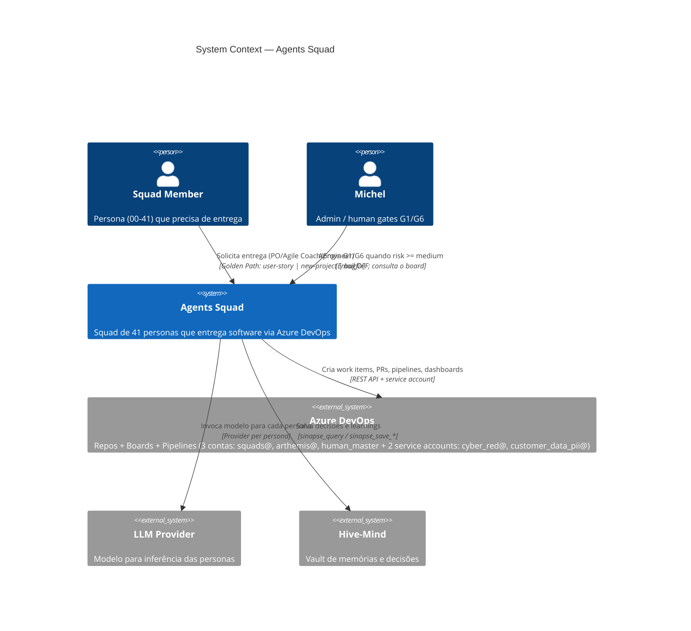

# C4 — System Context (Level 1)

> Diagrama C4 nível 1 (System Context). Mostra o sistema sob análise, os
> atores externos e os sistemas externos com os quais ele interage.
> Renderiza em qualquer visualizador Mermaid: GitHub, VS Code, mermaid.live.

## Personas (resumo)

| Squad | Personas | Função principal |
|---|---|---|
| core | 00, 01, 02, 03, 35, 40 | Coordenação, produto, ágil, consenso |
| web | 21, 22, 37, 41 | Frontend, backend, fullstack, UI |
| mobile | 38 | Mobile engineer |
| data | 16, 23, 07, 05 | Data, ETL, DB, arquitetura |
| ai | 17, 24, 25, 08, 15 | AI/ML/RAG/MLOps |
| infra-cloud | 27, 39, 13, 26, 29 | Platform, cloud, release, SRE, integration |
| quality | 09, 10, 11, 12, 28, 34, 14 | Review, security, test, QA, perf, cyber, governance |

## SoD (1 linha)

`5 contas AAD`: `squads@` (author, 38 personas) ≠ `arthemis@` (reviewer, 5 personas) ≠ `cyber_red@` (Red Team, 1 persona) ≠ `customer_data_pii@` (PII reader, 0 personas — somente leitura) ≠ `human_master` (admin, 0 personas). 4 contas segregadas para SoD; 1 admin.

## Confiabilidade da fonte

* `agents/_shared/OPERATING_CONTRACT.md §"Quem aprova o quê"` (canonical)
* `templates/devops.yaml:identities` e `:service_accounts`
* `adr/0001-three-azure-devops-accounts.md`
