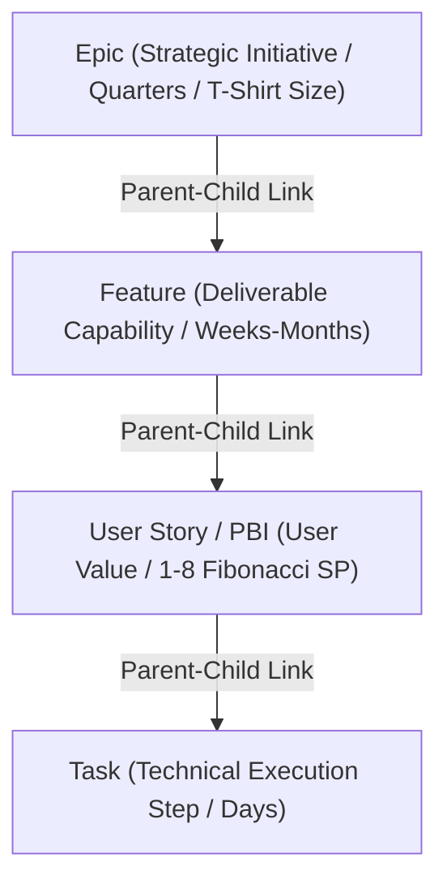

# Backlog Hierarchy, Deduplication, and Work Placement Engineering Specification

**Document ID**: `DOC-COMPLIANCE-2026-09-15`  
**Authors**: Product Owner (`02-product-owner`) & Agile Coach (`40-agile-coach`) in collaboration with Solution Architect (`04-solution-architect`)  
**Status**: Approved & Governing Standard  
**Scope**: Agents Squad Runtime (`C:\Users\miche\OneDrive\Documentos\agent_squad`) and Target Projects (`ZSquad_push`, Arthemis, Depvision, etc.)

---

## Executive Summary

This specification establishes the mandatory architectural, process, and code-level governance standards to resolve three critical backlog and workspace management issues identified by the Product Lead:
1. **Azure DevOps 4-Tier Hierarchy Misalignment**: Enforcement of the natural parent-child hierarchy (`Epic` -> `Feature` -> `User Story / PBI` -> `Task`) across both local file structures and Azure DevOps work items.
2. **Epic Proliferation & Uncoordinated Duplication**: Implementation of a strict **Query Before Create (QBC)** deduplication protocol.
3. **Work Folder Leakage (`work/` in Target Projects)**: Implementation of the `PathContainmentGuard` mechanism to strictly forbid target projects from creating local `work/` directories, forcing all work state into `<SQUAD_RUNTIME>/work/<project_id>/`.

---

## 1. Forensic Scan Results: Work Folder Leakage

### 1.1 Findings
A comprehensive filesystem forensic scan across `C:\Users\miche\OneDrive\Documentos` revealed the following `work/` directory placements:
*   `C:\Users\miche\OneDrive\Documentos\agent_squad\work` — **Canonical Shared Runtime Work Directory** (Valid).
*   `C:\Users\miche\OneDrive\Documentos\ZSquad_push\work` — **Misplaced Leakage Directory** (Invalid).

### 1.2 Root Cause Analysis
During early prototyping or unconstrained agent execution, target project repositories (such as `ZSquad_push`) occasionally instantiated a local `./work/` folder. This violates the core architectural tenet of the Agents Squad: **Target repositories contain only business code and `.agents_squad/config/project.yaml`, while all work items, logs, and artifacts reside exclusively in the centralized `SQUAD_RUNTIME` (`<SQUAD_RUNTIME>/work/<project_id>/`).**

### 1.3 Remediation & Containment
1.  **Purge Action**: Remove the stray `ZSquad_push/work` directory (after archiving any valuable detached work items into the canonical runtime database).
2.  **Guard-Rail Enforcement**: Introduce `PathContainmentGuard` in `scripts/project_context.py` and `scripts/agent_squad.py` to intercept and fail closed on any attempt to create a `work/` directory within a target project root.

---

## 2. Canonical 4-Tier Backlog Hierarchy Specification

In accordance with official Microsoft Azure DevOps guidance and enterprise agile taxonomy, all work items within the Agents Squad must strictly adhere to the 4-tier natural hierarchy.



### 2.1 Hierarchy Definitions & Attributes

| Level | Azure DevOps Work Item Type | Purpose & Scope | Time Horizon / Sizing | Linking Rule |
| :--- | :--- | :--- | :--- | :--- |
| **1. Strategic** | `Epic` | Large cross-cutting business initiatives, strategic themes, portfolio goals. | Quarters / T-Shirt (`PP` to `GG`) | Top-level node; parent to Features. |
| **2. Capability** | `Feature` | Major shippable functional capabilities delivering business value. | Weeks to Months | Must have exactly 1 parent `Epic`. Parent to User Stories. |
| **3. Delivery** | `User Story` / `PBI` | Fundamental unit of customer value satisfying acceptance criteria. | Single Sprint / **1 to 8 Story Points (Fibonacci)** | Must have exactly 1 parent `Feature`. Parent to Tasks. **Items > 8 SP are strictly blocked**. |
| **4. Execution** | `Task` | Granular technical implementation steps, testing, wiring, or configuration. | Days (1-4 hours each) | Must have exactly 1 parent `User Story`. No child items. |

### 2.2 Bug Handling Policy
*   Bugs discovered during active sprints are mapped directly to the parent `User Story` or `Feature` as a linked item or child task, maintaining sprint velocity and burn-down accuracy.
*   Production defects or major incidents are logged as `BUG` work items at the Feature/Epic level and decomposed into User Stories for remediation.

---

## 3. Deduplication and Pre-Enrichment Algorithm (Query Before Create)

To prevent Epic and Feature proliferation, agents must execute the **Query Before Create (QBC)** protocol before instantiating any new work item.

### 3.1 Protocol Steps
1.  **Local Database Index Query (`banco/squad.db`)**:
    *   Search existing Epics and Features using semantic title matching and tag filters.
2.  **Azure DevOps WIT Query (`wit_query` / `wit_backlog`)**:
    *   Query active and closed Epics/Features in the project backlog via `@azure-devops/mcp` tools.
3.  **Similarity Evaluation**:
    *   Calculate title/description Jaccard similarity or embedding cosine similarity against existing items.
    *   If similarity $\ge 0.75$, **prohibit creation of a new item**. Instead, enrich the existing Epic/Feature with new scope or link the new User Story to the existing parent.
4.  **Audit Trail Record**:
    *   Log the deduplication check result in `work/<project_id>/traceability/dedup-audit.log`.

---

## 4. Path Containment Guard (`PathContainmentGuard`)

To enforce absolute isolation between the shared runtime and target projects, we define the `PathContainmentGuard` class in Python.

### 4.1 Implementation Specification (`scripts/project_context.py`)

```python
class PathContainmentViolation(ProjectContextError):
    """Raised when an operation attempts to create or access work folders outside SQUAD_RUNTIME."""
    pass

class PathContainmentGuard:
    @staticmethod
    def validate_work_path(target_path: Path, runtime_root: Path, project_id: str) -> Path:
        """Validates that any work path resides strictly inside runtime_root/work/project_id."""
        resolved_target = target_path.resolve()
        canonical_work_root = (runtime_root / "work" / project_id).resolve()
        
        # Check if target is trying to create a local 'work' folder in a target project
        if "work" in resolved_target.parts and not str(resolved_target).startswith(str(runtime_root)):
            raise PathContainmentViolation(
                f"PathContainmentViolation: Creation of work directory at {resolved_target} "
                f"is strictly prohibited. All work state must reside in canonical root: {canonical_work_root}"
            )
        
        if not str(resolved_target).startswith(str(canonical_work_root)):
            if not resolved_target.is_relative_to(canonical_work_root):
                raise PathContainmentViolation(
                    f"PathContainmentViolation: Path {resolved_target} escapes canonical work boundary {canonical_work_root}"
                }
        return resolved_target
```

---

## 5. Verification & Acceptance Criteria
1.  **Filesystem Verification**: Confirm that `ZSquad_push/work` is removed and no stray `work/` folders exist outside `<SQUAD_RUNTIME>/work/`.
2.  **Code Enforcement**: Unit tests in `scripts/tests/test_path_containment.py` verify that `PathContainmentGuard` raises `PathContainmentViolation` upon encountering local project `work/` creation attempts.
3.  **Azure DevOps Sync**: All work item templates and CLI initializers (`agent_squad.py init-work-item`) enforce parent-child links corresponding to `Epic -> Feature -> User Story -> Task`.
