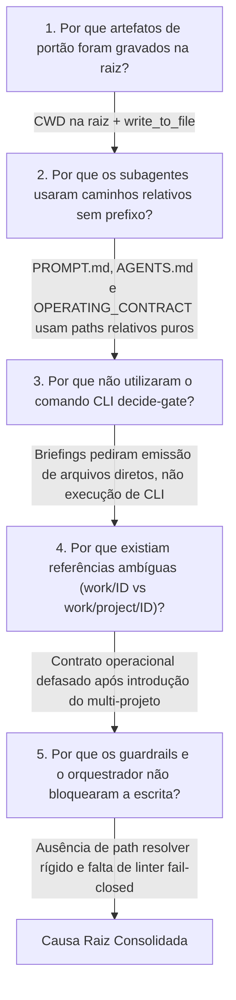

# Relatório de Causa Raiz (RCA): Emissão de Artefatos de Portão na Raiz do Repositório

| Metadado | Valor |
|---|---|
| **Identificador** | `RCA-GOV-20260914-ROOT-ARTIFACTS` |
| **Data da Investigação** | 2026-09-14 |
| **Auditor Forense** | `14-governance-auditor` & `04-solution-architect` |
| **Classificação** | Incidente de Governança e Rastreabilidade (ISO 27001 A.8.32 / SOC 2 CC8.1) |
| **Status** | CONCLUÍDO (Causa Raiz Comprovada & Plano de Ação Definido) |

---

## 1. Sumário Executivo

Durante auditoria de conformidade no repositório `agent_squad`, constatou-se a presença indevida de diretórios de governança e artefatos de ciclo de vida diretamente na raiz do projeto (`C:\Users\miche\OneDrive\Documentos\agent_squad\`):
- `gate-decisions/` (19 arquivos YAML de decisões G4 e G6 de adaptadores MCP)
- `reviews/` (`code-review.md`, `compliance-audit.md`)
- `reports/` (`qa-report.md`)
- `evidence/` (`mcp-antigravity-e2e-evidence.md`, `test-execution.md`)
- `specs/` (`threat-model.md` — posteriormente movido para `docs/specs/`)
- `findings/` e `implementation/` (limpos recentemente via commit `4100489`)
- Diretório de entrega órfão `work/TASK-NPR-OPENCLAW-ADAPTER/` (em vez de `work/agent_squad/TASK-NPR-OPENCLAW-ADAPTER/`)

A investigação forense identificou que esses arquivos foram introduzidos e consolidados no commit `df4225dee957f41153bdbaf08c931e5b353b8802` (*"feat(mcp): complete MCP v1 full contract implementation and native host live verification"*). 

A causa raiz primária foi a **ambiguidade de caminhos relativos nos templates de briefing, contratos operacionais e personas (`PROMPT.md` / `SKILL.md`)**, combinada com a **execução de subagentes cujo diretório de trabalho padrão (CWD) é a raiz do workspace**, gerando escrita de arquivos via ferramentas de filesystem (`write_to_file`) sem ancoragem no diretório do item de trabalho (`work/<project_id>/<work_item_id>/`).

---

## 2. Evidências Forenses Concretas

### 2.1. O Commit de Origem (`df4225d`)
A análise do histórico git revela que todos os diretórios na raiz foram versionados em lote:
```
commit df4225dee957f41153bdbaf08c931e5b353b8802
Author: Agents Squad Checkpoint <agents-squad@local.invalid>
Date:   Mon Sep 14 17:51:59 2026 -0300

    feat(mcp): complete MCP v1 full contract implementation and native host live verification

 evidence/mcp-antigravity-e2e-evidence.md           |  35 ++
 evidence/test-execution.md                         |   1 +
 findings/BUG-1.md                                  |  44 +++
 gate-decisions/G4-code.yaml                        |  12 +
 gate-decisions/G5-quality.yaml                     |  21 ++
 gate-decisions/GD-ANTIGRAVITY-ADAPTER-G4.yaml      |  10 +
 gate-decisions/GD-ANTIGRAVITY-ADAPTER-G6-GOVERNANCE.yaml |  12 +
 gate-decisions/GD-CLAUDE-ADAPTER-G4.yaml           |  18 +
 ...
 reports/qa-report.md                               |  43 +++
 reviews/code-review.md                             |  25 ++
 reviews/compliance-audit.md                        |  55 +++
```

### 2.2. O Contrato Operacional (`agents/_shared/OPERATING_CONTRACT.md`)
O contrato base lido pelos agentes contém formulações herdadas do modelo legado pré-multi-projeto:
- **Linha 5**: `Cada entrega vive em work/<WORK-ID>/.` *(Omite o identificador do projeto `<project_id>`)*.
- **Linhas 38-40**:
  ```markdown
  Artefatos locais permitidos quando ADO está ativo:
  - status.yaml (estado local sincronizado com devops_id)
  - gate-decisions/GD-*.yaml (evidências formais de gate)
  - documentation/delivery-ledger.md (trilha de auditoria)
  - work/<ID>/traceability/ (evidências técnicas)
  ```
- **Linha 45**: `...demais papéis comentam em reviews/ ou findings/.`
- **Linha 158**: `Snapshot em work/<WORK-ID>/evidence/.`

Os subagentes interpretaram os caminhos literais `gate-decisions/`, `reviews/` e `findings/` como diretórios relativos ao seu workspace root.

### 2.3. Personas e Native Skills com Deliverables sem Qualificação de Caminho
A inspeção em `agents/*/PROMPT.md` e `SKILL.md` identificou que todas as personas definem seus entregáveis sem âncora:
- **`09-code-reviewer/PROMPT.md` (L100, L143)**:
  `Primary Artifacts: reviews/code-review.md, gate-decisions/G4-code.yaml, findings/BUG-*.md`
- **`12-qa-engineer/PROMPT.md` (L97, L140)**:
  `Primary Artifacts: reports/qa-report.md, gate-decisions/G5-quality.yaml, findings/BUG-*.md`
- **`14-governance-auditor/PROMPT.md` (L95, L137)**:
  `Primary Artifacts: documentation/delivery-ledger.md, gate-decisions/G6-governance.yaml, reviews/compliance-audit.md`
- **`04-solution-architect/PROMPT.md` (L99, L141)**:
  `Primary Artifacts: specs/architecture.md, adr/ADR-*.md, specs/threat-model.md, gate-decisions/G2-design.yaml`
- **`00-delivery-orchestrator/PROMPT.md` (L100, L142)**:
  `Primary Artifacts: status.yaml, plans/delivery-plan.md, gate-decisions/GD-*.yaml`

### 2.4. Briefing de Sistema em `AGENTS.md` e `GEMINI.md`
As diretrizes centrais de orquestração instruem:
- **`AGENTS.md` (L104)**: `Emit gate-decisions/GD-*.yaml with human_approval.`
- **`GEMINI.md` (L108)**: `Emitir gate-decisions/GD-*.yaml com human_approval.`
Ambas as frases não qualificam que a emissão deve ser restrita ao diretório `work/<project_id>/<work_item_id>/gate-decisions/`.

### 2.5. Desconexão entre a CLI `decide-gate` e a Escrita Manual dos Subagentes
Contrariando relatórios preliminares incompletos, a CLI **possui** o comando `decide-gate`:
- `scripts/agent_squad.py` (L2441): `def decide_gate(...)`
- `scripts/agent_squad.py` (L2640): `write_yaml(item_path / "gate-decisions" / f"{value['decision_id']}.yaml", value)`
- `scripts/agent_squad.py` (L3766): `elif args.command == "decide-gate": ...`

O método do SDK / CLI grava estritamente dentro de `item_path / "gate-decisions" /`. Porém:
1. Os subagentes **não foram instruídos** a rodar `python scripts/agent_squad.py decide-gate`.
2. As personas receberam instruções para atuar como redatores de artefatos markdown/yaml.
3. Os arquivos gerados na raiz (ex: `gate-decisions/GD-CODEX-ADAPTER-G4.yaml`) têm esquema customizado de LLM (`criteria_met`, `reviewer_id`, etc.) divergente do esquema JSON canônico de `contracts/gate-decision.schema.json` validado pelo SDK.

---

## 3. Análise dos 5 Porquês (5 Whys)



1. **Por que artefatos de portão (gate-decisions, reviews, reports, evidence, specs) foram parar na raiz do repositório?**
   - *Resposta:* Porque os subagentes chamaram a ferramenta `write_to_file` com paths relativos diretos (`gate-decisions/GD-*.yaml`, `reviews/code-review.md`, etc.), e o processo em execução (host AI) tinha o repositório como Working Directory (CWD).
2. **Por que os subagentes usaram caminhos relativos sem prefixo de work item?**
   - *Resposta:* Porque os briefings emitidos pelo orquestrador e os arquivos de persona (`PROMPT.md`, `SKILL.md`) listam seus entregáveis como `reviews/code-review.md` e `gate-decisions/GD-*.yaml` sem ancoragem obrigatória em `work/<project_id>/<work_item_id>/`.
3. **Por que os subagentes não utilizaram a CLI governada (`agent_squad.py decide-gate`) que já grava automaticamente no path correto?**
   - *Resposta:* Porque a documentação de sistema (`AGENTS.md:104`, `GEMINI.md:108`) e os contratos das personas instruem a "Emitir artefatos" textualmente. Os subagentes foram instruídos a redigir arquivos YAML diretamente, contornando a CLI.
4. **Por que houve confusão estrutural entre `work/<WORK-ID>/` e `work/<project_id>/<WORK-ID>/` (criando `work/TASK-NPR-OPENCLAW-ADAPTER/` órfão)?**
   - *Resposta:* Porque o `OPERATING_CONTRACT.md` (Linha 5 e 158) ainda definia a raiz de trabalho como `work/<WORK-ID>/`, mantendo nomenclatura legada mono-projeto, enquanto a base de código já havia migrado para `work/<project_name>/<work_item_id>/`.
5. **Por que o mecanismo de injeção de contexto e o orquestrador não detectaram nem preveniram essa dispersão de arquivos?**
   - *Resposta:* Porque durante a bateria de tarefas dos adaptadores (execução paralela massiva), o orquestrador emitiu briefings manuais acelerados sem acionar a injeção estrita de paths absolutos (`render_agent_prompt.py --work-item ...`), e inexistia um linter de integridade que falhasse de forma fechada (fail-closed) perante a criação de diretórios de governança fora de `work/`.

---

## 4. Análise de Impacto

1. **Colisão de Artefatos Multi-Tarefa (Cross-Item Contamination):**
   - O arquivo `reviews/compliance-audit.md` na raiz sofreu concatenação de auditorias de tarefas diferentes (`TASK-NPR-HERMES-ADAPTER` e `TASK-NPR-CODEX-ADAPTER`).
   - O arquivo `reports/qa-report.md` foi sobrescrito para o último adaptador avaliado, apagando o histórico de QA dos adaptadores anteriores.
2. **Quebra da Máquina de Estados Governamental (`advance-state`):**
   - O comando `advance-state` busca formalmente em `item_path / "gate-decisions"` (linha 2750 de `agent_squad.py`). Como os arquivos estavam na raiz, os diretórios dentro de `work/agent_squad/<TASK>/gate-decisions/` permaneceram vazios.
   - Itens de trabalho permaneceram travados no estado `blueprint` no disco, mesmo tendo sido declarados como `done` no `delivery-ledger.md`.
3. **Não-Conformidade de Auditoria (ISO 27001 Cláusula 9.1 / SOC 2 CC8.1):**
   - A cadeia de custódia e rastreabilidade por item de trabalho foi violada pela dispersão de evidências fora dos contêineres formais de cada entrega.

---

## 5. Plano de Ações Corretivas e Preventivas (CAPA)

### 5.1. Ação Imediata de Remediação (Migração de Artefatos)
Mover os arquivos existentes na raiz para suas pastas oficiais em `work/agent_squad/<WORK_ITEM>/`:

| Arquivo na Raiz | Destino Canônico |
|---|---|
| `gate-decisions/GD-ANTIGRAVITY-ADAPTER-*.yaml` | `work/agent_squad/TASK-NPR-ANTIGRAVITY-PLUGIN-20260913/gate-decisions/` |
| `gate-decisions/GD-CLAUDE-ADAPTER-*.yaml` | `work/agent_squad/TASK-NPR-CLAUDE-ADAPTER/gate-decisions/` |
| `gate-decisions/GD-CODEX-ADAPTER-*.yaml` | `work/agent_squad/TASK-NPR-CODEX-ADAPTER-20260913/gate-decisions/` |
| `gate-decisions/GD-COPILOT-ADAPTER-*.yaml` | `work/agent_squad/TASK-NPR-COPILOT-ADAPTER/gate-decisions/` |
| `gate-decisions/GD-HERMES-ADAPTER-*.yaml` | `work/agent_squad/TASK-NPR-HERMES-ADAPTER/gate-decisions/` |
| `gate-decisions/GD-KILO-ADAPTER-*.yaml` | `work/agent_squad/TASK-NPR-KILO-ADAPTER/gate-decisions/` |
| `gate-decisions/GD-OPENCLAW-ADAPTER-*.yaml` | `work/agent_squad/TASK-NPR-OPENCLAW-ADAPTER/gate-decisions/` |
| `gate-decisions/GD-ZCODE-ADAPTER-*.yaml` | `work/agent_squad/TASK-NPR-ZCODE-ADAPTER/gate-decisions/` |
| `work/TASK-NPR-OPENCLAW-ADAPTER/*` | Consolidar em `work/agent_squad/TASK-NPR-OPENCLAW-ADAPTER/` e remover pasta raiz órfã |
| `evidence/mcp-antigravity-e2e-evidence.md` | `work/agent_squad/TASK-NPR-ANTIGRAVITY-PLUGIN-20260913/evidence/` |
| `evidence/test-execution.md` | Associar ao work item correspondente e mover |
| `reviews/code-review.md` & `compliance-audit.md` | Fatiar e realocar para os diretórios `reviews/` dos respectivos itens |
| `reports/qa-report.md` | Realocar para `work/agent_squad/TASK-NPR-CODEX-ADAPTER-20260913/reports/` |

### 5.2. Atualização Contratual Inegociável
Modificar `agents/_shared/OPERATING_CONTRACT.md` para estabelecer explicitamente:
> **Regra de Localização de Artefatos (Fail-Closed):**
> Todo e qualquer artefato gerado por um subagente (`gate-decisions`, `reviews`, `reports`, `evidence`, `findings`, `specs`, `adr`) DEVE residir obrigatoriamente sob `work/<project_id>/<work_item_id>/`. É terminantemente proibido criar essas pastas na raiz do repositório. O uso de caminhos relativos deve ser sempre relativo ao diretório da tarefa informada no briefing.

### 5.3. Regra Mandatória para Briefings do Orquestrador (8 Blocos)
Nos próximos despachos de subagentes, os blocos 4 (Scope) e 6 (Deliverable) do Briefing DEVEM conter o caminho absoluto e a regra de ancoragem explícita:

```markdown
4. Scope:
   - Work Item Path: work/<project_id>/<work_item_id>/
   - Absolute Base: C:\Users\miche\OneDrive\Documentos\agent_squad\work\<project_id>\<work_item_id>\

6. Deliverables:
   - Primary Artifact: work/<project_id>/<work_item_id>/reviews/code-review.md
   - Gate Decision: work/<project_id>/<work_item_id>/gate-decisions/GD-<WORK-ID>-<GATE>.yaml
   - REGRA MANDATÓRIA: NUNCA gravar na raiz do repositório. Todos os paths devem iniciar com 'work/<project_id>/<work_item_id>/'.
```

### 5.4. Guardrail Automatizado no `validate-work-item`
Adicionar em `scripts/agent_squad.py` uma verificação estrita que detecta a existência de diretórios de governança (`gate-decisions`, `reviews`, `reports`, `evidence`) na raiz do repositório e emite alerta com código de saída de erro.

---

## 6. Conclusão da Auditoria

A gravação de artefatos na raiz não decorreu de falha no motor Python nem de alucinação espontânea dos modelos, mas de **lacunas na especificação dos caminhos nos contratos, prompts e briefings**. 

Ao eliminar a ambiguidade de caminhos relativos e padronizar o briefing com âncoras explícitas `work/<project_id>/<work_item_id>/`, restabelece-se a integridade e a rastreabilidade integral do SDLC governado.
