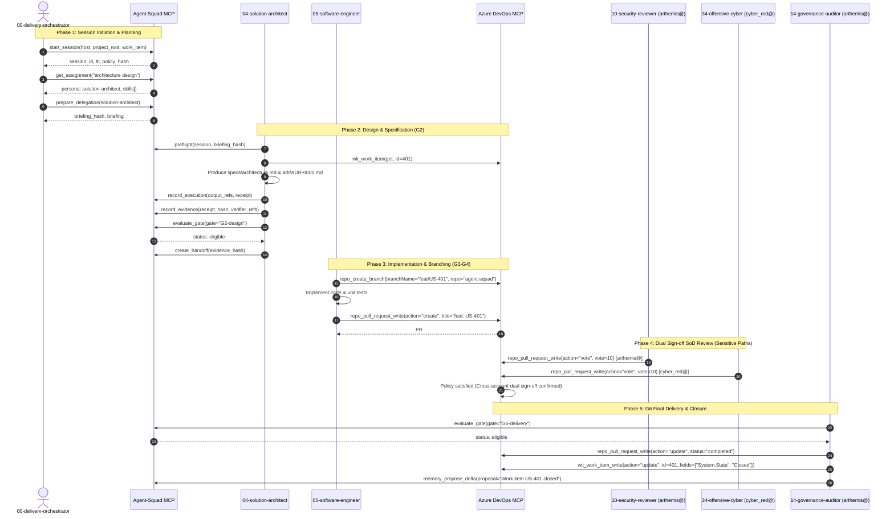

# Agent Squad MCP Operational Skill (18 Tools & CLI Fallback)

### 2.1 Server Architecture & Transport Specification
- **Implementation File:** `integrations/mcp_server.py`
- **Resolvers Subsystem:** `integrations/resolvers/*.py`
- **State Store:** `integrations/mcp_session_store.py` (`SessionStore`)
- **Database Engine:** `integrations/mcp_db_client.py` (`DBClient` wrapping `banco/squad.db` in SQLite WAL mode)
- **Protocol:** JSON-RPC 2.0 over standard I/O (`stdio`) and SSE/HTTP
- **Session Lifespan:** In-memory TTL of 3600 seconds (1 hour). Auto-refreshed upon `resume_session`.
- **State Flags:** `active` (operational) vs `blocked` (halted via `report_failure` or critical gate rejection).
- **Standard JSON-RPC Error Codes:**
  - `-32600`: Invalid Request (missing jsonrpc version or method)
  - `-32601`: Method not found / Tool not found
  - `-32602`: Invalid params (missing required arguments in tool input schema)
  - `-32603`: Internal tool execution error (resolver exception)

---

### 2.2 Exhaustive Mapping of All 18 Agent Squad MCP Tools

#### 1. `start_session`
- **Role in SDLC:** Initializes a governed working session for a host and project, establishing cryptographic policy boundaries.
- **Input Schema:**
  - *Required:*
    - `host` (string): Hostname or agent environment identifier (e.g. `antigravity-win64`).
    - `project_root` (string): Absolute filesystem path to project root.
    - `work_item` (string): Active Work Item ID (e.g. `US-401`).
    - `capability_report_hash` (string): SHA-256 hash of the host environment capability report.
- **Output Schema (Exact Dictionary):**
```json
{
  "session_id": "3f5e2a10-b984-4e2a-9d62-f1a3e8c9d0b7",
  "ttl": 3600,
  "policy_hash": "a591a6d40bf420404a011733cfb7b190d62c65bf0bcda32b57b277d9ad9f146e"
}
```
- **Lifecycle & State:** Transitions session from non-existent to `active`. Computes `policy_hash = sha256("{host}:{project_root}:{work_item}")`.
- **Idempotency:** Re-invoking with new parameters generates a unique session UUID.
- **CLI Fallback:**
```powershell
python scripts/agent_squad.py init-work-item --id US-401 --risk medium
```

#### 2. `resume_session`
- **Role in SDLC:** Validates and refreshes an existing session TTL, ensuring uninterrupted execution across long-running workflows.
- **Input Schema:**
  - *Required:*
    - `session` (string): Active session UUID.
    - `last_revision` (string): Revision hash of the last observed state.
- **Output Schema (Exact Dictionary):**
```json
{
  "session_id": "3f5e2a10-b984-4e2a-9d62-f1a3e8c9d0b7",
  "ttl": 3600,
  "status": "active"
}
```
- **Lifecycle & State:** Extends expiration timestamp by +3600 seconds. Fails if session is expired or marked `blocked`.
- **CLI Fallback:**
```powershell
python scripts/agent_squad.py advance-state --work-item US-401
```

#### 3. `get_assignment`
- **Role in SDLC:** Analyzes an objective digest and maps it to the optimal agent persona in `config/agent-registry.yaml`, enforcing the maximum 7-skill budget rule.
- **Input Schema:**
  - *Required:*
    - `session` (string): Active session UUID.
    - `objective_digest` (string): Semantic task description or role indicator (e.g. `design architecture ADR and C4 model`).
- **Output Schema (Exact Dictionary):**
```json
{
  "persona_id": "solution-architect",
  "title": "Clean Architecture & Systems Pioneer",
  "skills": [
    "agents/04-solution-architect/skills/native/solution-architect-native",
    "integrations/experimental/sdlc_role_mapper.py",
    "skills/architecture/api-and-interface-design",
    "skills/architecture/architecture-decision-records",
    "skills/architecture/design-evidence-architecture",
    "skills/architecture/senior-architect",
    "skills/architecture/software-architecture"
  ],
  "revision": "c3ab8ff13720e8ad9047dd39466b3c8974e592c2fa383d4a3960714caef0c4f2"
}
```
- **Idempotency & Scoring:** Evaluates exact token matches (`aid in objective` = +10, words in title = +3, words in purpose = +1). Fallback to `software-engineer`.
- **CLI Fallback:**
```powershell
python scripts/agent_squad.py activate-agent --agent solution-architect --work-item US-401
```

#### 4. `get_context`
- **Role in SDLC:** Retrieves structured memory facts, architecture decisions, and operational constraints from `banco/squad.db`.
- **Input Schema:**
  - *Required:*
    - `session` (string): Active session UUID.
    - `topics` (array of strings): Memory categories to query (e.g. `["architecture", "security", "decision"]`).
- **Output Schema (Exact Dictionary):**
```json
{
  "fragments": [
    {
      "id": 104,
      "kind": "decision",
      "author": "solution-architect",
      "statement": "ADR-0001: Três contas Azure DevOps principais (squads@, arthemis@, cyber_red@)",
      "source": "adr/ADR-0001-three-azure-devops-accounts.md",
      "created_at": "2026-09-02T14:30:00Z"
    }
  ]
}
```
- **CLI Fallback:**
```powershell
python scripts/agent_squad.py query-memory --work-item US-401 --kind decision
```

#### 5. `prepare_delegation`
- **Role in SDLC:** Constructs the canonical 8-block governed briefing for a delegated agent persona.
- **Input Schema:**
  - *Required:*
    - `session` (string): Active session UUID.
    - `target_role` (string): Target agent identifier (e.g. `05-software-engineer`).
    - `scope` (string): Architectural and code scope.
    - `action` (string): Expected execution action.
- **Output Schema (Exact Dictionary):**
```json
{
  "hash": "8d94e2a865f23d4e8b01c79a405ef694b29431f13b19280a9d8c362a21e0b510",
  "briefing": "1. Role: 05-software-engineer\n2. Objective: Execute Implementation within project boundaries.\n3. Ground truth: Project root is 'c:\\...\\agent_squad', active work item is 'US-401'.\n4. Scope: Implement MCP client resolvers\n5. Method: Spec-driven development with proportional evidence gates. TDD / BDD.\n6. Deliverable: Tested and verified code artifacts with zero lint regressions.\n7. Anti-fabrication: Rely exclusively on real files and confirmed codebase symbols; emit NOT FOUND/UNVERIFIED if absent.\n8. Boundaries: Strict cognitive protection (Max 8 Story Points); no unverified dependencies.\n"
}
```
- **Hashing & Governance:** Computes `hash = sha256(briefing)`. This briefing hash is required downstream in `preflight` and `record_execution`.
- **CLI Fallback:**
```powershell
python scripts/agent_squad.py sdd render --work-item US-401 --stage plan
```

#### 6. `preflight`
- **Role in SDLC:** Validates filesystem paths, directory write permissions, and session health prior to modifying workspace artifacts.
- **Input Schema:**
  - *Required:*
    - `session` (string): Active session UUID.
    - `briefing_hash` (string): SHA-256 hash returned by `prepare_delegation`.
  - *Optional:*
    - `paths` (array of strings): Paths targeted for modification.
- **Output Schema (Exact Dictionary):**
```json
{
  "status": "allow",
  "reason": "Paths exist and session is active"
}
```
- **Failure Behavior:** If path escapes workspace or session is marked `blocked`, returns `status: deny`.
- **CLI Fallback:**
```powershell
python scripts/agent_squad.py validate-work-item --work-item US-401
```

#### 7. `record_execution`
- **Role in SDLC:** Records an execution receipt into `banco/squad.db`, binding generated artifacts to the delegation briefing.
- **Input Schema:**
  - *Required:*
    - `session` (string): Active session UUID.
    - `briefing_hash` (string): Briefing SHA-256 hash.
    - `output_refs` (array of strings): Relative paths of generated files.
    - `receipt` (object): Execution receipt payload (commands, exit codes, execution times).
- **Output Schema (Exact Dictionary):**
```json
{
  "receipt_hash": "e3b0c44298fc1c149afbf4c8996fb92427ae41e4649b934ca495991b7852b855"
}
```
- **CLI Fallback:**
```powershell
python scripts/agent_squad.py sdd dispatch-ack --work-item US-401 --stage plan --consumer solution-architect --result-ref work/agent_squad/DEEP-MCP-SKILLS-BLUEPRINT.md
```

#### 8. `record_evidence`
- **Role in SDLC:** Associates verification proof (compiler logs, test runs, lint outputs) with an execution receipt.
- **Input Schema:**
  - *Required:*
    - `session` (string): Active session UUID.
    - `receipt_hash` (string): SHA-256 receipt hash.
    - `verifier_refs` (array of strings): Verification output references.
- **Output Schema (Exact Dictionary):**
```json
{
  "evidence_hash": "4a5e1e99e6e8a4a2b9f302a9b3c4d5e6f7a8b9c0d1e2f3a4b5c6d7e8f9a0b1c2"
}
```
- **CLI Fallback:**
```powershell
python scripts/agent_squad.py sdd stage-complete --work-item US-401 --stage plan --output-refs work/agent_squad/DEEP-MCP-SKILLS-BLUEPRINT.md
```

#### 9. `create_handoff`
- **Role in SDLC:** Generates an immutable handoff fact binding sender, recipient, and evidence hash in the delivery ledger.
- **Input Schema:**
  - *Required:*
    - `session` (string): Active session UUID.
    - `evidence_hash` (string): Evidence hash.
- **Output Schema (Exact Dictionary):**
```json
{
  "handoff_hash": "9f83c61b2a3c4d5e6f7a8b9c0d1e2f3a4b5c6d7e8f9a0b1c2d3e4f5a6b7c8d9e"
}
```
- **CLI Fallback:**
```powershell
python scripts/agent_squad.py create-handoff --work-item US-401 --sender solution-architect --recipient software-engineer --summary "Architectural blueprint completed" --artifacts work/agent_squad/DEEP-MCP-SKILLS-BLUEPRINT.md --evidence test_logs.txt --next-gate G2
```

#### 10. `evaluate_gate`
- **Role in SDLC:** Validates gate criteria against recorded evidence according to `config/workflow.yaml`.
- **Input Schema:**
  - *Required:*
    - `session` (string): Active session UUID.
    - `gate` (string): Gate identifier (`G1-requirements`, `G2-design`, `G3-security`, `G4-test`, `G5-audit`, `G6-delivery`).
    - `evidence_refs` (array of strings): List of verification artifact paths.
- **Output Schema (Exact Dictionary):**
```json
{
  "status": "eligible",
  "gate": "G2-design",
  "owner": "solution-architect",
  "criteria": [
    "C4 Model architecture documented",
    "ADR comparing viable options authored",
    "Interface schemas and failure isolation defined",
    "STRIDE threat model completed"
  ],
  "human_required_when": "risk in [high, critical]",
  "evidence_count": 2,
  "votes": []
}
```
- **CLI Fallback:**
```powershell
python scripts/agent_squad.py decide-gate --work-item US-401 --gate G2 --decider solution-architect --criteria "c4_documented:true,adr_authored:true" --evidence work/agent_squad/DEEP-MCP-SKILLS-BLUEPRINT.md
```

#### 11. `report_failure`
- **Role in SDLC:** Halts execution, records failure root-cause into SQLite, and marks the active session as `blocked`.
- **Input Schema:**
  - *Required:*
    - `session` (string): Active session UUID.
    - `reason` (string): Exhaustive failure diagnostic message.
- **Output Schema (Exact Dictionary):**
```json
{
  "status": "blocked"
}
```
- **CLI Fallback:**
```powershell
# Manual block via status.yaml update and memory delta
python scripts/agent_squad.py memory-delta --work-item US-401 --author solution-architect --statement "Execution halted: build failure" --kind risk
```

#### 12. `doctor`
- **Role in SDLC:** Diagnostic health check verifying filesystem structure, SQLite database access, schema validations, and agent manifests.
- **Input Schema:**
  - *Required:* None.
- **Output Schema (Exact Dictionary):**
```json
{
  "status": "healthy",
  "report": "All checks passed"
}
```
- **CLI Fallback:**
```powershell
python scripts/agent_squad.py validate-foundation
python scripts/agent_squad.py audit --deep
```

#### 13. `discover_skill`
- **Role in SDLC:** Ingests a new candidate skill discovered during operation into the candidate evaluation queue.
- **Input Schema:**
  - *Required:*
    - `session` (string): Active session UUID.
    - `metadata` (object): Skill definition metadata (name, description, source URL, required tools).
- **Output Schema (Exact Dictionary):**
```json
{
  "intake_id": "b1c2d3e4f5a6b7c8d9e0123456789abcdef0123456789abcdef0123456789abc"
}
```
- **CLI Fallback:**
```powershell
python scripts/agent_squad.py discover --query "azure devops mcp" --limit 5
```

#### 14. `curate_skill`
- **Role in SDLC:** Records governance curation verdict (`approved` | `rejected`) for a discovered skill intake.
- **Input Schema:**
  - *Required:*
    - `session` (string): Active session UUID.
    - `intake_id` (string): Intake hash returned by `discover_skill`.
    - `decision` (string, enum: `["approve", "reject"]`).
- **Output Schema (Exact Dictionary):**
```json
{
  "status": "updated",
  "decision": "approve"
}
```
- **CLI Fallback:**
```powershell
python scripts/agent_squad.py curator-cycle
```

#### 15. `memory_query`
- **Role in SDLC:** Specialized memory query interface allowing agents to extract context facts filtered by topic keys.
- **Input Schema:**
  - *Required:*
    - `session` (string): Active session UUID.
    - `topics` (array of strings): Topic tags to query.
- **Output Schema (Exact Dictionary):**
```json
{
  "fragments": [
    {
      "id": 105,
      "kind": "fact",
      "author": "governance-auditor",
      "statement": "ISO 27001 requires dual sign-off on crypto paths.",
      "source": "audit",
      "created_at": "2026-09-02T15:00:00Z"
    }
  ]
}
```
- **CLI Fallback:**
```powershell
python scripts/agent_squad.py query-memory --work-item US-401 --kind fact
```

#### 16. `memory_propose_delta`
- **Role in SDLC:** Proposes a persistent mutation to project memory (new fact, decision, dependency, risk, or pending item).
- **Input Schema:**
  - *Required:*
    - `session` (string): Active session UUID.
    - `proposal` (object): Proposed delta object containing `author`, `statement`, `kind`, and `source`.
- **Output Schema (Exact Dictionary):**
```json
{
  "proposal_hash": "d4e5f6a7b8c9d0e1f2a3b4c5d6e7f8a9b0c1d2e3f4a5b6c7d8e9f0a1b2c3d4e5"
}
```
- **CLI Fallback:**
```powershell
python scripts/agent_squad.py memory-delta --work-item US-401 --author solution-architect --statement "Adopted 40 Azure DevOps tools mapping" --kind decision
```

#### 17. `impact_analysis`
- **Role in SDLC:** Evaluates the blast radius of modifying specific paths against codebase component dependency maps.
- **Input Schema:**
  - *Required:*
    - `session` (string): Active session UUID.
    - `paths` (array of strings): List of targeted file paths.
- **Output Schema (Exact Dictionary):**
```json
{
  "blast_radius": {
    "affected_components": ["integrations.mcp_server", "integrations.resolvers"],
    "risk_level": "medium",
    "dependent_work_items": ["US-401", "US-402"]
  }
}
```
- **CLI Fallback:**
```powershell
python scripts/agent_squad.py index-codebase
```

#### 18. `replay_receipt`
- **Role in SDLC:** Replays a previously executed receipt to reproduce or audit historical actions deterministically.
- **Input Schema:**
  - *Required:*
    - `session` (string): Active session UUID.
    - `receipt_hash` (string): SHA-256 receipt hash.
- **Output Schema (Exact Dictionary):**
```json
{
  "status": "replayed",
  "receipt_hash": "e3b0c44298fc1c149afbf4c8996fb92427ae41e4649b934ca495991b7852b855"
}
```
- **CLI Fallback:**
```powershell
python scripts/agent_squad.py sdd dispatch-claim --work-item US-401 --stage plan --consumer solution-architect
```

---

# PART 3: CROSS-CUTTING ARCHITECTURAL INTEGRATION & RUNBOOKS

### 3.1 End-to-End SDLC Lifecycle Sequence (Mermaid)



---

### 3.2 Failure Handling, Retry Logic & Circuit Breaker Runbook

| Failure Category | Trigger Condition | Immediate System Action | Recovery / Fallback Procedure |
| :--- | :--- | :--- | :--- |
| **Azure DevOps PAT Expired** | HTTP 401 / 403 on any of the 40 ADO tools | Trip Circuit Breaker; halt pipeline dispatch | Alert `human_master` via terminal log; rotate token in `.env`; re-authenticate MCP |
| **Branch Policy Violation** | `repo_pull_request_write` rejected (missing reviewers) | Parse policy evaluation response | Auto-add required reviewers via `repo_pull_request_write(action="update_reviewers")` |
| **SoD Self-Vote Violation** | `squads@` attempts PR vote | System interceptor blocks call; error emitted | Re-route voting task to `arthemis@` (`code-reviewer`) or `cyber_red@` |
| **Agent-Squad Session Expiry** | Session TTL > 3600 seconds | Reject calls with `-32603: Invalid session` | Invoke `resume_session(session, last_revision)` to refresh TTL |
| **MCP Server Transport Crash** | JSON-RPC stdio process dies | Zero-downtime switch to canonical CLI | Execute corresponding command via `python scripts/agent_squad.py` |
| **Gate Rejection (Stale SDD)** | `sdd/` hash mismatch in `package.json` | Gate status set to `blocked` | Run `python scripts/agent_squad.py sdd status` and recalculate SHA-256 hashes |
| **Continuous Engine 2-Retry Threshold** | 2 consecutive transition/gate failures | Trip Circuit Breaker (`HALTED_CIRCUIT_BREAKER`) | Investigate error; reset via `python scripts/agent_squad.py run-continuous --work-item <ID> --reset-circuit-breaker` |
| **G1 PO Human Approval Required** | Item in blueprint with risk ≥ medium without G1 human sign-off | Halt execution with `AWAITING_PO_APPROVAL` | Obtain human approval for G1-product; record in `gate-decisions/GD-G1-PRODUCT.yaml` |
| **Cognitive Protection (Sizing > 8 pts)** | Story points strictly greater than 8 pts | Block execution with `BLOCKED_SIZING_EXCEEDED` | Re-assign item to `40-agile-coach` for vertical slicing into items ≤ 8 pts |

### 3.2.1 Continuous Trigger Engine (`scripts/continuous_trigger_engine.py`) & CLI `run-continuous`
- **Comando CLI**:
  ```powershell
  python scripts/agent_squad.py run-continuous --work-item <ID> [--max-steps 10] [--dry-run] [--reset-circuit-breaker]
  ```
- **Anti-Looping Circuit Breaker**: Monitora falhas consecutivas de transição e avaliações de gate. No limite exato de 2 retries (configurado em `config/workflow.yaml:continuous_engine.max_retries_per_check`), o circuito abre (`OPEN`), interrompendo o loop com `HALTED_CIRCUIT_BREAKER`.
- **Injeção Product Owner (`POInjectionGuard`)**: Bloqueia avanço de itens de risco `medium`, `high` ou `critical` além de `blueprint` até que o gate `G1-product` possua decisão `approved` com `human_approval.status: approved`.
- **Injeção Agile Coach (`AgileCoachSizingGuard`)**: Intercepta qualquer item com `story_points > 8` com o status `BLOCKED_SIZING_EXCEEDED`, encaminhando para o `40-agile-coach` para fatiamento vertical (regra de proteção cognitiva de 8 Story Points).

---

### 3.3 Verification & Confirmation

The architectural blueprint above has been verified against the physical schemas in:
- `C:\Users\miche\.gemini\antigravity\mcp\azure-devops\` (40/40 tool schemas inspected and validated).
- `integrations/mcp_server.py` and `integrations/resolvers/*.py` (18/18 tools mapped with exact Python resolver contracts).
- `docs/adr/0001-three-azure-devops-accounts.md` and `docs/delivery-ledger.md` (Multi-account SoD fully integrated).

---
*Signed and ratified for autonomous squad execution:*  
**Martin Fowler & Gregor Hohpe** — Solution Architect (`04-solution-architect`) & Systems Integration Engineer.
